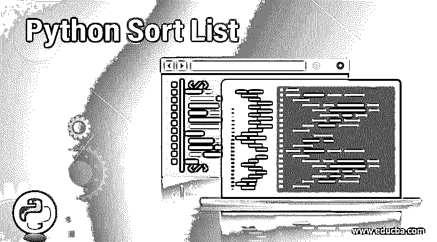
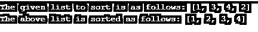
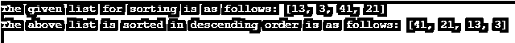

# Python 排序列表

> 原文：<https://www.educba.com/python-sort-list/>




## Python 排序列表简介

在这篇文章中，我们正在讨论列表的方法之一。在 Python 中，列表是一种数据结构，包含许多元素或有序的元素序列。该列表中的元素也称为项目。在本文中，我们将讨论一个 sort()方法。sort()方法被定义为按照指定的顺序对列表中的元素进行排序，比如升序或降序。默认情况下，该方法可以按升序对项目列表进行排序。当我们使用这种方法时，原来的列表不会改变；应用这个方法后，您会得到一个不同的排序列表。

### 在 Python 中使用 sort()列表

本文将看到列表数据结构最常用的方法之一是 sort()。此方法用于以升序或降序排列列表中给定或指定元素的列表。

<small>网页开发、编程语言、软件测试&其他</small>

**语法:**

`list.sort([func])`

或者

`List.sort (reverse = True or False, key = func_name)`

在上面的语法中，我们可以看到第一个非常简单，如果它只是被指定为 sort()，那么默认情况下，它将按照升序和“func”参数对元素进行排序，该参数用于指定任何排序标准。

也可以使用第二种语法，其工作方式类似于第一种，如果我们希望列表以降序排序，那么我们必须将 reverse 参数设置为“True ”,否则设置为“false ”, key 参数用于可以指定排序标准的函数。

### Python 排序列表示例

以下是 python 排序列表的示例

#### 示例#1

**代码:**

```
num = [1, 3, 4, 2]
print("The given list to sort is as follows:", num)
num.sort()
print("The above list is sorted as follows:",num) 
```

**输出:**




在上面的程序中，我们可以看到我们已经对简单列表进行了排序。我们可以看到，上面的程序只有 sort()方法，所以默认情况下，列表是按升序排序的。

现在让我们看另一个例子，我们可以按降序排序。

#### 实施例 2

**代码:**

```
num = [13, 3, 41, 21]
print("The given list for sorting is as follows:", num)
num.sort(reverse = True)
print("The above list is sorted in descending order is as follows:",num) 
```

**输出:**




在上面的程序中，我们已经为给定的列表声明了 sort()方法，并将其命名为“num”。该列表使用参数“reverse”按降序排序，该参数设置为“True ”,以便列表可以按逆序或降序排序。

现在让我们看看如何根据单词的字母长度对列表进行排序，我们可以用任何一种方式进行排序，比如升序或降序。在下面的例子中，我们将看到如何对列表中的值的长度进行降序排序。要按升序排序，我们必须将 reverse 参数指定为 false，或者只将其指定为 sort()方法。

#### 实施例 3

**代码:**

```
def Func(e):
return len(e)
fruits = ['Mango','Watermelon', 'Banana', 'Kiwi']
print("The list of fruits are as follows:",fruits)
fruits.sort(reverse=True, key=Func)
print("The list of fruits will be sorted according to the length of the letters in descending order:")
print(fruits) 
```

**输出:**


在上面的程序中，我们可以看到我们已经声明了一个水果列表，在这个列表中有不同长度的单词。这个列表是按照我们在上面的截图中看到的每个单词中字母的长度以逆序或者降序排序的。

正如我们在上面的语法中看到的，我们已经看到了参数“key”，在这个参数中我们可以使用自定义排序，它可以在比较之前转换每个元素。功能键接受 1 个值并返回一个值，该返回值用于排序方法中的比较。让我们以上面的水果列表为例，我们按照字母的长度降序排列。这也可以使用“键”功能来完成。在下面的例子中，我们将从最短到最长对列表中单词的字母长度进行排序。sort()方法为每个单词调用 len()方法来获取长度值，然后我们可以根据给定列表中单词的字母值的长度对水果列表进行排序。在这其中，我们有一个关键函数作为 len()函数；正如我们在上面的程序中看到的，我们将 key 指定为 func，这是首先定义和创建的函数名。

现在让我们看看如何在 Python 中为特定的列或索引对列表进行排序，然后我们可以使用 lambda。让我们举下面的例子:

#### 实施例 4

**代码:**

```
emplyoee_list =[['Ashok','Patil',21],['Seema','Gali',48],['Kulwinder','Singh',52],['Lata','Agrwal',25], ['Pooja','Shetty',35]]
print("The given list of lists is as follows :")
print(emplyoee_list)
print("\n")
print ("Sorting the list of lists using lambda is as follows:")
emplyoee_list.sort(key = lambda i: i[2])
print(emplyoee_list) 
```

**输出:**


### 结论

在本文中，我们看到了如何使用 Python 中的 sort()方法对元素列表进行排序。在本文中，我们看到了如何使用值为“True”或“False”的“reverse”参数对列表进行升序或降序排序。为了对列表进行排序，我们可以使用函数 sort()进行升序排序，因为如果没有指定，这是默认的；否则，我们可以将反向参数值指定为“假”。如果我们想按降序排序，那么我们可以使用 reverse 参数值作为“True”。我们还看到了如何使用 lambda 方法对列表进行排序。

### 推荐文章

这是一个 Python 排序列表的指南。在这里，我们还将讨论 python 中 sort()列表的介绍和工作方式，以及不同的示例和代码实现。您也可以看看以下文章，了解更多信息–

1.  [Python 计数器](https://www.educba.com/python-counter/)
2.  [Python 并发](https://www.educba.com/python-concurrency/)
3.  [Python 排序数组](https://www.educba.com/python-sort-array/)
4.  [Python 的幂函数](https://www.educba.com/python-power-function/)


