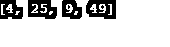
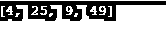
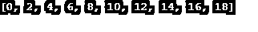
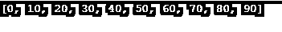
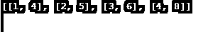
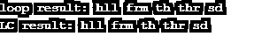
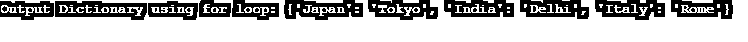

# 列表理解 Python

> 原文：<https://www.educba.com/list-comprehensions-python/>

## 列表理解 Python 简介

下面的文章提供了列表理解 Python 的概要。理解是构建代码块的一种方式，用于定义、调用和执行对一系列值/数据元素的操作。python 是一种简单的面向对象编程语言，广泛用于基于 web 的应用程序开发过程，它提供了多种列表理解方法。其中一些是列表、集合、字典等。python 中的 list comprehension 函数有三种不同类型的组件:iterables、用于表示 iterables 成员的迭代器变量，以及可选的可以忽略的输出表达式。

列表理解有 3 个组成部分，它们是:

<small>网页开发、编程语言、软件测试&其他</small>

*   输出表达式:这是可选的，可以忽略。
*   可迭代的
*   代表 iterable 成员的变量称为 Iterator 变量。

### 语法和示例

在 Python 中，我们可以使用以下语法创建列表理解:

`list_variable = [x for x in iterable]`

正如你在列表理解中看到的，一个列表被分配给一个变量。

我们来看一个例子；首先，我们可以考虑一种使用循环来寻找数字平方的方法。

**代码:**

`numbers = [2, 5, 3, 7] square = [] for n in numbers:
square.append(n**2)
print(square)`

**输出:**

让我们考虑做同样的事情，使用列表理解而不是循环。

**代码:**

`numbers = [2, 5, 3, 7] square = [n**2 for n in numbers] print(square)`

**输出:**

在这里，您可以看到方括号“[ ]”用于表示其中表达式的输出是一个列表。

### 列表理解和 Lambda 函数

如果你记住列表理解不是创建列表的唯一方式，这将会有所帮助；Python 有许多可以使用的内置函数和 lambda 函数，例如:

**代码:**

`letters = list(map(lambda x: x, 'human'))
print(letters)`

**输出:**

虽然这在很多情况下都是可行的，但是列表理解对于不是代码程序员的人来说可读性更好，也更容易理解。

### 在列表理解中添加条件

你可以在列表理解中自由使用任何需要的条件来修改现有的列表。

让我们来看一个使用条件句的例子:

**代码:**

`numbers_list = [ x for x in range(20) if x % 2 == 0] print(numbers_list)`

**输出:**

这是另一个例子:

**代码:**

`numbers_list = [x for x in range(100) if x % 2 == 0 if x % 5 == 0] print(numbers_list)`

**输出:**

### 在列表理解中使用嵌套循环

需要时，我们可以在列表理解中使用[嵌套循环](https://www.educba.com/python-nested-loops/)；让我们看看如何通过寻找矩阵的转置来使用嵌套循环。

**代码:**

`transposedmatrix = [] matrix = [[1, 2, 3, 4], [4, 5, 6, 8]] for i in range(len(matrix [0])):
transposedmatrix_row = [] for row in matrix:
transposedmatrix_row.append(row[i])
transposedmatrix.append(transposedmatrix_row)
print(transposedmatrix)`

**输出:**

### 例子

以下是列表理解 Python 的示例:

#### 例 1–从给定的句子中去掉元音

**代码:**

`def eg_for(sentence):
vowels = 'aeiou'
filter_list = [] for l in sentence:
if l not in vowels:
filter_list.append(l)
return ''.join(filter_list)
def eg_lc(sentence):
vowels = 'aeiou'
return ''.join([ X for X in sentence if X not in vowels])
Now, let’s define the matrix, run the program, and then check out the results:
sentence = "hello from the other side."
print ("loop result: " + eg_for(sentence))
print ("LC result: " + eg_lc(sentence))`

**输出:**

#### 示例 2–将国家名称与其首都对应起来

**代码:**

`country  = [ 'India', 'Italy', 'Japan' ] capital = [ 'Delhi' , 'Rome', 'Tokyo' ] output_dict = {}
# Using loop for constructing dictionary
for (key, value) in zip(country  , capital):
output_dict[key] = value
print("Output Dictionary using for loop:", output_dict)`

**输出:**

### 优势

有人可能会想，如果循环可以用来做列表理解所能做的几乎所有事情，那么为什么首先要使用它们呢？答案在于速度，完成任务所需的时间和所需的内存量。当列表理解完成后，我们已经将 3 行代码缩减为一行。完成后，代码比面对列表理解要快得多。Python 首先为列表分配内存，然后在其中添加元素。此外，这无疑是一种更优雅、更复杂的基于已有列表创建列表的方式。

### 结论

现在我们已经有了列表理解的经验，很容易理解这些如何允许我们将一个列表转换成一个新的列表。它们有一个简单的语法来限制创建一个列表所需的工作量。考虑到列表理解的语法和结构基本上就像一个集合生成器符号，这些很快成为程序员的第二天性，并确保一旦代码被交给其他人来维护和扩展，它将很容易理解和使用。

### 推荐文章

这是一个列表理解 Python 的指南。这里我们讨论了列表理解和 lambda 函数以及代码实现和输出。您也可以浏览我们推荐的其他文章，了解更多信息——

1.  [Python 中的析构函数](https://www.educba.com/destructor-in-python/)
2.  [Python 中的 Do While 循环](https://www.educba.com/do-while-loop-in-python/)
3.  [Python 中的字符串数组](https://www.educba.com/string-array-in-python/)
4.  [Python 列表索引](https://www.educba.com/python-list-index/)

