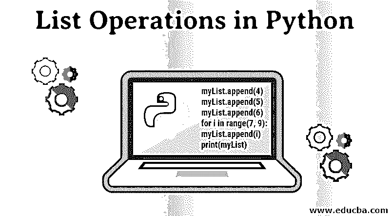
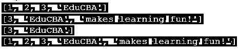
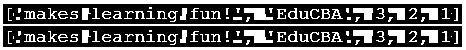
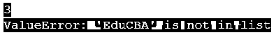

# Python 中的列表操作

> 原文：<https://www.educba.com/list-operations-in-python/>




## Python 中的列表操作简介

列表是一种数据结构化方法，允许以从 0 开始的索引顺序存储整数或字符。列表操作是可以对列表数据结构中的数据执行的操作。Python 编程中使用的一些基本列表操作有 extend()、insert()、append()、remove()、pop()、slice()、reverse()、min() & max()、concatenate()、count()、multiply()、sort()、index()、clear()等。

myList = [1，2，3，' EduCBA '，'让学习变得有趣！']

### Python 中的列表操作

下面给出了 Python 中一些最广泛使用的列表操作:

<small>网页开发、编程语言、软件测试&其他</small>

#### 1.追加()

append()方法用于在列表末尾添加元素。此方法一次只能添加一个元素。要添加多个元素，可以在循环中使用 append()方法。

**代码:**

```
myList.append(4)
myList.append(5)
myList.append(6)
for i in range(7, 9):
    myList.append(i)
print(myList)
```

**输出:**


#### 2.扩展()

extend()方法用于在列表末尾添加多个元素。虽然它可以添加多个元素，但与 append()不同，它像 append() *一样将它们添加到列表的末尾。*

**代码:**

```
myList.extend([4, 5, 6])
for i in range(7, 9):
    myList.append(i)
print(myList)
```

**输出:**


#### 3.插入()

insert()方法可以在列表中的给定位置添加元素。因此，与 append()不同，它可以在任何位置添加元素，但与 append()一样，它一次只能添加一个元素。这个方法有两个参数。第一个参数指定位置，第二个参数指定要插入的元素。

**代码:**

```
myList.insert(3, 4)
myList.insert(4, 5)
myList.insert(5, 6)
print(myList)
```

**输出:**


#### 4.移除()

remove()方法用于从列表中移除一个元素。在同一元素多次出现的情况下，仅删除第一次出现的元素。

**代码:**

```
myList.remove('makes learning fun!')
myList.insert(4, 'makes')
myList.insert(5, 'learning')
myList.insert(6, 'so much fun!')
print(myList)
```

**输出:**


#### 5.流行()

pop()方法可以从列表中的任何位置移除元素。提供给此方法的参数是要移除的元素的索引。

**代码:**

```
myList.pop(4)
myList.insert(4, 'makes')
myList.insert(5, 'learning')
myList.insert(6, 'so much fun!')
print(myList)
```

**输出:**


#### 6.薄片

切片操作用于打印列表的一部分。切片操作返回特定范围的元素。它不会修改原始列表。

**代码:**

```
print(myList[:4])  # prints from beginning to end index
print(myList[2:])  # prints from start index to end of list
print(myList[2:4]) # prints from start index to end index
print(myList[:])   # prints from beginning to end of list
```

**输出:**




#### 7.反向()

reverse()操作用于反转列表中的元素。该方法修改原始列表。为了在不修改原始列表的情况下反转列表，我们使用带有负索引的 slice 操作。指定负索引会从列表的后端到前端迭代列表。

**代码:**

```
print(myList[::-1])  # does not modify the original list
myList.reverse()     # modifies the original list
print(myList)
```

**输出:**




#### 8.len()

len()方法返回列表的长度，即列表中元素的数量。

**代码:**

```
print(len(myList))
```

**输出:**


#### 9.最小()&最大()

min()方法返回列表中的最小值。max()方法返回列表中的最大值。这两种方法都只接受同类列表，即具有相似类型元素的列表。

**代码:**

```
print(min(myList))
```

**输出:**


**代码:**

```
print(min([1, 2, 3]))
print(max([1, 2, 3]))
```

**输出:**


#### 10.计数()

函数 count()返回给定元素在列表中出现的次数。

**代码:**

```
print(myList.count(3))
```

**输出:**


#### 11.连锁的

concatenate 操作用于合并两个列表并返回一个列表。+符号用于执行连接。请注意，不会修改单个列表，而是返回一个新的组合列表。

**代码:**

```
yourList = [4, 5, 'Python', 'is fun!']
print(myList+yourList)
```

**输出:**


#### 12.多样地

Python 还允许将列表*乘以 n* 倍。结果列表是迭代了 n 次*的原始列表。*

**代码:**

```
print(myList*2)
```

**输出:**


#### 13.索引()

index()方法返回给定元素第一次出现的位置。它有两个可选参数——开始索引和结束索引。这些参数定义了列表中搜索区域的开始和结束位置。当提供时，仅在由开始和结束索引限定的子列表中搜索元素。如果未提供，则在整个列表中搜索该元素。

**代码:**

```
print(myList.index('EduCBA'))            # searches in the whole list
print(myList.index('EduCBA', 0, 2))     # searches from 0<sup>th</sup> to 2<sup>nd</sup> position
```

**输出:**




#### 14.排序()

sort 方法按升序对列表进行排序。该操作只能在同类列表上执行，即具有相似类型元素的列表。

**代码:**

```
yourList = [4, 2, 6, 5, 0, 1]
yourList.sort()
print(yourList)
```

**输出:**


#### 15.清除()

这个函数删除列表中的所有元素并清空它们。

**代码:**

```
myList.sort()
print(myList)
```

**输出:**


### 结论

列表操作对于学习如何用最少的代码行执行一项任务是至关重要的。这只是对列表操作的基本介绍，涵盖了大多数方法。建议多尝试，发挥创造力，进一步发掘列表的潜力。

### 推荐文章

这是一个在 Python 中列出操作的指南。这里我们用代码和输出来讨论 python 中的简介和最广泛使用的列表操作。您也可以浏览我们推荐的其他文章，了解更多信息——

1.  [Python 的优势](https://www.educba.com/advantages-of-python/)
2.  [Python 中的星形模式](https://www.educba.com/star-patterns-in-python/)
3.  [Python 中的布尔运算符](https://www.educba.com/boolean-operators-in-python/)
4.  [Python 中的回文](https://www.educba.com/palindrome-in-python/)


