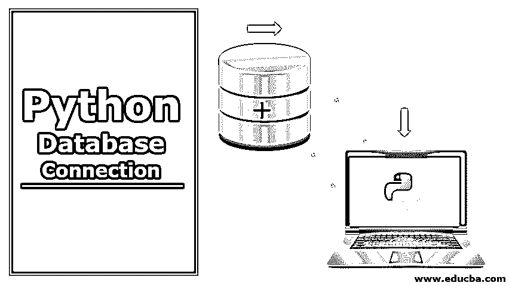

# Python 数据库连接

> 原文：<https://www.educba.com/python-database-connection/>




## Python 数据库编程概述

Python 编程语言通常在所有主要的数据库系统中访问和实现，如 Oracle、Teradata、MySQL、PostgreSQL 等。所有这些数据库都可以通过它们各自 Python 应用程序接口(API)来访问，例如 MySQL 的 MySQLdb、Pydb2 的 DB2、oracle 的 dc_oracle2 & cx_oracle 和 Postgresql 的 psycopg，PyGresQL & pyPgSQL’。python 中一些常用的数据库连接对象是。游标()，。commit()，。回滚()，。close()等。这些对象中的每一个都有其他函数对象，例如。cursor()对象是。execute()，。executemany()，。fetchone()，。fetchmany()，。fetchall()和 cursor.next()。

数据库是预先安排好的信息的集合，可以毫不费力地被使用、管理、修改。DB API 的关键特性是，

<small>网页开发、编程语言、软件测试&其他</small>

*   创建数据库连接
*   处理 SQL 语句和存储过程
*   可以关闭连接

### Python 对数据库编程的好处

*   与其他语言相比， [python 编程](https://www.educba.com/what-is-python/)更快更容易。
*   在 python 中，像打开和关闭数据库连接这样的强制操作是由 python 本身执行的。对于所有其他编程语言，这些类型的操作是由开发人员专门执行的。
*   python 数据库 API 支持广泛的数据库设置，因此它使得连接数据库的任务变得更加容易。

**Python 数据库 API:**

| **数据库** | **Python DB API 的** |
| 关系型数据库 | MySQLdb |
| 一种数据库系统 | psycopg、PyGresQL 和 pyPgSQL |
| 神谕 | dc_oracle2 和 cx_oracle |
| DB2 | Pydb2 |

### 数据库连接的关键步骤

从 python 的角度来看，使用 python 连接数据库的过程有四个主要步骤。它们如下:

1.创建连接对象

4.创建的连接的终止

2.为了适应读写过程，声明一个游标

3.数据库交互

| **连接对象** |
| 名字 | 描述 |
| 。关闭() | 关闭与数据库建立的连接 |
| 。提交() | 提交数据库的挂起事务 |
| 。回滚() | 此事务同意将回滚到未决事务的开始 |
| 。光标() | 创建一个表示光标的对象 |

### Python 光标对象

以下是 python 光标对象的列表:

#### 1) .执行()

执行该函数中提到的 Sequel 语句。

**语法**

`execute(sql, [parameters])`

**例子**

```
import sqlite3
con = sqlite3.connect("UserDB")
cur = con.cursor()
cur.execute(" select * from emp ")
print cur.fetchone() 
```

#### 2) .executemany()

对于序列中列出的所有参数，执行给定的 SQL 语句。

**语法**

`executemany(sql, [parameters])`

**例题**

```
import sqlite3
def aplphabet_generator():
    import string
    for D in string.letters[:26]:
        yield (D,)
con = sqlite3.connect(":memory:")
cur = con.cursor()
cur.execute(" create table characters( Aplphabet_Column ) ")
cur.executemany("insert into characters( Aplhabet_Column ) values (?)", char_generator())
cur.execute(" select Aplhabet_Column from characters ")
print cur.fetchall() 
```

#### 3) .费特乔内()

获取查询输出中的一行。

**例子**

```
import MySQLdb as my
try:
    db = my.connect(host="129.0.0.1",
                    user="admin",
                    passwd="admin",
                    db="emp"
                    )
    cursor = db.cursor()
    sql = "select * from dept#1 where id < 10"
    number_of_rows = cursor.execute(sql)
    while True:
        row = cursor.fetchone()
        if row == None:
            break
        print(row)
    db.close() 
```

#### 4) .费奇曼尼()

获取查询结果的一组特定行。参数指定每次调用的行数。被提取的行数很大程度上取决于游标元素所涉及的数组大小。因此，根据给定参数中指示的行数，必须尝试提取相同数量的行。如果由于可用的特定行而无法实现这一点，则可能会返回较少的行。

**例子**

```
import MySQLdb as my
try:
    db = my.connect(host="128.0.0.10",
                    user="admin",
                    passwd="admin",
                    db="emp"
                   )
    cursor = db.cursor()
    sql = "select * from dept_#1 where id < 10"
    number_of_rows = cursor.execute(sql)
    print(cursor.fetchmany(2))  # 2 row fetched               db.close() 
```

#### 5) .fetchall()

获取查询的所有行。这些行按顺序返回。在这里，提取的性能有时会受到游标数组提取的影响。当游标数组非常大时，提取行所花费的时间也会相当长。

**例子**

```
import MySQLdb as my
try:
    db = my.connect(host="128.0.0.10",
                    user="admin",
                    passwd="admin",
                    db="emp"
                   )
    cursor = db.cursor()
    sql = "select * from dept_#1 where id < 10"
    number_of_rows = cursor.execute(sql)
    print(cursor.fetchall())                  db.close() 
```

#### 6) Cursor.scroll(value [，mode='relative' ])

根据提到的模式值滚动光标。如果模式是相对的，那么提到的值被认为是偏移；如果模式是绝对的，那么提到的值就是目标位置。

1.  **Cursor.next():** 从当前执行的 sequel 语句位置返回下一行。
2.  **光标。–ITER-():****显示适合迭代协议的光标。**
***   **cursor . lastrowid():****T3】这里返回最后修改的行的行 id。****

 **### Python 数据库操作

任何数据库的关键操作是插入、删除、更新和选择。所有这些 CRUD 操作也可以通过 python 来实现。在 python 中，像打开和关闭数据库连接这样的强制操作是由 python 本身执行的。对于所有其他编程语言，这些类型的操作是由开发人员专门执行的。下面的例子描述了这些操作的应用。

**例子**

```
import sqlite3
db=sqlite3.connect('test.db')
qry1="insert into student (name, age, marks) values(?,?,?);"
qry2="update student set age=? where name=?;"
qry3="SELECT * from student;"
qry4="DELETE from student where name=?;"
students=[('Amarh', 17, 20), ('Deepika', 45, 87)]
try:
    cur=db.cursor()
    cur.executemany(qry1, students)
    cur.execute(qry2, (19,'Deepak'))
    db.commit()
    cur.execute(qry3)
    print(" record updated!! ")
    cur.execute(qry4, ('Bill',))
    db.commit()
    print(" record deleted!! ")
except:
    print(" error found")
    db.rollback()
db.close() 
```

### Python Db 异常层次结构

*   标准误差
*   警告
*   错误
*   接口错误
*   数据库错误
*   数据错误
*   操作错误
*   完整性误差
*   内部错误
*   编程错误
*   NotSupportedError

### 面向 Python 数据库的构造函数

*   **Date(年、月、日):**构建一个包含日期值的对象
*   **时间(小时、分钟、秒):** 构建一个带有时间值的对象
*   **Timestamp(年、月、日、小时、分钟、秒):**构建一个包含时间戳值的对象
*   **Binary(string):** 构造一个能够保存二进制值的 python 对象
*   **字符串类型:**描述数据库中所有字符串类型的列
*   **数字类型:**描述所有数字类型的列
*   **日期时间** **类型** **:** 表示数据库中所有日期和时间类型的列
*   **ROWID 类型** **:** 到达数据库中的行 ID 列

### 结论–Python 数据库连接

Python 无疑是面向数据库编程中最灵活的编程接口之一。python DB-API 的分类集合使得与 DB 的通信任务成为一个高效的过程，而与任何数据库无关。

### 推荐文章

这是一个 Python 数据库连接的指南。在这里，我们讨论数据库连接的关键步骤以及 Python 对于数据库编程的好处。您也可以看看以下文章，了解更多信息–

1.  [Python 中的阶乘](https://www.educba.com/factorial-in-python/)
2.  [Python 文件操作](https://www.educba.com/python-file-operations/)
3.  [Python 集](https://www.educba.com/python-sets/)
4.  [Python 特性](https://www.educba.com/python-features/)


**