# 用 Python 发送邮件

> 原文：<https://www.educba.com/send-mail-in-python/>

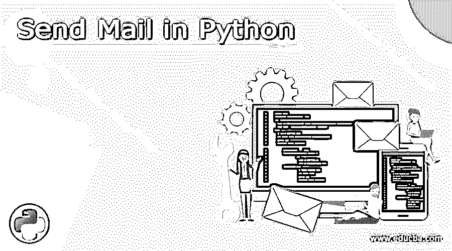


## 用 Python 发送邮件简介

我们可以通过使用简单邮件传输协议(SMTP)非常容易地在 python 中发送邮件。Python 提供了一个名为“smptlib”的原生库。smptlib 模块实际上定义了一个可用于发送邮件的客户端会话对象。

我们只需从 smtplib 类中调用 SMTP 方法。

<small>网页开发、编程语言、软件测试&其他</small>

**代码:**

```
Obj = Smtplib.SMTP([host[,port[,local_hostname]]])
```

**参数:**

*   **主机:**运行 SMTP 服务器的主机。这是一个可选参数。
*   **端口:**通常如果指定了主机，我们需要指定一个端口。
*   **local_hostname:** 如果 SMTP 服务器在本地运行，我们应该将这个值作为 localhost 传递。

### 用 Python 发送邮件的方法

发送邮件有两种方式:

1.我们可以通过以下命令设置本地 SMTP 调试服务器:

**代码:**

```
Python –m Smtp –c DebuggingServer –n localhost:1025
```

当电子邮件通过此服务器发送时，该电子邮件将被丢弃并显示在终端中。

在 mail 中发送纯文本:

当通过 python 发送邮件时，我们应该确保连接是加密的，这确保了登录凭证和消息被安全地传输。

我们可以通过两种方式建立连接:

*   使用 SMTP_SSL()启动连接
*   正在启动使用加密的连接。starttls()

通过以上方式，Gmail 将使用 TLS 加密电子邮件，这比 SSL 更好。

使用 SMTP_SSL()的连接

2.我们可以登录 Gmail 帐户，然后发送邮件。

为此，我们需要遵循一些步骤:

**第一步:**登录您的 google 帐户。

**第二步:**点击此链接【https://myaccount.google.com/intro/security T2】

**步骤 3:** 禁用登录 google 的两步验证。

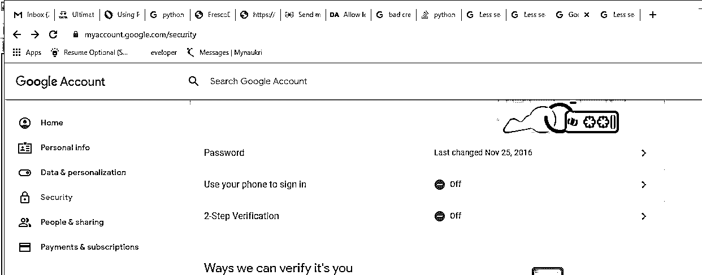


**第四步:**关闭不太安全的 app 访问。

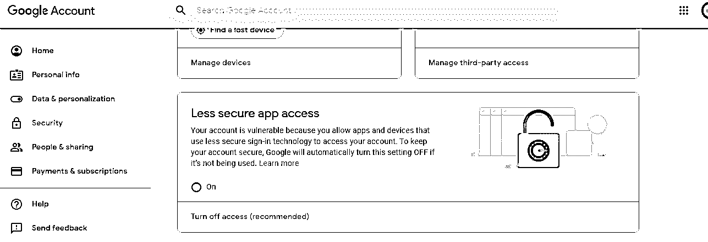


下面是示例代码，我们可以通过它来检查上述设置是否有助于从 gmail 帐户向他人发送邮件。

**代码:**

```
#!/usr/bin/python
# Python code for sending mail from your Gmail account
import smtplib
# Creating SMTP Client Session
smtpobj = smtplib.SMTP('smtp.gmail.com', 587)
# start TLS for security which makes the connection more secure
smtpobj.starttls()
senderemail_id="sendermail@gmail.com"
senderemail_id_password="######"
receiveremail_id="receivermail@gmail.com"
# Authentication for signing to gmail account
smtpobj.login(senderemail_id, senderemail_id_password)
# message to be sent
message = "Hey this is the test code for sending email from gmail account to another account"
# sending the mail - passing 3 arguments i.e sender address, receiver address and the message
smtpobj.sendmail(senderemail_id,receiveremail_id, message)
# Hereby terminate the session
smtpobj.quit()
print "mail send - Using simple text message"
```

在上面的代码中，我们执行了以下步骤:

*   smtplib 已导入。
*   SMTP 客户端会话被创建为“smtpobj”，用于捆绑 SMTP 连接。此外，对于 Gmail，使用端口 587。
*   出于安全考虑，SMTP 连接被置于 TLS 模式，即启用所有命令的加密。如果给出了无效的电子邮件 id 和密码，编译器将显示身份验证错误。
*   该消息作为第三个参数传递给一个名为 send mail 的方法。带有发件人和收件人的电子邮件地址
*   注意，不要打乱上面代码中所示的参数顺序。
*   所有任务完成后，我们将退出 SMTP 会话

**输出:**

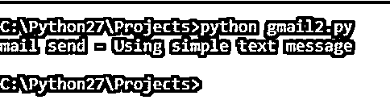


其中 gmail2.py 为 python 代码名称，包含上述内容。

**Note: **After checking 2-step verification and allow less secure app access. Make sure you give some time for the changes to reflect and then run the code.

否则，您可能会遇到以下错误:

**输出:**

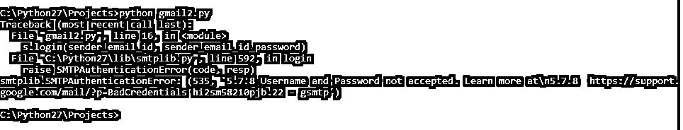


当我们通过电子邮件发送文本消息时，内容被视为简单文本。但是我们也可以在文本中包含 HTML 标签。

**举例:**

**代码:**

```
#!/usr/bin/python
# Python code for sending mail from your Gmail account
import smtplib
# Creating SMTP Client Session
smtpobj = smtplib.SMTP('smtp.gmail.com', 587)
# start TLS for security which makes the connection more secure
smtpobj.starttls()
senderemail_id="sendermail@gmail.com"
senderemail_id_password="######"
receiveremail_id="receivermail@gmail.com"
# Authentication for signing to Gmail account
smtpobj.login(senderemail_id, senderemail_id_password)
# message to be sent
message = """From: From Someone <from@sendermail@gmail.com>
To: To Person <to@receivermail@gmail.com>
MIME-Version: 1.0
Content-type: text/html
Subject: SMTP HTML e-mail test
I have send you an test e-mail message in HTML format
<b>Sample HTML message</b>
<h1>headline</h1>
"""
# sending the mail - passing 3 arguments i.e sender address, receiver address and the message
smtpobj.sendmail(senderemail_id,receiveremail_id, message)
# Hereby terminate the session
smtpobj.quit()
print " mail send - Using HTML tags inside the message body"
```

在上面的代码中，我们也用 HTML 标签定义了消息。你可以在下面的截图中看到，我们可能会收到这样的邮件。

**输出:**

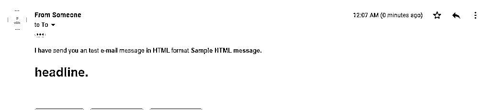


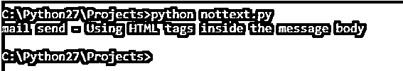


### 发送带附件的电子邮件

发送电子邮件有两种方式:

1.我们可以发送内容类型标题为 multipart/mixed 的电子邮件。然后，我们需要以二进制模式读取要附加的文件，之后必须对文件进行编码。我们可以在发送邮件之前使用 base64 编码。

下面是仅使用 3 个库 smtpblib、base64 和 os 发送邮件的示例。

首先，我们需要创建一个文本文件，我们将把它作为附件发送到邮件中。我们需要读取文本文件，然后使用 base64 进行编码；现在将发送编码文件。

在创建要发送的消息时，我们将消息分为 3 个部分:

*   这里我们提到的收件人和发件人地址，主题也是多用途互联网邮件扩展(mime)版本。
*   接下来，我们定义对消息的操作。
*   定义附件。

然后将所有部分连接成一个“消息”。

然后，我们按照相同的步骤使用 SMTP 发送邮件。

**代码:**

```
#!/usr/bin/python
import smtplib
import base64
import os
os.chdir(r'C:/Python27/Projects')
fileName= 'abc.txt'
#os.path.join(r'C:/Python27/Projects/','abc.txt')
# We are reading the file abc.txt in binary mode
fs = open('C:/Python27/Projects/abc.txt',"rb")
fsContent=fs.read()
# Encoding the file before sending
fsEncoded = base64.b64encode(fsContent)
senderemail_id=senderemail@gmail.com"
senderemail_id_password=”#########"
receiveremail_id="receivermail@gmail.com"
marker = "AUNIQUEMARKER"
body= """I am sending you a test mail including attachment"""
# Defining header for the message
p1 = """From: From Someone <sendermail@gmail.com>
To: To Person <receivermail@gmail.com>
Subject: Sending an Attachment
MIME-Version: 1.0
Content-Type: multipart/mixed; boundary=%s
--%s""" % (marker, marker)
# Defining action for message
p2 = """Content-Type: text/plain
Content-Transfer-Encoding:8bit
%s
--%s""" % (body,marker)
# Defining the attachment part
p3 = """Content-Type: multipart/mixed; name=\"%s\"
Content-Transfer-Encoding:base64
Content-Disposition: attachment; fileName=%s
%s
--%s--""" %(fileName, fileName, fsEncoded, marker)
message = p1+p2+p3
# Creating SMTP Client Session
smtpobj = smtplib.SMTP('smtp.gmail.com', 587)
# start TLS for security which makes connection more secure
smtpobj.starttls()
# Authentication for signing to gmail account
smtpobj.login(senderemail_id, senderemail_id_password)
# sending the mail - passing 3 arguments i.e sender address,receiver address and the message
smtpobj.sendmail(senderemail_id,receiveremail_id, message)
# Hereby terminate the session
smtpobj.quit()
print "mail send - Using simple message including encoding"
```

**输出:**

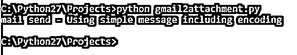


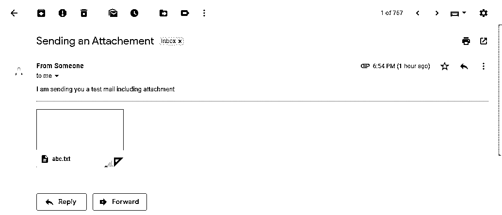


2.另一种方法是在 python 代码中使用以下导入。它们是 python 中的本地库。

**代码:**

```
from email.mime.base import MIMEBase
from email.mime.multipart import MIMEMultipart
from email.mime.text import MIMEText
from email import encoders
```

下面是使用 python 本地库发送邮件的代码。

**代码:**

```
# Libraries to be imported
import smtplib
from email.mime.multipart import MIMEMultipart
from email.mime.text import MIMEText
from email.mime.base import MIMEBase
from email import encoders
fromaddr = "senderemail@gmail.com"
toaddr = "receiveremail@gmail.com"
fromaddrpassword = "#######"
# Instance of MIMEMultipart
msg = MIMEMultipart()
msg['From'] = fromaddr
msg['To'] = toaddr
msg['Subject'] = " SUBJECT OF THE MAIL"
body = " Main body of the mail"
msg.attach(MIMEText(body,'plain'))
```

**输出:**

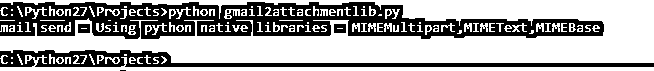


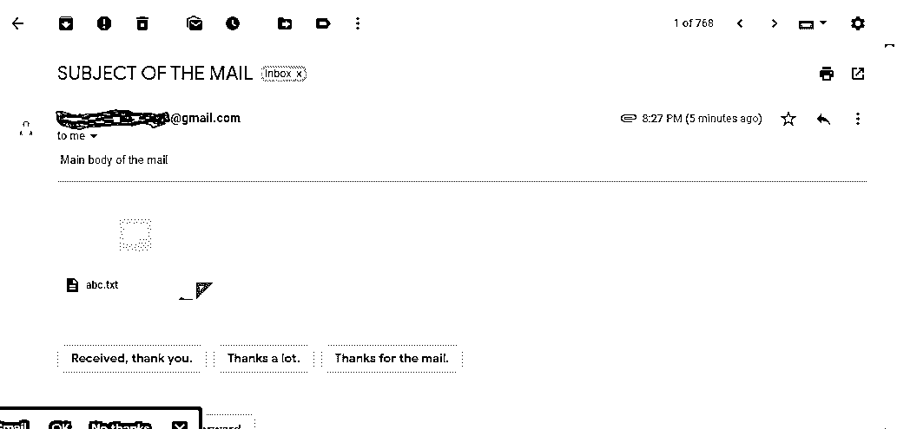


### 结论

上面提到了所有用于发送邮件的方法，包括简单文本、带有 HTML 标签的文本和电子邮件附件。如今，发送邮件已经使用通知或警报的应用程序运行，并用于正常的电子邮件目的。Python 通过引入上述库使之变得简单。

### 推荐文章

这是一个用 Python 发送邮件的指南。这里我们讨论在邮件中发送纯文本和发送带附件的邮件的两种方式。您也可以浏览我们推荐的其他文章，了解更多信息——

1.  [Python 中的 If 语句](https://www.educba.com/if-statement-in-python/)
2.  [Python 列表索引](https://www.educba.com/python-list-index/)
3.  [Python 空列表](https://www.educba.com/python-empty-list/)
4.  [Python 迭代器字典](https://www.educba.com/python-iterator-dictionary/)


