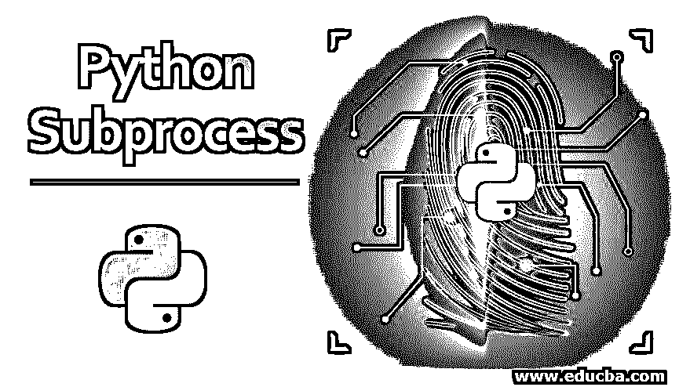
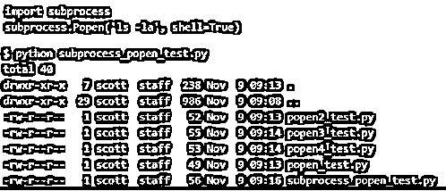
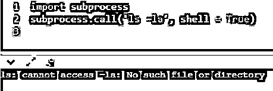
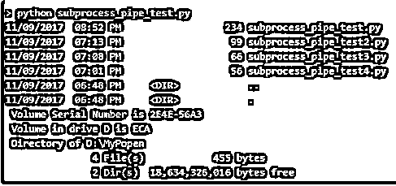

# Python 子流程

> 原文：<https://www.educba.com/python-subprocess/>




## Python 子流程简介

该过程被定义为运行的程序；每个进程都有自己不同的状态，如内存、打开文件列表等。我们知道，每个进程一次执行一条语句。在 Python 版本 2 和 3 中，有几种不同的方法可以在外部运行流程，以便与操作系统进行交互。早期版本有 os 模块来完成这项工作，但现在在最新版本中，这些 os 模块被子进程模块所取代，以从 Python 代码中调用外部命令。子进程模块是独立的，因为它们在私有系统状态下运行完全独立的实体，并与原始进程同时执行主线程。

### 使用语法和示例处理 Python 子流程

在 Python 的最新版本中，因为它支持子进程模块，而不是旧的操作系统模块。创建子流程的流程与其他事物一起工作，其中子流程执行其工作，即使该流程正在与其他事物一起工作。子进程模块用于通过 Python 代码运行新程序，方法是创建一个新进程来帮助获得输入或输出或错误管道，并获得各种命令的退出代码。

<small>网页开发、编程语言、软件测试&其他</small>

该子进程提供了一个比 os.system()、os.spawn()、os.popen()等旧操作系统模块更高级的接口。这些都被替换为一个新的 spawn 进程，连接到它们的输入或输出或错误管道，并获得它们的返回代码。

**语法:**

```
subprocess.call (args, *, stdin=None, stdout=None, stderr=None, shell=False)
```

*   **args:** 当您希望命令被执行时使用。
*   **stdin:** 携带要传递的标准输入的值。
*   **stdout:** 携带 output 的值，由标准输出流获得。
*   **stderr:** 它携带从标准错误流中获得的错误。
*   **shell:** 返回一个布尔值。执行命令时为真。

因此，您可以使用 args 参数运行命令，等待命令执行完毕，然后返回 returncode 属性；如果为零，则返回函数；否则，它会引发 CalledProcessError。

#### 示例#1

我们想在 Python 脚本中执行 echo 命令，[一个 UNIX 命令](https://www.educba.com/unix-commands/)，但是这会给我们一个错误，说这是一个语法错误，因为 echo 不是 Python 的内置命令。Echo 是打印值或语句的 UNIX 命令，而在 Python 中，我们将 print 作为打印值或语句的命令。

因此，要在 Python 中运行这些 UNIX 命令，我们必须创建一个可以使用子流程模块完成的新流程。这是以前使用 os.system()完成的，但这仅适用于旧版本；相反，我们可以使用 subprocess.call()，它将一个程序作为子进程执行，在这个子进程中我们无法完成我们的需求。所以我们需要在高级情况下使用 open，因为 popen 是一个类，而不仅仅是一个方法。

如下图所示:

```
import subprocess
subprocess.Popen('ls –la', shell = True)
```

上述程序也可以使用 subprocess.call()，但这将程序作为子进程执行，而子进程由操作系统作为单独的进程执行，因此根据 Python 文档，建议使用 popen 类。它可以写成

```
import subprocess
subprocess.call('ls –la', shell =True)
```

在上面的例子中，两个程序的 shell 参数都默认为‘false ’,但是我们想要执行命令，那么我们必须将 shell 参数指定为‘True’。




如果没有导入子流程，那么如前所述，在 Python 代码中不能在外部执行任何命令，因此要做到这一点，我们需要使用子流程模块。为此，我们需要首先导入子流程；否则，您将得到错误消息，指出没有这样的文件可用，这意味着 ls 命令不能像它的 UNIX 命令一样在 Python 中执行。如下图所示。




在子进程文档中，您会得到一个 popen 类方法的列表，其中一些是 popen.wait()，它将等待子进程终止，popen，kill()终止子进程，popen.terminate()停止子进程，popen.communicate()这是帮助与进程交互的最常用方法。让我们考虑一下 communicate()方法，它允许分别从标准输入和标准输出中读取数据和向标准输入和标准输出发送数据。

#### 实施例 2

让我们举一个例子来执行像 dir 和 sort 这样的 windows 命令。所以有两个命令:要执行这些命令，我们必须创建两个子进程，因为我们希望目录以相反的顺序排序，即我们在排序调用中使用的' \R '选项。在下面的程序中，我们使用 p1 的 stdout 作为 p2 的输入，因此我们在 p1 的 stdout 中声明了管道。因此，我们必须关闭 p1，因为我们已经使用它作为 p2 的输入。和往常一样，使用 communicate()方法完成通信。

```
import subprocess
p1 = subprocess.Popen(‘dir’, shell =True, stdin = None, stdout = subprocess.PIPE, stderr = subprocess.PIPE)
p2 = subprocess.Popen('sort /R', shell=True, stdin=p1.stdout)
p1.stdout.close()
out, err = p2.communicate()
```

**输出:**




上面的例子有两个子过程 dir 和 sort 命令，它们将通过上面给出的 Python 脚本执行，dir 命令过程是 sort 命令过程的输入，以逆序对获得的目录进行排序。

### 结论

在 Python 中，第 2 版和第 3 版通过 Python 代码从外部调用命令的方式是不同的。在 Python 2 中，我们将操作系统(os)方法作为通过 Python 脚本调用其他语言的子进程的更好方式。但是，在当前版本中，它使用子流程模块，该模块有几种方法。Popen 是两个版本中使用最多的类之一，但在最新版本中，它又有了许多其他方法，使它非常高效。子进程也有一个 call()，check_stdout()，check_stdin()也是子进程的一些方法，用来代替 Popen 类的方法 communicate()。

### 推荐文章

这是 Python 子过程的指南。在这里，我们将讨论 Python 子流程的基本概念、工作原理以及相应的语法和示例。您也可以看看以下文章，了解更多信息–

1.  [Python 全局变量](https://www.educba.com/python-global-variable/)
2.  [Python 中的迭代器](https://www.educba.com/iterators-in-python/)
3.  [Python 主方法](https://www.educba.com/python-main-method/)
4.  [Python 线程定时器](https://www.educba.com/python-threading-timer/)


