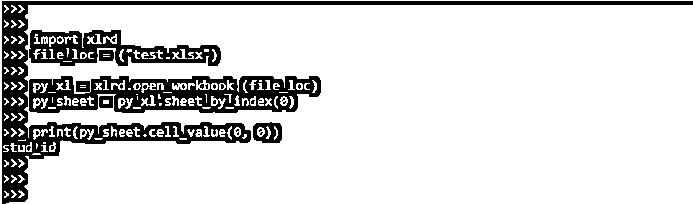
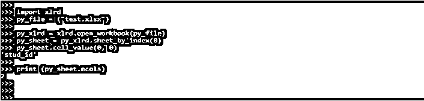

# Python xlrd

> 原文：<https://www.educba.com/python-xlrd/>


## Python xlrd 的定义

Python xlrd 使用 xlrd 模块从电子表格中检索数据。它用于读取、写入或修改数据。此外，用户可能需要根据特定标准导航工作表，以及修改一些行和列并执行其他任务。该模块用于从工作表中提取数据。它主要用于读写和从工作表中提取数据。

### Python xlrd 是什么？

*   此外，用户可能需要浏览多个工作表，并根据特定标准提取数据。
*   这些属性可用于确定工作表中的行。默认情况下，所有行都以相同的大小填充，但如果我们想跳过末尾的空列，请在调用 open workbook 函数时使用 ragged rows 参数。
*   我们需要使用 pip 命令安装 xlrd 包。如果不安装 xlrd 包，我们就不能在代码中使用它。它在 python 中非常有用和重要。

### 如何使用 Python xlrd？

我们需要使用 pip 命令安装 xlrd 包。在我们的系统中安装 python 包时，默认情况下不会出现 Xlrd 模块。

<small>网页开发、编程语言、软件测试&其他</small>

1.第一步，我们使用 pip 命令安装 xlrd 模块。我们可以在任何安装了 python 的操作系统中安装 xlrd 模块。在下面的例子中，我们在 UNIX 系统上安装 xlrd 模块。

**代码:**

```
pip install xlrd  
```

**输出:**


2.安装完所有模块后，我们使用 python3 命令打开 python shell。

**代码:**

```
python3
```

**输出:**


3.在这一步登录到 python shell 之后，我们检查 xlrd 包是否安装在我们的系统中。要在我们的程序中使用 xlrd 模块，我们需要通过使用 import 关键字在代码中导入相同的模块。如果不导入 xlrd 模块，我们就不能在代码中使用它。

**代码:**

```
import xlrd
print (xlrd)
```

**输出:**


4.在这一步检查了 xlrd 包的安装之后，我们将创建电子表格文件名 test.xlsx。


5.在这一步创建电子表格后，我们从表格中提取特定的单元格，如下所示。为了提取单元，我们首先使用 import 关键字导入 xlrd 模块。在下一步中导入 xlrd 模块后，我们将使用 open workbook 方法打开电子表格文件。

打开工作表后，我们根据电子表格索引提取单元格，我们检索 0 索引单元格如下。

**代码:**

```
import xlrd
file_loc = ("test.xlsx")
py_xl = xlrd.open_workbook (file_loc)
py_sheet = py_xl.sheet_by_index (0)
print (py_sheet.cell_value (0, 0))
```

**输出:**




### 如何在 Python 中安装 XLRD？

我们正在使用 pip 命令进行安装。在下面的例子中，我们将它安装在 windows 系统上，如下所示。以下步骤显示了如何在 windows 系统上安装 xlrd 模块。

1.第一步，我们使用 pip 命令安装 xlrd 模块。我们将 xlrd 版本安装为 xlrd==1.2.0

**代码:**

```
pip install xlrd==1.2.0
```

**输出:**


2.安装完模块后，我们使用 python 命令打开 python shell，检查 xlrd 包是否安装在我们的系统上。

**代码:**

```
python
```

**输出:**


3.在这一步登录到 python shell 后，我们检查 xlrd 包是否安装在我们的 windows 系统中。

**代码:**

```
import xlrd
print (xlrd)
```

**输出:**


在下面的例子中，我们将它安装在 Ubuntu 系统上，如下所示。以下步骤显示了如何在 ubuntu 系统上安装 xlrd 模块。

1.第一步，我们使用 pip 命令安装 xlrd 模块。我们正在将 xlrd 版本安装为 2.0.1。

**代码:**

```
pip install xlrd
```

**输出:**


2.安装完 xlrd 模块后，我们使用 python3 命令打开 python shell，如下所示。

**代码:**

```
python3
```

**输出:**


在这一步登录到 python shell 之后，我们检查 xlrd 包是否安装在我们的 Ubuntu 系统中。

**代码:**

```
import xlrd
```

**输出:**


### Excel 文件中的 Python xlrd

我们还可以使用 python xlrd 模块从 excel 文件中提取数据。以下示例显示了从 excel 文件中提取行数，如下所示。在下面的例子中，我们使用 excel 文件名 test.xlsx。

**代码:**

```
import xlrd
py_file = ("test.xlsx")
py_xlrd = xlrd.open_workbook (py_file)
py_sheet = py_xlrd.sheet_by_index (0)
py_sheet.cell_value (0, 0)
print (py_sheet.nrows)
```

**输出:**


以下示例显示了从 excel 文件中提取的列数，如下所示。在下面的例子中，我们使用 excel 文件名 test.xlsx。

**代码:**

```
import xlrd
py_file = ("test.xlsx")
py_xlrd = xlrd.open_workbook (py_file)
py_sheet = py_xlrd.sheet_by_index (0)
py_sheet.cell_value (0, 0)
print (py_sheet.ncols)
```

**输出:**




以下示例显示了从 excel 文件中提取所有列名，如下所示。

**代码:**

```
import xlrd
py_file = ("test.xlsx")
py_xlrd = xlrd.open_workbook (py_file)
py_sheet = py_xlrd.sheet_by_index (0)
py_sheet.cell_value (0, 0)
for i in range (py_sheet.ncols):
    print (py_sheet.cell_value(0, i))
```

**输出:**


以下示例显示了从 excel 文件中提取第一列，如下所示。

**代码:**

```
import xlrd
py_file = ("test.xlsx")
py_xlrd = xlrd.open_workbook(py_file)
py_sheet = py_xlrd.sheet_by_index(0)
py_sheet.cell_value(0, 0)
for i in range(py_sheet.nrows):
    print(py_sheet.cell_value(i, 0))
```

**输出:**


### 结论

要使用 python xlrd，我们需要使用 pip 命令安装 xlrd 包。如果不安装 xlrd 包，我们就不能在代码中使用它。它使用 xlrd 模块从电子表格中检索数据。它还用于读取、写入或修改 excel 文件中的数据。

### 推荐文章

这是 Python xlrd 的指南。在这里，我们讨论定义，什么是 python xlrd，如何使用 python xlrd，示例以及代码实现和输出。您也可以看看以下文章，了解更多信息–

1.  [Python UUID](https://www.educba.com/python-uuid/)
2.  [Python 中的 f 字符串](https://www.educba.com/f-string-in-python/)
3.  [Python 中的二叉树](https://www.educba.com/binary-tree-in-python/)
4.  [Python 中的抽象](https://www.educba.com/abstraction-in-python/)


