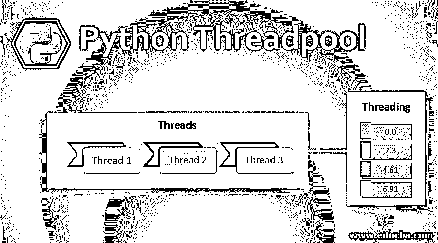
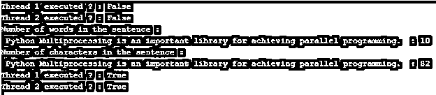

# Python 线程池

> 原文：<https://www.educba.com/python-threadpool/>




## Python 线程池简介

随着时间的推移，程序中涉及的数据呈指数增长，这导致了新技术的采用，从而减少了程序的执行时间。出于对更快程序执行的需求，并发的概念应运而生。在本主题中，我们将学习 Python Threadpool。

并发这个词的字面意思是同时发生。同样，并发的概念是关于并行计算的，因此它减少了程序的执行时间。在 Python 中，主要有三个同时发生的实体，即线程、任务和进程。

<small>网页开发、编程语言、软件测试&其他</small>

在讨论主话题之前，我们先简单了解一下线程[和线程](https://www.educba.com/what-is-threading/)。

**线程:**线程是可以并行运行的进程的组件。父进程中可以有多个线程。所有线程在父进程中共享要执行的程序和程序所需的数据。

**线程化:**线程化是 Python 中的一个库，它有助于使用驻留在父进程中的各种线程实现并行编程。

### 螺纹加工

线程的基本单元是一个线程，多个线程可以驻留在一个父进程中，每个线程完成一个单独的任务。首先需要通过传递函数名和参数来创建和初始化线程对象。

然后要启动一个特定的线程，需要 start()函数，join()函数表示该线程的执行已经完成。每个线程都需要单独的会话来执行。因为请求。会话()不是线程安全的；一个线程一次可以访问一段代码或内存，这是通过 threading.Lock 实现的。

### Python 中的线程池

在 Python 中，线程池是一组预先实例化的空闲线程，随时准备接受任务。

我们可以为每个线程实例化新线程，或者为新线程使用 Python 线程池。但是，当任务的数量远远超过 Python 线程池的时候，它比前面的方法更受欢迎。

线程池可以管理大量线程的并行执行，如下所示:–

*   如果线程池中的一个线程完成了它的执行，那么这个线程可以被重用。
*   创建一个新线程来替换终止的线程。

### 如何使用 Python Threadpool？

concurrent.futures 是 Python 标准库中的一个模块。它包含一个具体的子类 ThreadPoolExecuter，它使用多线程，我们得到一个线程池来提交任务。这样创建的池将任务分配给可用的线程，并调度它们运行。

让我们看看线程池执行器的语法，以便更好地理解它的工作方式:—

**语法:–**

```
from concurrent.futures import ThreadPoolExecutor
from time import sleep
def func_name(arguements):
   // function definition
def main():
   executor = ThreadPoolExecutor(num_of_threads)
   future = executor.submit(function_name, (arguement))
   print(future.done())
   sleep(2)
   print(future.done())
   print(future.result())
if __name__ == '__main__':
main()
```

### Python 线程池示例

下面是 Python 线程池的例子

#### 示例#1

**代码:**

```
from concurrent.futures import ThreadPoolExecutor
from time import sleep
def count_number_of_words(sentence):
  number_of_words = len(sentence.split())
  sleep(1)
  print("Number of words in the sentence :",sentence," : {}".format(number_of_words),end="\n")
def count_number_of_characters(sentence):
  number_of_characters = len(sentence)
  sleep(1)
  print("Number of characters in the sentence :",sentence," : {}".format(number_of_characters),end="\n")
if __name__ == '__main__':
  sentence = "Python Multiprocessing is an important library for achieving parallel programming."  
  executor = ThreadPoolExecutor(4)
  thread1 = executor.submit(count_number_of_words, (sentence))
  thread2 = executor.submit(count_number_of_characters, (sentence))
  print("Thread 1 executed ? :",thread1.done())
  print("Thread 2 executed ? :",thread2.done())
  sleep(2)
  print("Thread 1 executed ? :",thread1.done())
  print("Thread 2 executed ? :",thread2.done())
```

**输出:**




**代码解释:**在上面的例子中，已经用 4 个线程创建了一个线程池执行器。然后，分别由函数 count_number_of_words 和 count_number_of_characters 表示的两个任务将在执行函数和显示结果之前各等待 1 秒钟。任务在第一个一秒钟的时间间隔内没有完成，因此对 done()函数的调用返回一个 False 值。在执行任务并显示相应的打印语句之后，当调用 done()函数时，它会返回一个 true 值。

#### 实施例 2

**代码:**

```
import concurrent.futures
import numpy as np
from time import sleep
numbers = [10,23,54,7,89,100]
def get_max_number(numbers):
   greatest_num = np.max(numbers)
   sleep(2)
   print("Greatest number is :{}".format(greatest_num))
with concurrent.futures.ThreadPoolExecutor(max_workers = 4) as executor:
  thread1 = executor.submit(get_max_number, (numbers))
  print("Thread 1 executed ? :",thread1.done())
  sleep(2)
  print("Thread 1 executed ? :",thread1.done())
```

**输出:**


**代码解释:**这个例子展示了使用上下文管理器实例化 ThreadPoolExecuter，在它的帮助下我们已经创建了 4 个线程。然后，由函数 get_max_number(arguments)表示的任务将在执行该函数并显示结果之前等待 2 秒钟。这些任务在前两秒的时间间隔内没有完成，因此对 done()函数的调用返回一个 False 值。在执行任务并显示相应的打印语句之后，当调用 done()函数时，它会返回一个 true 值。

#### 实施例 3

**代码:**

```
from concurrent.futures import ThreadPoolExecutor
from concurrent.futures import as_completed
import numpy as np
from time import sleep
def log(n):
   log_value = np.log(n)
   sleep(1)
   return log_value
if __name__ == '__main__':
  values = [1,10,100,1000]
  with ThreadPoolExecutor(max_workers = 3) as executor:
      thread1 = executor.map(log, values)
  for result in thread1:
      print(np.round(result,2))
```

**输出:**


**代码解释:**这个例子展示了 Executor.map 函数的使用方法。我们知道在 Python 中，使用[映射函数](https://www.educba.com/javascript-map-function/)将特定函数应用于 iterables 中的每个元素。这里，我们将迭代器值的所有元素映射到名为 log(argument)的函数，并将这些作为独立的作业提交给 ThreadPoolExecutor。

### 结论

在下面的文章中，我们讨论了 Python Threadpool 的基础知识以及它的内部工作方式。为了更好地理解这个概念，我们看了 Python 线程池的语法和 3 个例子。因此，下次当您偶然发现一个需要并行计算的程序时，一定要记得使用线程，并使用 ThreadPoolExecutor 来更好地理解它们的用法。

### 推荐文章

这是 Python 线程池的指南。这里我们讨论一下基本概念，如何使用 Python 线程池？以及相应的示例。您也可以看看以下文章，了解更多信息–

1.  [Python 中的类型转换](https://www.educba.com/type-casting-in-python/)
2.  [Python 查找字符串](https://www.educba.com/python-find-string/)
3.  [Python 多重处理](https://www.educba.com/python-multiprocessing/)
4.  [Python 地图功能](https://www.educba.com/python-map-function/)


