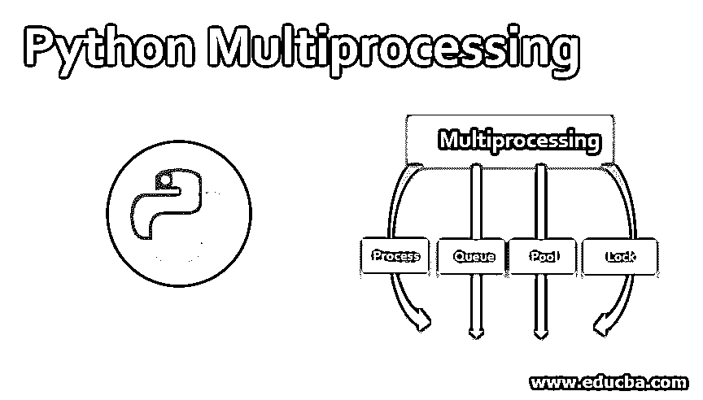
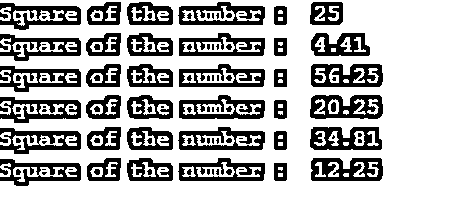
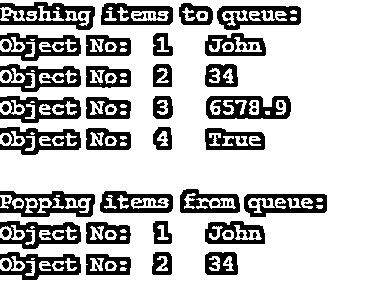
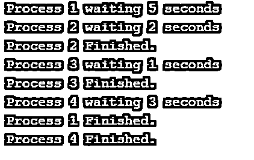
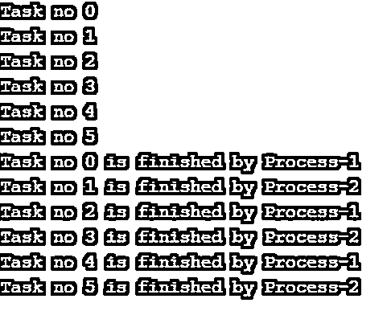

# Python 多重处理

> 原文：<https://www.educba.com/python-multiprocessing/>




## Python 多重处理简介

多重处理有点像多任务处理的计算机化版本。多任务处理是同时高效处理几项任务的过程。类似地，Python 中的多重处理是指同时处理多个进程的能力。在现实生活中，一心多用的人在工作中非常成功；类似地，使用多重处理的 python 程序比不使用多重处理的要好得多。

Python 多处理使用并行处理的思想，其中来自单个程序的代码可以使用并行代码在计算机的不同核心上执行。

<small>网页开发、编程语言、软件测试&其他</small>

### Python 中的多重处理

Python 有一个名为多重处理的模块，可以帮助我们编写并行代码，从而实现并行计算。Python 多重处理中的以下类帮助我们创建一个并行程序:

*   过程
*   长队
*   泳池
*   锁

在并行编程中，代码在不同的内核上运行。我们可以通过以下方式了解系统中的内核数量:

**代码:**

```
import multiprocessing
print("The number of cores in the system is",multiprocessing.cpu_count())
```

**输出:**


### 我们如何使用不同的类创建一个并行程序？

下面是构建并行编程的各个要点:

#### 1.过程

**代码:**

```
import numpy as np
from multiprocessing import Process
numbers = [2.1,7.5,5.9,4.5,3.5]
def print_func(element=5):
  print('Square of the number : ', np.square(element))
if __name__ == "__main__": # confirmation that the code is under main function
    procs = []
    proc = Process(target=print_func) # instantiating without any argument
    procs.append(proc)
    proc.start()
    for number in numbers:
        proc = Process(target=print_func, args=(number,))
        procs.append(proc)
        proc.start()
        for proc in procs:
            proc.join()
```

**输出:**




以下是 Process 类的两个重要功能:-

*   **start():**start()函数启动已创建的流程对象的处理。
*   join():join()函数指示进程完成它的执行。如果没有 join()函数，进程将保持空闲状态，不会终止。

在进程终止后调用 join()函数来为以后的进程释放资源是非常重要的；否则，必须手动完成。args 关键字用于在整个过程中发送参数。

#### 2.长队

**代码:**

```
from multiprocessing import Queue
objects = ["John",34,6578.9,True]
counter = 1
# We would instantiate a queue object
queue = Queue()
print('Pushing items to queue:')
for o in objects:
    print('Object No: ', counter, ' ', o)
    queue.put(o)
    counter = counter + 1
print('\nPopping items from queue:')
counter  = 1
while not queue.empty():
    print('Object No: ', counter, ' ', queue.get())
    counter = counter + 1
```

**输出:**




Python 多处理有一个队列类，它帮助检索和获取数据，以便按照 FIFO(先进先出)数据结构进行处理。它们对于存储 Python pickle 对象非常有用，并简化了不同进程之间的对象共享，从而有助于并行编程。

它们作为参数传递给流程目标函数，使流程能够在执行过程中使用这些数据。主要有两个函数帮助我们在队列中存储和读取数据

*   **put:** put()函数帮助将数据插入队列。
*   **get:** get()函数帮助从队列中检索数据。

在 FIFO 数据结构中，首先存储的元素将首先被检索。

FIFO 数据结构类似于客户服务呼叫，其中客户是元素，最早呼叫的客户必须等待最少的时间才能将呼叫连接到客户服务人员。

#### 3.泳池

**代码:**

```
from multiprocessing import Pool
import time
work = (["1", 5], ["2", 2], ["3", 1], ["4", 3])
def work_log(work_data):
    print(" Process %s waiting %s seconds" % (work_data[0], work_data[1]))
    time.sleep(int(work_data[1]))
    print(" Process %s Finished." % work_data[0])
def pool_handler():
    p = Pool(2)
    p.map(work_log, work)
if __name__ == '__main__':
    pool_handler()
```

**输出:**




Python 多处理池类有助于跨多个输入值并行执行函数。变量 work 声明时提到进程 1、进程 2、进程 3、进程 4 分别等待 5、2、1、3 秒。在执行期间，上述过程等待上述时间间隔，这从打印语句的顺序中可以明显看出。

#### 4.锁

Python 多重处理锁类允许代码声明锁，因此没有其他进程可以处理类似的代码。锁的两个重要功能如下:-

*   **acquire:** acquire()函数声明锁
*   **释放:** release()函数释放锁定

让我们把我们学过的所有东西合并成一个例子:—

**代码:**

```
from multiprocessing import Lock, Process, Queue, current_process
import time
import queue
def do_job(tasks_to_do, tasks_finished):
    while True:
        try:
            '''
      get_nowait() function raises queue empty exception if the queue is empty. 
            queue(False) function also does the same task.
            '''
            task = tasks_to_do.get_nowait()
        except queue.Empty:
            break
        else:
            '''
                if no exception is raised, add the task completion 
                message to tasks_finished queue
            '''
            print(task)
            tasks_finished.put(task + ' is finished by ' + current_process().name)
            time.sleep(0.25)
    return True
def main():
    number_of_task = 6
    number_of_processes = 2
    tasks_to_do = Queue()
    tasks_finished = Queue()
    processes = []
    for i in range(number_of_task):
        tasks_to_do.put("Task no " + str(i))
    # creating processes
    for w in range(number_of_processes):
        p = Process(target=do_job, args=(tasks_to_do, tasks_finished))
        processes.append(p)
        p.start()
    # completing process
    for p in processes:
        p.join()
    # print the output
    while not tasks_finished.empty():
        print(tasks_finished.get())
    return True
if __name__ == '__main__':
    main()
```

**输出:**




### 结论

我们已经讨论了 Python 中多处理的基本概念，现在是时候结束这篇文章了。下一次你写一个复杂的大代码时，一定要记住应用多重处理的概念来充分理解它的强大功能。

### 推荐文章

这是 Python 多重处理的指南。这里我们讨论介绍，多重处理，以及如何使用不同的类创建一个并行程序。您也可以浏览我们的其他相关文章，了解更多信息——

1.  [Python 全局变量](https://www.educba.com/python-global-variable/)
2.  [用 Python 复制列表](https://www.educba.com/copy-list-in-python/)
3.  [Python 正则表达式测试器](https://www.educba.com/python-regex-tester/)
4.  [Python Rest 服务器](https://www.educba.com/python-rest-server/)


