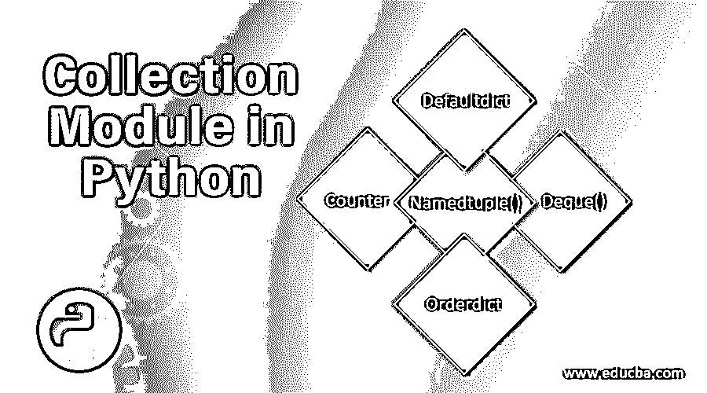
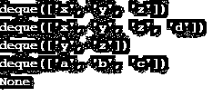
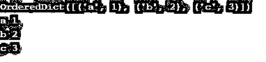

# Python 中的集合模块

> 原文：<https://www.educba.com/collection-module-in-python/>

## Python 中集合模块的介绍

在 Python 中，模块被描述为一个小的 Python 程序或文件，包含用于实现一组函数或方法的定义、变量和语句。Python 集合模块是在 Python 版本 2.4 中引入的。Python 集合模块定义为收集或存储列表、字典、集合、元组等数据集合的容器。为了改进[内置集合容器](https://www.educba.com/python-collections/)的功能，Python 引入了集合模块。因为有许多不同的模块提供额外的数据结构来存储数据集，其中一个这样的模块是 Python 的 collections 模块。集合模块是 Python 的通用内置容器的替代物。

### Python 中收集模块的前 5 种数据结构

在本文中，我们将讨论 Python 集合模块中使用的最常见的数据结构。集合模块中有不同的数据结构，如 Counter、deque、orderdict、defaultdict、namedtuple、chainmap、userdict、userlist、userstring 等。下面让我们详细讨论其中的几个:

<small>网页开发、编程语言、软件测试&其他</small>

#### 1.柜台

counter 是一个 dict 子类，它是一个 dictionary 子类，用于对 hashtable 对象进行计数。计数器就像一个字典，其中一个元素是一个可迭代的键，值是该键元素在字典中出现的次数。所以在 collections 模块中，counter()函数将一个键作为参数，并返回一个字典。让我们看看它是如何工作的:

**举例:**

`from collections import Counter
c = Counter()
list = [1,2,3,4,5,7,8,5,9,6,10] Counter(list)
Counter({1:5,2:4})
list = [1,2,4,7,5,1,6,7,6,9,1] c = Counter(list)
print(c[1])`

**输出:**

**解释:**在上面的代码 counter 对象中，创建了' c '，counter()函数可以将字典或列表作为参数，因此 key: count 输出一个键的值，因此当要求 c[1]输出时，它将输出' 1 '在列表中出现了多少次。所以它返回“3”作为输出。

#### 2.命名元组()

正如函数名本身所说，它返回带有命名条目的元组。因此，一般来说，元组中的每个值都有一个名称，在这个名称中，大多数时候可以很容易地访问元组中的这些值；它是通过索引完成的，但是它往往会忘记索引号，这将很难访问值。因此，使用元组中的命名值很容易访问这些值。

**举例:**

`from collections import namedtuple
Student = namedtuple('Student', 'fname, lname, age')
s1 = Student('Sita', 'Patil', '10')
print(s1.fname)`

**输出:**

**解释:**在上面的例子中，namedtuple 创建了一个“Student”对象，因此使用类“Student”的实例“s1 ”,我们可以访问该对象中的任何字段，例如“fname ”,因此它返回“Sita ”,这与程序中的一样。

#### 3.德克()

所以这也是一个队列或列表，为在队列两端添加和删除元素而优化。所以 dequee 是使用 dequee()构造函数创建的。

**举例:**

`from collections import deque
list = ["x","y","z"] deq = deque(list)
print(deq)
deq.append("d")
print(deq)
deq.pop()
deq.popleft()
print(deq)
list = ["a","b","c"] deq = deque(list)
print(deq)
print(deq.clear())`

**输出:**

**解释:**在上面的程序中，它创建一个对象“deq ”,该对象将首先打印列表，然后使用 deq.append()添加项目，从右 deq.pop()删除项目，从左 deq.popleft()删除项目，然后使用 deq.clear()清除整个列表。

#### 4.Defaultdict(预设字典)

正如它所说的，它类似于字典，但它不会查看是否有正确的键被给予访问，如果声明了不正确的键，则它不会抛出任何错误；相反，它将初始化您作为参数传递的数据类型的 key 元素，这个数据类型称为 default_factory。它的行为类似于一个字典，但是它将第一个参数作为默认数据类型。

**举例:**

`from collections import defaultdict
n = defaultdict(int)
n['a'] = 1
n['b'] = 2
print(n['c'])`

**输出:**

**解释:**在上面的代码中，defaultdict()创建了一个对象“n ”,该对象被分配了一个值为“1”的键“a”和一个值为“2”的键“b ”,而键“c”没有被分配任何值，因此默认情况下，它将打印 0 作为该键的值。

#### 5.订单

顾名思义，这是一个字典，其中的键是按照它们被插入的顺序排列的，所以如果你改变值，键的位置不会改变。这意味着如果再次插入密钥，则该密钥的先前值将被覆盖。

**举例:**

`from collections import OrderedDict
od = OrderedDict()
od['a'] = 1
od['b'] = 2
od['c'] = 3
print(od)
for k, v in od.items():
print(k, v)`

**输出:**

**解释:**在上面的代码中，对象‘od’是从‘order dict()’中创建的，它将分配每个键值，并且将在输出中以相同的顺序打印，它们各自的键和值作为结果按顺序打印。

### 结论

因此，总结本文，正如本文所讨论的，Python 中的集合模块不过是收集和存储不同数据类型(如 dict、list、tuple、set 等)的数据的容器。集合模块中使用了许多不同的数据结构。为了使用所有这些数据结构，我们需要在 Python 中导入 collections 模块，具体来说，每个数据结构都有不同的功能，它们的工作方式也不同。它们可以处理数字、字符或字符串。根据调查，他们说 Java 有一个比 Python 更好的集合库，所以它需要改进。

### 推荐文章

这是一个关于 Python 中集合模块的指南。这里我们讨论 Python 中集合模块的基本概念和前 5 个数据结构，以及不同的例子和代码实现。您也可以阅读以下文章，了解更多信息——

1.  [Python 中的线程池](https://www.educba.com/python-threadpool/)
2.  [Python 格式()函数](https://www.educba.com/python-format-function/)
3.  [Python 线程定时器](https://www.educba.com/python-threading-timer/)
4.  [名为 tuple Python](https://www.educba.com/namedtuple-python/)

