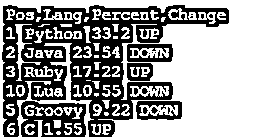
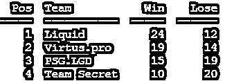

# Python 打印表格

> 原文：<https://www.educba.com/python-print-table/>


## Python 打印表格简介

就其数据科学能力而言，Python 是一种非常强大的语言。此外，python 中的打印表格有时很有挑战性，因为琐碎的选项会以不可读的格式向您提供输出。我们掩护你。有多种选择可以将表格转换并打印成许多漂亮且可读性更好的格式。如果您在 Unix / Linux 环境中使用 python，那么从用户的角度来看，可读性可能是个大问题。

### 如何用 Python 打印表格？

有几种方法可以用来在 python 中打印表格，即:

<small>网页开发、编程语言、软件测试&其他</small>

*   使用 format()函数打印字典和列表
*   使用制表()函数打印字典和列表
*   文本表格
*   美丽的
*   漂亮的桌子

与非结构化格式相比，以表格格式读取数据要容易得多，如下所示:

*   位置、语言、百分比、变化
*   1，Python，33.2，UP
*   2，Java，23.54，下
*   3，红宝石，17.22，向上
*   5，Groovy，9.22，向下
*   6，C，1.55，向上
*   十月，月亮，十点五十五分，下降

**表格格式**

**Pos Lang 百分比变化**
1 Python 33.2 以上
2 Java 23.54 以下
3 Ruby 17.22 以上
5 Groovy 9.22 以下
6 C 1.55 以上
10 Lua 10.55 以下

### 如何用 Python 打印表格？

我们倾向于频繁地使用字典或列表中的信息。打印相同内容的一种方式可以是:

#### 1.无格式时尚

让我们举一个例子来详细理解这一点

**代码:**

```
## Python program to print the data
d = {1: ["Python", 33.2, 'UP'],
2: ["Java", 23.54, 'DOWN'],
3: ["Ruby", 17.22, 'UP'],
10: ["Lua", 10.55, 'DOWN'],
5: ["Groovy", 9.22, 'DOWN'],
6: ["C", 1.55, 'UP']
} 
print ("Pos,Lang,Percent,Change")
for k, v in d.items():
    lang, perc, change = v
    print (k, lang, perc, change)
```

**输出:**




上面例子的输出很难读懂；让我们再举一个例子，看看如何用 python 打印可读的表格。

#### 2.格式化时尚

**代码:**

```
## Python program to print the data
d = {1: ["Python", 33.2, 'UP'],
2: ["Java", 23.54, 'DOWN'],
3: ["Ruby", 17.22, 'UP'],
10: ["Lua", 10.55, 'DOWN'],
5: ["Groovy", 9.22, 'DOWN'],
6: ["C", 1.55, 'UP']
}
print ("{:<8} {:<15} {:<10} {:<10}".format('Pos','Lang','Percent','Change'))
for k, v in d.items():
    lang, perc, change = v
    print ("{:<8} {:<15} {:<10} {:<10}".format(k, lang, perc, change))
```

**输出:**


*   这为我们在打印命令中使用格式功能提供了更好的可读性
*   如果我们想用 python 以表格格式打印列表中的数据，该怎么办？如何做到这一点？

#### 3.通过利用格式功能

**代码:**

```
dota_teams = ["Liquid", "Virtus.pro", "PSG.LGD", "Team Secret"]
data = [[1, 2, 1, 'x'],
['x', 1, 1, 'x'],
[1, 'x', 0, 1],
[2, 0, 2, 1]]
format_row = "{:>12}" * (len(dota_teams) + 1)
print(format_row.format("", *dota_teams))
for team, row in zip(dota_teams, data):
    print(format_row.format(team, *row))
```

**输出:**


**Note:** Here, we are utilizing the format function to define the white spaces to print before each data point so that the resultant output looks like a table.

#### 4.通过使用制表功能

让我们再举一个例子来更详细地理解这一点。

**代码:**

```
## Python program to understand the usage of tabulate function for printing tables in a tabular format
from tabulate import tabulate
data = [[1, 'Liquid', 24, 12],
[2, 'Virtus.pro', 19, 14],
[3, 'PSG.LGD', 15, 19],
[4,'Team Secret', 10, 20]]
print (tabulate(data, headers=["Pos", "Team", "Win", "Lose"]))
```

**输出:**




最好的一点是，每次向字典或列表中添加新条目时，不需要格式化每个 print 语句。还有其他几种方法可以用来在 python 中打印表格，即:

*   文本表格
*   美丽的
*   漂亮的桌子
*   否则，如果您试图以最佳格式打印数据，Pandas 是另一个不错的解决方案。

#### 5.使用熊猫详细打印表格

Pandas 是一个 python 库，它提供数据处理、操作和各种各样的功能，以便管理、更改和创建数据集中有意义的指标。让我们以下面的例子为例来详细理解 pandas 的打印表格选项。

**代码:**

```
## Python program to understand, how to print tables using pandas data frame
import pandas
data = [[1, 'Liquid', 24, 12],
[2, 'Virtus.pro', 19, 14],
[3, 'PSG.LGD', 15, 19],
[4,'Team Secret', 10, 20]]
headers=["Pos", "Team", "Win", "Lose"]
print(pandas.DataFrame(data, headers, headers))
print('                                         ')
print('-----------------------------------------')
print('                                         ')
print(pandas.DataFrame(data, headers))
```

**输出:**


### 它是如何工作的？

*   我们使用 import 语句导入了熊猫的库
*   >>进口熊猫
*   此后声明了一个 list 列表，并将其赋给名为“data”的变量。
*   在下一步中，我们声明了头
*   > > headers=["Pos "，" Team "，" Win "，" Lose"]

### 我们如何以一种格式化的可读结构打印这个列表呢？

*   熊猫拥有数据框的力量，可以处理、修改、更新和增强表格格式的数据。
*   我们利用 pandas 库的数据框模块和 print 语句以可读的格式打印表格。

### 结论

与非结构化格式相比，以表格格式读取数据要容易得多。利用 python print 语句的众多功能可以帮助您获得更好的可读性。

### 推荐文章

这是一个 Python 打印表格的指南。这里我们讨论一下 Python 打印表格的介绍，以及如何用不同的例子打印表格。您也可以浏览我们的其他相关文章，了解更多信息——

1.  [Python 范围函数](https://www.educba.com/python-range-function/)
2.  [Python 中的类型转换](https://www.educba.com/type-casting-in-python/)
3.  [Python if main](https://www.educba.com/python-if-main/)
4.  [Python 列表函数](https://www.educba.com/python-list-functions/)


