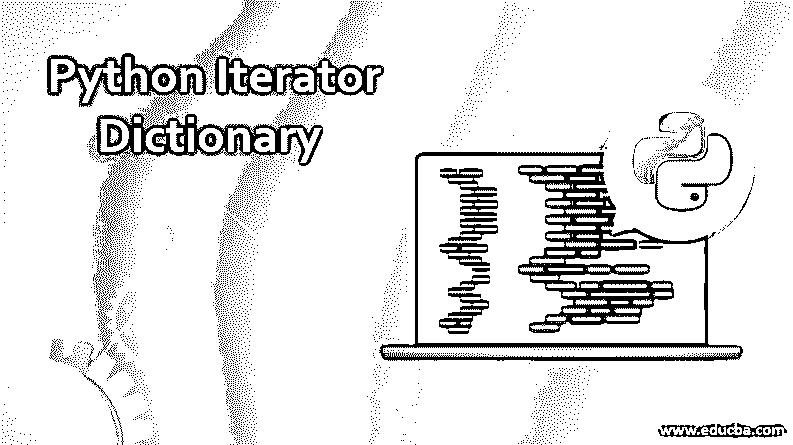
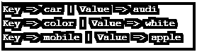
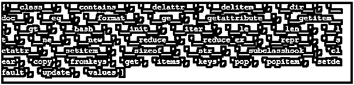
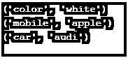

# Python 迭代器字典

> 原文：<https://www.educba.com/python-iterator-dictionary/>

## Python 迭代器字典介绍

字典是花括号内使用的数据的集合。字典中的数据以键-值对的形式存储，其中键应该是不可变的和唯一的。我们可以使用字典的关键字从字典中获取数据。迭代意味着遍历数据集合中的每一个值，就像列表或字典一样。我们也可以称之为值循环。这种迭代存在于每一种编程语言中，它们有不同的方式来实现。

### 实现 Python 迭代器字典的示例

以下是 Python 迭代器字典的示例:

<small>网页开发、编程语言、软件测试&其他</small>

#### 示例#1

**代码:**

`data  = {'color':'white','car':'audi','mobile':'apple'}
print(data['car'])`

**输出:**

**解释:**通过这种方式，我们可以使用字典的键来迭代字典的单个条目。如果我们知道字典的键，那么我们可以访问字典的任何值。如果我们不知道字典的键，并且想要访问所有的值，我们可以使用循环来访问这些值。让我们试着循环查找这本词典。

#### 实施例 2

**代码:**

`data  = {'color':'white','car':'audi','mobile':'apple'}
for item in data:
print(item)`

**输出:**

**解释:**现在，在这种情况下，您可能已经注意到，我们只获得字典的键的名称；我们没有得到价值。因为我们打印的是“item ”,这是关键，所以现在我们必须修改循环来访问字典中的值。

#### 实施例 3

**代码:**

`data  = {'color':'white','car':'audi','mobile':'apple'}
for item in data:
print('Key => '+item+' | Value => '+ data[item])`

**输出:**

现在您可以看到，这一次我们如预期的那样获得了键及其值。

### 我们如何知道一个数据集合是否是可迭代的？

我们可以使用 dir 函数，并在其中传递一个对象进行检查。

#### 示例#1

**代码:**

`print(dir({}))`

我们使用 dir 方法并向其传递一个空字典。

**输出:**

**解释:**现在你可以看到它函数列表，你也可以注意到它有一个“__iter__”方法。这意味着任何返回“__iter__”的方法或函数都可以使用 for 循环或任何其他循环进行迭代。现在我们知道了如何访问键，以及如何访问键并对两者赋值。假设我只想访问字典中的值。

#### 实施例 2

**代码:**

`data  = {'color':'white','car':'audi','mobile':'apple'}
for item indata.values():
print(item)`

**输出:**

**解释:**在上面的程序中，我们使用了与使用 values 方法相同的字典和循环；在这种情况下，它将返回字典的值，而不是键。同样，我们也可以只获取字典的键。

#### 实施例 3

**代码:**

`data  = {'color':'white','car':'audi','mobile':'apple'}
for item indata.keys():
print(item)`

**输出:**

如您所见，这一次，我们为循环提供了一个 keys 函数，并且循环只返回键。我们也可以在不使用循环的情况下获取字典的键和值。我们有值和键函数。

#### 实施例 4

**代码:**

`data  = {'color':'white','car':'audi','mobile':'apple'}
print(data.values())`

**输出:**

如你所见，在上面的程序中，我们没有使用任何类型的循环。相反，我们使用 python 的 built values 方法，它从字典中返回所有值。

#### 实施例 5

**代码:**

`data  = {'color':'white','car':'audi','mobile':'apple'}
print(data.keys())`

**输出:**

同样，在上面的程序中，我们使用了 keys 方法，它返回了字典的所有键。

#### 实施例 6

**代码:**

`data  = {'color':'white','car':'audi','mobile':'apple'}
for item in data.items():
print(item)`

**输出:**

**解释:**在上面的程序中，我们在 for 循环内部使用了一个 item 函数，在这个函数的帮助下，它将同时打印字典的键和值。我们不需要花费额外的精力来分别获取键和值。

#### 实施例 7

**代码:**

`data  = {'color':'white','car':'audi','mobile':'apple'}
for key, value indata.items():
print(key, value)`

**输出:**

这也是从字典中获取键和值的一个非常简单的方法。

### 结论

迭代意味着遍历数据集的值或数据集合；它可以是列表、字典或任何数据集。通过使用循环或使用一些内置方法，有许多不同的方法来获取字典的键和值。

### 推荐文章

这是一个 Python 迭代器字典的指南。在这里，我们讨论 Python 迭代器字典及其示例和代码实现的简要概述。您也可以浏览我们推荐的其他文章，了解更多信息——

1.  [Python 的优势](https://www.educba.com/advantages-of-python/)
2.  [Python 中的递归函数](https://www.educba.com/recursive-function-in-python/)
3.  [Python 范围函数](https://www.educba.com/python-range-function/)
4.  [Python 设置函数](https://www.educba.com/python-set-function/)

