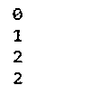
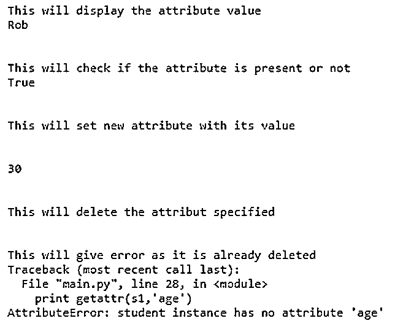

# Python 类属性

> 原文：<https://www.educba.com/python-class-attributes/>


## Python 类属性简介

类的属性意味着这些术语用于描述类的属性、字段、数据成员或类成员。属性仅仅意味着对象的数据成员。在 Python 中，类属性是属于类本身的类的属性，这意味着它是类的属性而不是类的实例的属性。Python 类属性将由所有实例共享，其中实例属性不在实例之间共享。为了更好的理解，这些类属性通常被定义在类体的顶部。

### 使用 Class 属性的示例

属性是任何组件、程序或类的可变属性或任何特征，可以设置为不同的值。例如:通常，人类的属性可以是头发、脸的颜色等。

<small>网页开发、编程语言、软件测试&其他</small>

因此，让我们在下面的例子中看看如何创建类属性:

#### 示例#1

**代码:**

```
class classwithattribute:
count = 0
print count
def increment(self):
classwithattribute.count += 1
c1 = classwithattribute()
c1.increment()
print c1.count
c2 = classwithattribute()
c2.increment()
print c2.count
print classwithattribute.count
```

**输出:**




在上面的例子中，我们有一个名为“classwithattribute”的类，类属性为“count ”,它被初始化为值“0 ”,然后我们编写一个函数将 count 属性的值增加 1，这是在一个名为“increment”的函数中完成的。然后我们创建一个类的变量，然后用类变量“c1”调用函数。

在 Python 中，用来实现类的访问控制的属性。有几个内置的方法和函数来访问类的这些属性。

*   **getattr():** 这是用来获取属性的，这样它就可以访问对象的这些属性。
*   **hasattr():** 这个函数用来知道属性是否出现在类中。
*   **setattr():** 这个方法用来给属性赋值，如果属性不存在，这个方法也会创建属性，然后设置属性。
*   **delattr():** 该函数用于删除为该类创建的属性，如果删除后试图访问相同的属性，将会报错。

让我们考虑一个例子来演示所有上述用于访问类属性的内置方法。

#### 实施例 2

**代码:**

```
class student: 
    name='Rob'
    age='15'
    def display(self): 
        print self.name 
        print self.age 
s1 = student() 
print("This will display the attribute value")
print getattr(s1,'name') 
print "\n"  
print("This will check if the attribute is present or not")
print hasattr(s1,'name') 
print "\n"
print("This will set new attribute with its value")  
setattr(s1,'weight',30) 
print "\n"
print getattr(s1,'weight')
print "\n" 
print("This will delete the attribut specified")
delattr(student,'age') 
print "\n"
print("This will give error as it is already deleted")
print getattr(s1,'age')
```

**输出:**




在上面的例子中，我们已经编写了代码来演示上面访问类属性的方法。在上面的例子中，我们创建了一个类“student ”,带有属性“name”、“age”来显示这些细节，我们有一个“display”函数，所以这个类变量“s1”被用在所有的方法中。在 getattr(s1，name)中，我们要求将属性“name”的属性值提取为 Rob，它是在属性创建之初分配的。类似地，hasattr(s1，“name”)在类“student”中搜索“name”属性(如果存在)，然后返回 true，否则返回 false。然后 setattr(s1，“weight”)如果不存在，这个函数将创建一个新的属性，否则它将为这个属性赋值。最后，delattr (student，' age ')这个函数将从类“student”中删除属性“age”。删除该属性后，将无法再访问该属性。

因为类属性可以从一个类访问到另一个类。在这一节中，我们将看到在另一个类中访问该类的属性和方法。要在任何其他类中访问一个类的属性或方法，我们必须绕过该类的对象到另一个类。让我们考虑一个例子来证明这个概念:

#### 实施例 3

**代码:**

```
class firstclass(): 
    def __init__(self): 
        self.a1 = 1
        self.a2 = 2  
    def methodfirst(self): 
        self.a1 = self.a1 + self.a2 
        return self.a1   
class secondclass(firstclass): 
    def __init__(self, class_first): 
        self.a1 = class_first.a1 
        self.a2 = class_first.a2  
object1 = firstclass() 
summation = object1.methodfirst()   
print summation  
object2 = secondclass(object1)   
print object2.a1 
print object2.a2 
```

**输出:**


在上面的程序中，定义了两个类“firstclass”和“secondclass ”,在“firstclass”中我们定义了两个数相加的函数，这两个数在“firstclass”中被声明为属性，然后这个“firstclass”被传递给“secondclass ”,这样两个类的对象都被创建，它返回两个数的和。

让我们看看什么时候可以使用 Python 类属性:

*   所以我们知道类的属性可以在类内部和在另一个类中被访问，所以它经常被用来存储一些常量就像我们在上面的程序中做的那样在另一个类中访问一个类的类属性。
*   有时类属性被用来定义一些默认值。如果一个类具有保存某个极限值或某个有界列表的属性，我们需要通过分配某个实例的极限属性来创建一个实例。

### 结论

在 Python 中，许多人认为类属性的概念有点复杂，所以它们用得不多，但是我们应该注意如何以及何时使用它们。所以，一般来说，类属性和类属性只不过是它们定义的类的简单属性。有许多不同的方法和函数来访问类属性，也有一个选项，其中一个类的类属性可以在其他类中访问；相反，实例只能在类中访问。

### 推荐文章

这是 Python 类属性的指南。在这里，我们讨论了 Class 属性的介绍、工作原理以及属性和输出的例子。您也可以浏览我们推荐的其他文章，了解更多信息——

1.  [Python 循环函数](https://www.educba.com/python-round-function/)
2.  [Python 统计模块](https://www.educba.com/python-statistics-module/)
3.  [Python 多重处理](https://www.educba.com/python-multiprocessing/)
4.  [Python 类常数](https://www.educba.com/python-class-constants/)


