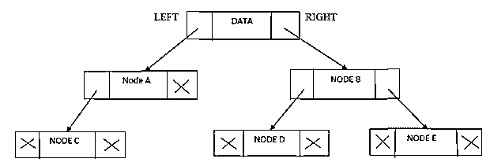

# Python 中的二叉树

> 原文：<https://www.educba.com/binary-tree-in-python/>


## Python 中二叉树的介绍

Python 中的二叉树是一种用于数据搜索和组织的非线性数据结构。二叉树由节点组成，并且这些节点(每个都是数据组件)具有左和右子节点。与其他数据结构(如数组、堆栈和队列)不同，链表是线性类型的数据结构，而树是分层类型的数据结构。简称为二叉查找树或 BST，其节点存储的键大于其左侧子节点，小于所有右侧子节点。由于二叉树中的数据是有组织的，它允许像插入、删除、更新和提取这样的操作。让我们更深入地研究与二叉树相关的概念，并使用 Python 编程语言实现一些例子。

**语法:**

<small>网页开发、编程语言、软件测试&其他</small>

二叉树没有任何特定的语法，但是在实现二叉树时有一个算法可以遵循。

### Python 中二叉树的算法

**第一步:**我们需要为二叉树声明创建一个节点类。创建节点构造函数:

```
class BTNode:
	def __init__(self, key):
		self.val = key
		self.left = None
		self.right = None
```

在这里，我们可以有 key-value，但是如果没有任何值，用户可以将其设置为 None。左、右两个子节点也可以指定为“无”。

**第二步:**我们可以插入数据。如果节点没有任何值，用户可以设置一个值并返回它。如果用户试图插入任何存在的数据，我们可以简单地返回值。如果给定值小于节点值，并且有一个左节点，那么我们需要在左子节点上调用 insert 方法。

**第三步:**有两个有用的辅助函数，getMin 和 getMax。这些是简单的递归函数，遍历树的边来存储最小或最大的值。

**步骤 4:** 删除操作也是一个递归函数，但是在删除操作之后返回给定节点的新状态。在删除任何子节点时，父节点会将左数据或右数据设置为无。

### 二叉树插图




二叉树由以下部分组成:

数据，指向左节点的指针和指向右节点的指针。

**节点:**二叉树的基本单元

**根:**二叉树的根单位。

**叶子:**二叉树的叶子，其节点没有子节点

**级别:**根为 0 级，根节点的子节点为 1 级，根节点的孙节点为 2 级

**父节点:**比该节点高一级的节点的父节点。

**子节点:**节点的子节点是比父节点低一级的节点。

### Python 中二叉树的例子

下面是提到的例子:

#### 示例#1

为分配了根节点的二叉树创建节点类

**代码:**

```
class BTNode:
    def __init__(self, val):
        self.left = None
        self.right = None
        self.val = val
    def rootNode(self):
        print(self.val)
root = BTNode('A')
root.rootNode()
```

**输出:**


所以在这里，我们已经创建了一个节点类，并分配了一个根节点值“a”

#### 实施例 2

在二叉树中插入节点

**代码:**

```
class BTNode:
    def __init__(self, val):
        self.leftNode = None
        self.rightNode = None
        self.val = val
    def insertNode(self, val):
        if self.val:
            if val < self.val: if self.leftNode is None: self.leftNode = BTNode(val) else: self.leftNode.insertNode(val) elif val > self.val:
                if self.rightNode is None:
                    self.rightNode = BTNode(val)
                else:
                    self.rightNode.insertNode(val)
        else:
            self.val = val
    def displayTree(self):
        if self.leftNode:
            self.leftNode.displayTree()
        print( self.val),
        if self.rightNode:
            self.rightNode.displayTree()
root = BTNode('A')
root.insertNode('B')
root.insertNode('C')
root.insertNode('D')
root.insertNode('E')
root.insertNode('F')
root.displayTree()
```

**输出:**


所以这里根节点是 A，左边节点会是 B，右边节点会是 c。

#### 实施例 3

在二叉树中搜索值

**代码:**

```
class BTNode:
    def __init__(self, val):
        self.leftNode = None
        self.rightNode = None
        self.val = val
    def insertNode(self, val):
        if self.val:
            if val < self.val: if self.leftNode is None: self.leftNode = BTNode(val) else: self.leftNode.insertNode(val) elif val > self.val:
                if self.rightNode is None:
                    self.rightNode = BTNode(val)
                else:
                    self.rightNode.insertNode(val)
        else:
            self.val = val
    def searchVal(self, data):
        if data < self.val: if self.leftNode is None: return str(data)+" is not Found in the Binary Tree" return self.leftNode.searchVal(data) elif data > self.val:
            if self.rightNode is None:
                return str(data)+" is not Found in the Binary Tree"
            return self.rightNode.searchVal(data)
        else:
            return str(self.val) + " is found in the Binary Tree"
root = BTNode('A')
root.insertNode('B')
root.insertNode('C')
root.insertNode('D')
root.insertNode('E')
root.insertNode('F')
print(root.searchVal('B'))
print(root.searchVal('b'))
print(root.searchVal('D'))
```

**输出:**


在二叉树中搜索一个值时，节点是从左向右遍历的。

### 二叉树的类型

下面是不同类型的二叉树:

1.  **完全二叉树:**特殊类型的二叉树，其中每个父节点或内部节点有 2 个或没有子节点。
2.  **完美二叉树:**每个内部节点恰好有两个子节点，所有叶节点都在同一层的二叉树。
3.  **完全二叉树:**和完全二叉树一样，但是所有的叶子节点都必须在左边，每一层都必须有左右两个子节点。最后一个叶节点不应该有正确的子节点。
4.  **病理树:**二叉树只有一个子节点，即左节点或右节点。
5.  **偏斜二叉树:**类似于二叉树要么以左节点为主要么以右节点为主的病理树。它有两种类型:左斜二叉树和右斜二叉树。
6.  **平衡二叉树:**二叉树的类型，其中每个子节点的左右子树的高度之差为 0 或 1

### 结论

至此，我们将结束我们的主题“Python 中的二叉树”。我们已经看到了什么是二叉树及其算法。很少看到二叉树是如何创建的，插入是如何完成的，以及我们如何搜索并显示二叉树节点的例子。还有我们上面解释过的二叉树的类型。还有其他的运算，可以帮助我们完全理解二叉树的概念。

### 推荐文章

这是一个关于 Python 中二叉树的指南。这里我们讨论了 python 中二叉树的介绍、算法和图解，并给出了不同的例子。您也可以阅读以下文章，了解更多信息——

1.  [Python 中的插入排序](https://www.educba.com/insertion-sort-in-python/)
2.  [Java 中的 BinarySearch()](https://www.educba.com/binarysearch-in-java/)
3.  [Python 字符串包含](https://www.educba.com/python-string-contains/)
4.  [PySpark foreach](https://www.educba.com/pyspark-foreach/)


