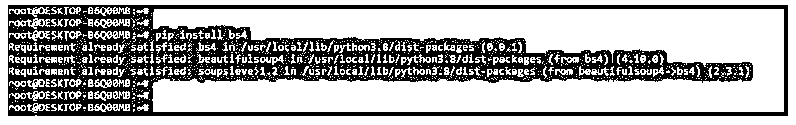
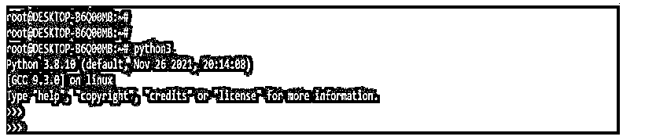
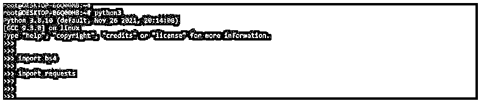
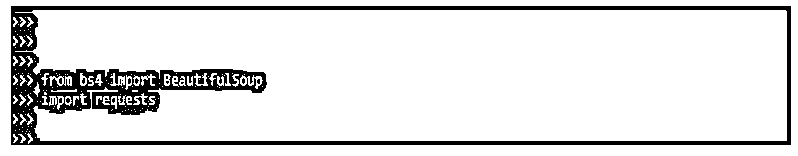
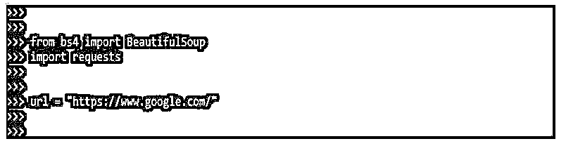
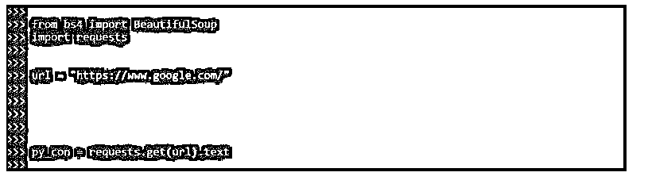
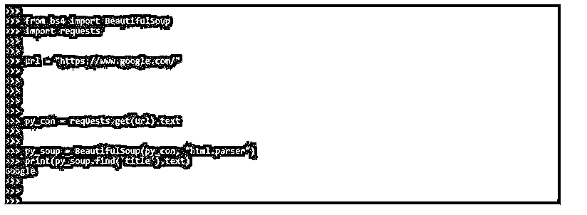
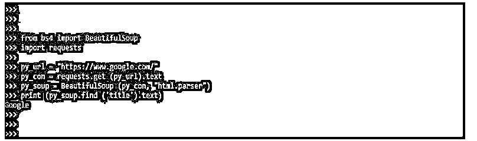
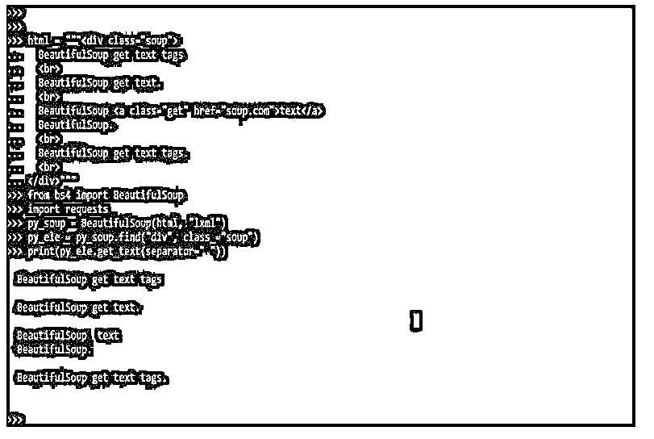
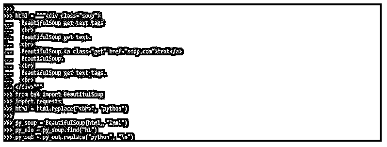

# 美丽的声音获取文本

> 原文：<https://www.educba.com/beautifulsoup-get-text/>


## BeautifulSoup 简介获取文本

BeautifulSoup get text 是使用称为 web scrapers 的软件机器人从网页的 HTML 或 XML 内容中检索信息的过程。它是一个 python 模块，允许我们抓取数据。BeautifulSoup 与一个解析器协作，允许迭代、搜索和修改解析器的内容(以解析树的形式)。因此，BeautifulSoup 使浏览网页变得相对简单。

### 什么是 BeautifulSoup get 文本？

*   处理 XML 和 html 文档需要几个解析器，如 lxml 和 HTML 解析器。
*   BeautifulSoup 允许我们遍历 HTML 文档树，除了提取数据之外，还可以编程地编辑它。
*   BeautifulSoup 通常与 requests 包一起使用，该包获取一个页面，BeautifulSoup 从中提取数据。
*   字符串是最基本的过滤器类型之一。如果我们将字符串传递给 search 方法，BeautifulSoup 将对它进行匹配。我们可以搜索以特定字符串或标签开头的所有标签。
*   BeautifulSoup 中的 get text 方法用于从元素中获取文本。我们可以通过简单地调用 object 方法来使用它。但是，因为对象表示字符串，所以 get text 不对可导航字符串起作用。
*   BeautifulSoup 给出了几个参数来帮助我们优化搜索，其中一个参数是字符串。
*   我们有各种各样的过滤器传递给这个方法，理解它们是很重要的，因为它们经常在整个搜索 API 中使用。
*   这些过滤器可以根据标签的名称、属性、字符串文本或组合应用于标签。
*   HTML 文件可以在锚定标签 a >、span span span >、段落标签 p >和其他标签中找到。结果，可爱的 soup 帮助我们获得想要的输出，比如从特定的 url/html 文件中提取段落。
*   用于从 HTML 和 XML 文档中提取信息的 BeautifulSoup 包。Python 默认不包含这个模块。
*   查询使得发送 HTTP/1.1 请求变得非常简单。不幸的是，python 也没有包含这个模块。

### BeautifulSoup 获取文本网页

要使用 BeautifulSoup 创建获取文本网页的示例，我们需要遵循以下步骤:

<small>网页开发、编程语言、软件测试&其他</small>

1.在这一步中，我们使用 pip 命令安装 bs4 包。在下面的例子中，我们已经在我们的系统中安装了 bs4 包，所以它将显示需求已经得到满足，然后我们不需要做任何事情。

**代码:**

```
pip install bs4 
```

**输出:**




2\. After installing the bs4 package in this step, we install the requested packages. In the below example, we have already installed the requests package in our system, so it will show that requirement is already satisfied, then we have no need to do anything.

**代码:**

```
pip install requests 
```

**输出:**


3.安装完所有模块后，我们使用 python3 命令打开 python shell。

**代码:**

```
python3 
```

**输出:**




4.在这一步登录到 python shell 之后，我们检查 bs4，请求包安装在我们的系统中。

**代码:**

```
import bs4
import requests 
```

**输出:**




5.在检查了这一步中的所有先决条件之后，我们导入 bs4 的库并请求包。

**代码:**

```
from bs4 import BeautifulSoup
import requests 
```

**输出:**




6\. After importing the library in this step, we assign the URL; we use the Google URL.

**代码:**

`url = https://www.google.com/`

**输出:**




7.在这个步骤中分配了 URL 之后，我们从这个 URL 获取原始的 html 内容，如下所示。

**代码:**

```
py_con = requests.get(url).text 
```

**输出:**




8.在这一步获取原始 html 内容后，我们将解析内容；解析完内容后，我们打印它的文本。

**代码:**

```
py_soup = BeautifulSoup(py_con, "html.parser")
print(py_soup.find('title').text) 
```

**输出:**




### BeautifulSoup 获取文本方法

*   URLLib 方法对应于指定的 URL。使用 urlopen (html)获取 HTML 后。read()函数，BeautifulSoup 的 get text()方法用于获取 HTML 文本。
*   在一些 NLP 出版物中推荐使用 NLTK.clean html()。但是，在最新的 NLTK 实现中，不推荐使用 NLTK.clean html 方法。
*   要删除 HTML 标记，根据 NLTK.clean html 技术，使用 BeautifulSoup 的 get text()函数。
*   一旦获取了 HTML 内容，就使用 NLTK 单词标记化方法来恢复单词和标点符号。
*   然后，使用单词过滤技术，我们可以进一步过滤出符合标准的术语，比如单词长度。
*   我们也可以使用 NLTK 文本来构建使用 NLTK 的频率分布。下面的例子展示了 BeautifulSoup 获取文本的方法。

**代码:**

```
from bs4 import BeautifulSoup
import requests
py_url = "https://www.google.com/"
py_con = requests.get (py_url).text
py_soup = BeautifulSoup (py_con, "html.parser")
print (py_soup.find ('title').text) 
```

**输出:**




*   在上面的例子中，在分配了 URL 之后，我们在使用 py_soup 变量解析内容之后获取了原始内容。

### 获取文本标签

*   每次标签关闭时，BeautifulSoup 都会获取文本并添加一个新的行字符。因此，有些情况下我们需要通过 br >标记而不是正确的标记来分割它。
*   以下示例显示了 BeautifulSoup get 文本的用法。

**代码:**

```
html = """<div class="soup">
BeautifulSoup get text tags
BeautifulSoup get text.
BeautifulSoup <a class="get" href="soup.com">text</a>
BeautifulSoup.
BeautifulSoup get text tags.
</div>"""
from bs4 import BeautifulSoup
import requests
py_soup = BeautifulSoup(html, "lxml")
py_ele = py_soup.find("div", class_="soup")
print (py_ele.get_text(separator=" ")) 
```

**输出:**




在下面的例子中，我们用一个字符串替换每个标签。

**代码:**

```
html = """<div class="soup">
BeautifulSoup get text tags
BeautifulSoup get text.
BeautifulSoup <a class="get" href="soup.com">text</a>
BeautifulSoup.
BeautifulSoup get text tags.
<br>
</div>"""
from bs4 import BeautifulSoup
import requests
html = html.replace ("<br>", "python")
py_soup = BeautifulSoup(html, "lxml")
py_ele = py_soup.find("h1")
py_out = py_out.replace ("python", "\n") 
```

**输出:**




### 结论

处理 XML 和 html 文档需要几个解析器，如 lxml 和 HTML 解析器。BeautifulSoup get text 是使用称为 web scrapers 的软件机器人从网页的 HTML 或 XML 内容中检索信息的过程。在 python 中，BeautifulSoup get text 方法至关重要。

### 推荐文章

这是一个美丽的向导。这里我们讨论引言；BeautifulSoup 获取文本网页、方法和标签。您也可以看看以下文章，了解更多信息–

1.  [Python BeautifulSoup](https://www.educba.com/python-beautifulsoup/)
2.  [Python 连接列表](https://www.educba.com/python-join-list/)
3.  [argmax 指针](https://www.educba.com/pytorch-argmax/)
4.  [Python 连接列表](https://www.educba.com/python-join-list/)


