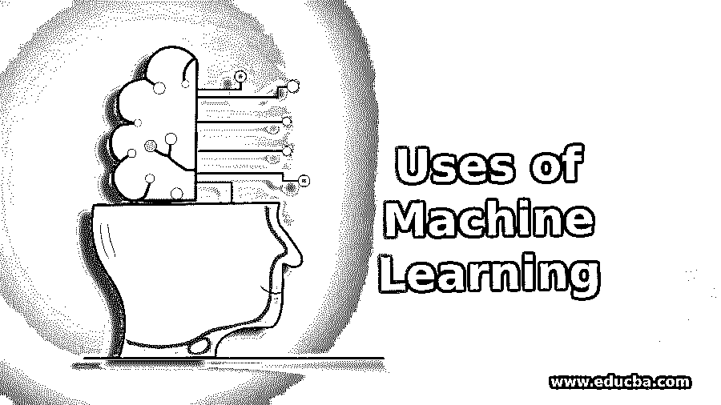

# 机器学习的用途

> 原文：<https://www.educba.com/uses-of-machine-learning/>

## 机器学习导论

机器学习用于构建算法，该算法可以接收输入数据，并基于可用数据的类型，使用统计分析来预测输出。这些机器学习算法分为有监督的、无监督的和强化学习，其中所有这些算法具有各种无限的应用，例如图像识别、语音识别、预测、视频监控、社交媒体平台、垃圾邮件和恶意软件、客户支持、搜索引擎、应用、欺诈和偏好等。

### 机器学习的用途

机器学习有无限的应用，有很多机器学习算法可供学习。从简单到非常复杂的各种形式都有。机器学习的十大用途如下:

<small>Hadoop、数据科学、统计学&其他</small>

#### 图像识别

图像识别是机器学习应用程序最常见的用途之一。也可以将[称为数字图像](https://www.educba.com/what-is-digital-image/)，对于这些图像，测量描述了图像中每个像素的输出。人脸识别也是仅由机器学习开发的伟大功能之一。它有助于识别人脸，并向人们发送相关通知。

#### 声音识别

机器学习(ML)也有助于开发语音识别应用程序。它也被称为虚拟个人助理(VPA)。当通过语音询问时，它将帮助您找到信息。在您提出问题后，该助理将寻找您所询问的数据或信息，并收集所需的信息，为您提供最佳答案。在当今的机器学习世界中，有许多设备可用于语音识别，如亚马逊 echo 和谷歌的智能扬声器。有一个手机应用程序叫做谷歌 allo，智能手机是三星 S8 和 Bixby。

#### 预言

它有助于构建预测特定时间段内出租车或旅行价格以及交通拥堵情况的应用程序。在预订出租车时，应用程序仅通过使用机器学习来估计旅行的大致价格。当我们使用 [GPS 服务](https://www.educba.com/what-is-gps/)来检查从源到目的地的路线时，该应用程序将向我们显示各种方式，并检查当时车辆数量较少的交通情况，以及交通拥堵较多的地方，这些都是通过使用机器学习应用程序来完成或检索的。

#### 视频监控

它有助于在犯罪发生之前发现犯罪或任何将要发生的失误。它有助于跟踪人们的异常行为，如在长椅上打盹、长时间站立不动、绊倒等。它会自动向守卫或所有在那里的人发出警报，他们可以帮助避免任何问题。

#### 社交媒体平台

社交媒体正被用于提供更好的新闻和广告，因为用户的兴趣主要是通过使用机器学习来完成的。有很多例子，比如朋友建议、脸书的页面建议、YouTube 上的歌曲和视频建议。它主要基于用户体验的简单概念工作，用户通过用户体验连接并经常访问简档或网站，相应地向用户提供建议。它还提供了从图像和视频中提取有用信息的技术

#### 垃圾邮件和恶意软件

电子邮件客户端使用许多垃圾邮件过滤，这些垃圾邮件过滤器不断更新，这些主要是通过使用机器学习来完成的。基于规则、多层和树归纳是机器学习提供的一些技术。类似地，检测到许多恶意软件，并且这些恶意软件主要由系统安全程序来检测，这些程序主要仅由机器学习来帮助。

#### 客户支持

大多数知名公司或许多网站都提供与客户支持代表聊天的选项。因此，在客户询问任何问题后，答案不一定只能由人给出，有时答案由聊天机器人给出，聊天机器人从网站提取信息并将答案提供给客户。现在他们更好，理解查询越来越快，还通过给出适当的结果来提供良好的结果，这是通过仅使用机器学习来完成的。

#### 搜索引擎

在搜索时有搜索引擎可以为客户提供最好的结果。有许多机器学习算法是为搜索特定的用户查询而创建的，如 google。无论用户打开哪个页面，某个特定的主题都会频繁地出现在页面的顶部很长一段时间。

#### 应用/公司

有许多应用程序和公司使用机器学习来完成他们的日常工作，因为它比人工干预更加准确和精确。这些公司是网飞、facebook、[谷歌地图](https://www.educba.com/career-in-google-maps/)、Gmail、谷歌搜索等。

#### 欺诈和偏好

像 Paypal 这样的公司用它来记录洗钱活动。它使用这套工具来帮助他们检查或比较数百万笔交易，并进行安全交易。

### 结论

机器学习被称为人工智能领域的伟大成就之一。机器学习对你的日常生活有很大帮助，因为它使工作变得更容易和更容易。大多数组织都在使用机器学习的应用程序，并在这方面投入大量资金，以使这一过程更快、更顺畅。它是当今世界广泛使用和采用的语言或技术之一。

### 推荐文章:

这是在现实世界中使用机器学习的指南。在这里，我们已经详细讨论了机器学习的介绍，以及机器学习的 10 大流行用途。您也可以阅读以下文章，了解更多信息——

1.  [角度 JS 的用途](https://www.educba.com/uses-of-angular-js/)
2.  [Photoshop 在现实世界中的 10 个最佳用途](https://www.educba.com/uses-of-photoshop/)
3.  [树莓酱的用途](https://www.educba.com/uses-of-raspberry-pi/)
4.  [Matlab 在现实世界中的 15 大有用用途](https://www.educba.com/uses-of-matlab/)
5.  [Matlab 和八度音阶](https://www.educba.com/matlab-vs-octave/)

