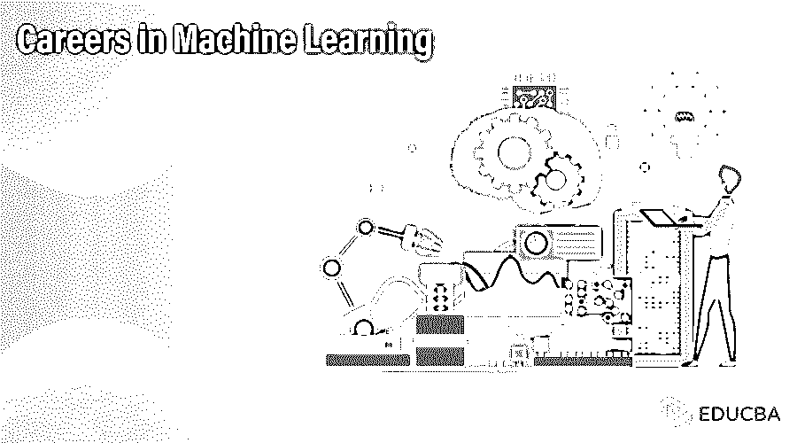

# 机器学习领域的职业

> 原文：<https://www.educba.com/careers-in-machine-learning/>

## 机器学习职业介绍

机器学习是人工智能的一个领域，它为系统提供了在没有任何人工干预的情况下以更高的精度进行自主学习的能力，由于这一点，它在信息技术行业的领域中是非常需要的，并且从事这些技术的开发人员被分配了机器学习工程师的角色。最初，接下来是架构师级别的职位，其工作是为需要开发的应用程序设计原型，根据美国网站，机器学习工程师的起薪是每年 10 万美元。

### 机器学习所需的教育

机器学习需要许多基本的计算机科学概念，一个人应该精通计算机科学概念，如数学、数据结构和算法学科，如计算、统计等。基础数学知识强的也推荐。机器学习是[人工智能](https://www.educba.com/what-is-artificial-intelligence/)的核心组成部分，人们需要对学习这些概念表现出极大的兴趣和热情。

<small>Hadoop、数据科学、统计学&其他</small>

*   如今，机器学习发展得相当迅速和渐进。未来几年，机器学习领域需要大量技术专业人员。
*   机器学习包括技术、数学、统计、商业知识，以及许多在这一领域出类拔萃的技术和逻辑技能。数据分析是机器学习领域的主要元素之一，该领域主要依赖于机器自己学习的数据。
*   这需要在机器自我学习之前处理大量有价值的数据。数据分析师可以很容易地改变他/她的机器学习职业生涯。Python 是机器学习领域最常用的编程语言。这也包括在大多数大学的学术课程中。

### 职业道路

在世界范围内，尤其是在美国，信息技术行业非常需要机器学习专业人员。机器学习通过减少痛苦和错误，轻松地减少了大量人类工作。大多数公司正在开始自动化，这些公司也需要在业务部门实施机器学习技术，以提高绩效和效率，同时降低成本。

*   职业道路最初是作为一名机器学习工程师开始的，他将开发执行一些由人类完成的常见任务的应用程序，这将用于重复执行没有任何错误并产生有效结果的事情。
*   机器学习工程师角色之后将是架构师级别的职位。架构师职业道路的下一个层次将是为要开发的应用程序设计和开发原型。
*   即使是有几年经验的软件工程师也可以在机器学习领域转行。Python 开发人员或数据科学家也可以很容易地在机器学习领域转行。
*   即使没有任何软件工程经验的人，如果他们有一些计算机科学、数学、统计学等方面的知识，也可以在机器学习领域开始他们的职业生涯。

### 工作职位或应用领域

在机器学习领域，信息技术行业中有不同的角色可供选择，如机器学习工程师、高级机器学习工程师、首席机器学习工程师、机器学习工程师前台和后台、机器学习首席工程师、[机器学习软件](https://www.educba.com/machine-learning-software/)工程师、数据科学家、高级数据科学家、数据科学家 IT、高级数据科学家 IT 等。机器学习工程师拥有一些计算机科学概念的强大核心知识，以及扎实的统计数学背景。

### 薪水

根据美国顶级网站提供的不同公司**的工资和薪酬信息，美国机器学习工程师的平均工资为每年 100，956 美元。而且，这个职位有不超过 10 年行业经验的候选人。**

 **另一个顶级薪资信息网站**提到的机器学习的全国平均薪资在美国是 120931 美元。**

 **最著名的网站[**Indeed.com**](https://www.glassdoor.co.in/index.htm?countryRedirect=true)也提到机器学习领域的职业平均工资是每年 135246 美元。

不同 SharePoint 职业道路的平均工资中位数如下:

*   数据科学家(69000 美元至 133000 美元)
*   高级数据科学家(98000 美元–160000 美元)
*   机器学习工程师(77000 美元-155000 美元)
*   IT 部门的数据科学家(69000 美元–129000 美元)
*   高级数据科学家 IT(92000 美元–164000 美元)

在美国，一名机器学习工程师的平均工资约为**112，622** 美元。

### 机器学习中的职业前景

在机器学习领域有多种不同的职业道路，平均工资在机器学习职业道路上也是一个大数字。这表明，对于想进入机器学习领域的人来说，未来将是光明和令人兴奋的。在不久的将来，将会有大量的机器学习领域的人才需求。

*   进入人工智能、数据科学和数据分析等机器学习工程师领域后，还有多种职业道路可走。
*   一个拥有良好沟通技巧和强大技术技能的 IT 专业人员，如果有扎实的数学或统计背景，可以在职业生涯中达到一些顶峰，就像机器学习或人工智能职业生涯中的高级架构师或高级主题专家一样。
*   在美国，机器学习工程师领域的工作职位需求每天都在大量增加。由于在以客户为基础的大公司中的日常活动或任务，工作处理责任需要非常准确无误，以便成功地向客户交付业务。
*   企业非常需要机器学习软件应用程序或产品来维护客户的内容数据安全，机器学习工程师是市场上最好的技术进步之一，可以提供一些高复杂性的业务解决方案。

### 推荐文章

这是机器学习领域的职业指南。在这里，我们讨论了介绍，教育，职业道路，工作职位以及工资和职业前景。您也可以阅读以下文章，了解更多信息——

1.  [SharePoint 中的职业](https://www.educba.com/careers-in-sharepoint/)
2.  [利用改善发展你的职业生涯](https://www.educba.com/develop-your-career-using-kaizen/)
3.  给大学生的职业建议
4.  [网页开发专家](https://www.educba.com/web-development-software/)

****