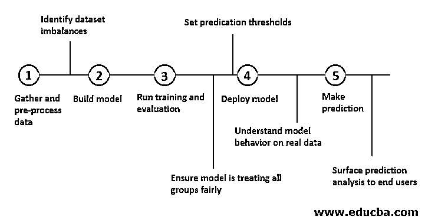
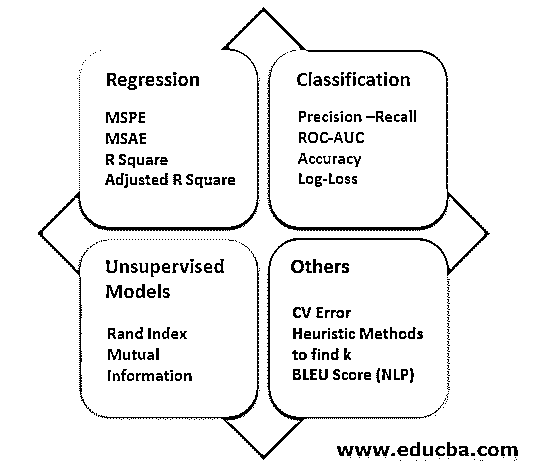

# 机器学习系统

> 原文：<https://www.educba.com/machine-learning-system/>

## 机器学习系统介绍

下面的文章提供了机器学习系统的概要。学习是获取知识和改变行为的实践。当这被赋予计算机(机器)以便它们可以在没有明确命令的情况下协助我们执行复杂任务时，[机器学习](https://www.educba.com/what-is-machine-learning/)就诞生了。机器学习系统作为人工智能的一个子集，使用算法和计算统计来进行真实世界应用中所需的可靠预测。

机器学习为应用程序提供了自我修复和学习的能力，而无需一直进行显式编程。与传统的软件训练不同，在传统的软件训练中，遵循预定义的规则来获得解决方案，机器学习系统通过对各种方法进行实验来接近最佳解决方案。

<small>Hadoop、数据科学、统计学&其他</small>

### 什么是机器学习系统？

机器学习旨在通过学习经过训练的算法来提供有洞察力的、准确的商业价值。机器学习系统包括一系列活动，从数据收集到使用为其指定的行动过程创建的模型。

### 数据理解和分析

很好地理解手头的问题陈述可以导致理解与之相关的数据。此外，它可以为一系列阶段设置布局，这些阶段将被计划以达到最佳解决方案。

数据驱动机器学习。虽然最近我们有大量的数据，但是获得干净的数据来进行成功的预测仍然是一个巨大的任务。在创建可用的 ML 应用程序的过程中，将近 80%的时间花在了数据争论和数据预处理上。

在处理 ML 时，与预期相反，数据并不是一尘不染的。它通常以 csv 或 json 文件的形式包含大量不必要的信息或噪音。在能够使用数据来训练 ML 模型之前，需要采取适当的措施来准备好数据、模型。许多统计和可视化技术被用于数据校正和形成特征集的线索。

最初的步骤是通过执行探索性数据分析来总结给定的数据集，以获得关于以下方面的事实。

*   **关于数据的信息:**帮助我们理解与每个属性相关的数据类型。
*   **数据描述:**帮助我们查看每个属性下有什么样的数据。
*   **缺失值:**缺失值通常会限制 ML 模型发挥其全部潜力，因此处理缺失值变得非常重要。它们可以根据需要用缺失值的特定属性的 0 或平均值、中值(对于数值)或众数(对于分类值)来替换。
*   **数据可视化:**图形和图表用于直观地表示属性之间的关系。例如，一个视觉上吸引人的热图可以让我们更好地理解属性之间的相关性，而不仅仅是看数字。可视化的数据提供了一个想法来制定什么方法需要进一步采取。

### 特征工程

一旦初步分析完成，我们对手头的数据和问题有了概念，我们就可以通过以下方式构建下一层:

*   **仅选择相关特征:**这可以通过诸如 PCA ( [主成分分析](https://www.educba.com/principal-component-analysis/))、因子分析、LDA(线性判别分析)等降维方法来实现。
*   **丢弃数据中的噪声和异常值:**这可以通过实施诸如正则化、k 倍验证、考虑 IQR 区域内的值或者甚至消除冗余特征的方法来实现。

### 建模 ML 系统

#### 1.型号选择

模型选择是选择最适合给定问题陈述要求的算法的过程。一般来说，回归算法是预测连续值的首选算法，而分类算法则用于目标为二元或多类的情况。

#### 2.模型训练和评估

为模型训练获得的数据可分为 3 组，即训练组、验证组和测试组。通常，70%的数据用于训练，剩余的 30%用于在未知测试数据上使用之前验证模型训练。

一旦选择了一个模型，就必须通过调整所需的超参数在预处理数据上对其进行训练，以实现良好的性能并避免过度拟合。一个好的最大似然模型不仅在训练数据上表现出色，在未知的测试数据上也是如此。因此，在预测目标值之前，评估关键方面的训练模型是至关重要的一步。初步评估后获得的结果可用于模型的进一步分析和微调。

#### 3.模型部署

模型部署是这样一个阶段，在此阶段，经过各种参数测试的工作 ML 模型将可用于其在现实世界中的服务。生产就绪模型是使用一个管道创建的，该管道包含从数据收集到数据预处理到模型培训的所有阶段，从而确保一个体面的 CI/CD 课程。如果 ML 系统能够在进一步的测试阶段中保持一致性和再现性，那么它将具有优势。

#### 4.寻找更新

一旦 ML 系统成功部署，工作并没有结束。即使在选择和部署了模型之后，仍然需要定期更新系统。ML 系统会随着时间的推移而消亡。由于每隔一天就会有新数据出现，因此必须检查 ML 系统并对其进行更新以适应新的要求。

### 最大似然系统中的误差分析

在 ML 系统设计中，一个好的和推荐的方法是远离复杂性。没有必要用复杂的算法和方法来支持一个好的 ML 系统。如果一个简单的算法可以满足手头问题陈述的要求，那么至少从一开始，跟随它可能是最好的选择。

可以通过以下方式处理错误并优化 ML 系统:

*   实施交叉验证等技术，以实现改进。
*   可视化数据点，并基于偏差和方差等分析，可以决定是否包括更多数据、更多特征等。
*   为了避免过早优化，让证据引导而不是跟着直觉走是非常必要的。

### 结论-机器学习系统

与流行的观点相反，建立一个成功的 ML 系统并不仅仅依赖于选择一个模型来训练和验证。必须对质量数据进行选择、分析和预处理，为 ML 系统的长期运行奠定坚实的基础。在构建一个 ML 系统时，任何达到目的的途径都必须完全基于数据分析过程中获得的事实，而不是直觉或直觉。

### 推荐文章

这是一个机器学习系统的指南。这里我们讨论 ML 系统中的介绍、数据理解和分析以及错误分析。你也可以看看下面的文章来了解更多-

1.  [感知器学习算法](https://www.educba.com/perceptron-learning-algorithm/)
2.  [大数据编程语言](https://www.educba.com/big-data-programming-languages/)
3.  [Matlab 特性](https://www.educba.com/matlab-features/)
4.  [恶意软件分析工具](https://www.educba.com/malware-analysis-tools/)

