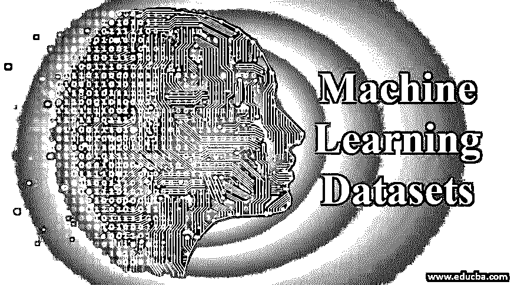

# 机器学习数据集

> 原文：<https://www.educba.com/machine-learning-datasets/>

## 机器学习数据集简介

以下文章提供了机器学习数据集的概述。机器学习数据集被定义为训练模型和进行预测所需的数据集合。这些数据集分为结构化数据集和非结构化数据集，其中结构化数据集采用表格格式，其中数据集的行对应于记录，列对应于特征，非结构化数据集对应于图像、文本、语音、音频等。该数据集是通过数据获取、数据争论和数据探索获得的，在学习过程中，这些数据集被划分为训练、验证和测试集，用于训练和测量模式的准确性。

以下是数据分析中需要的三个主要步骤:

<small>Hadoop、数据科学、统计学&其他</small>

*   数据采集
*   数据争论或数据预处理
*   数据探索

作为数据分析的输出，我们将拥有可用于模型训练的相关数据集。

### 数据集的类型

在[机器学习](https://www.educba.com/what-is-machine-learning/)中，在训练模型时，我们经常会遇到过拟合和欠拟合的问题。

为了克服这种情况，我们需要将数据集分成 3 个不同的部分:

*   训练数据集
*   验证数据集
*   测试数据集

数据集按 60:20:20 的比例划分为上述三个类别。

#### 1.训练数据集

*   该数据集用于训练模型，即，这些数据集用于更新模型的权重。

#### 2.验证数据集

*   这些类型的数据集用于减少过度拟合。它用于验证如果我们使用训练中未使用的数据来测试模型，训练数据集的准确性的增加是否确实增加了。
*   如果训练数据集的精度增加，而验证数据集的精度降低，则这导致高方差的情况，即过拟合。

#### 3.测试数据集

*   大多数时候，当我们试图根据验证集的输出对模型进行更改时，我们会无意中让模型窥视我们的验证集，结果，我们的模型也可能会过度适应验证集。
*   为了克服这个问题，我们有一个测试数据集，它仅用于测试模型的最终输出，以确认准确性。

数据集结构和属性是由各种特征定义的，如属性或特征。数据集通常由人工观察创建，或者有时可能在算法的帮助下创建，用于一些[应用测试](https://www.educba.com/application-testing/)。数据集中可用的数据可以是数字、分类、文本或时间序列。例如，在预测汽车价格时，这些值将是数字。在数据集中，每一行对应一个观察或一个样本。

### 数据类型

让我们从机器学习的角度来看看数据集中可用的数据类型。

#### 1.数据

任何是数字的数据点都称为数值数据。数字数据可以是离散的，也可以是连续的。连续数据具有给定范围内的任何值，而离散数据应该具有不同的值。例如，轿厢门的数量将是离散的，即两个、四个、六个等。汽车的价格将是连续的，可能是 1000 美元或 1250.5 美元。数值数据的数据类型是 int64 或 float64。

#### 2.分类数据

分类数据用于表示特征。例如汽车颜色、制造日期等。它也可以是一个数值，只要该数值表示一个类别。例如，1 可以用来表示燃气汽车，0 表示柴油汽车。我们可以使用分类数据来形成组，但不能对它们执行任何数学运算。它的数据类型是一个对象。

#### 3.时序数据

它是在一定时期内，以固定间隔收集的一系列数字的集合。这是非常重要的，就像在股票市场领域，我们需要一个固定时间间隔后的股票价格。这种类型的数据附有一个时间字段，这样就可以很容易地监控数据的时间戳。

#### 4.文本数据

文本数据只是文字。处理测试数据的第一步是将它们转换成数字，因为 or 模型是数学模型，需要数据来表示数字。因此，为了做到这一点，我们可能会使用函数作为一个单词公式包。

### 数据集的各种来源

通常很难找到机器学习应用程序的数据集。

以下是一些可用于实验的数据集列表及其描述。

#### 1.谷歌数据集搜索引擎

**链接**:https://datasetsearch.research.google.com/

谷歌有自己的数据集搜索引擎。他们的目标是统一几乎所有可用的数据集存储库，并使它们可被发现。人们可以基于他们的学习模型的应用来容易地搜索数据集。

#### 2.Microsoft 数据集

**链接:**【https://msropendata.com/】T2

微软有微软研究院开放数据。它是一个数据存储库，使微软研究人员创建的数据集可供数据科学家使用。在这里，人们可以得到一堆精选的数据集。

#### 3.计算机视觉数据集

**链接:**【https://www.visualdata.io/】T2

这个来源提供了一个图像数据集。如果你计划从事图像处理、深度学习或计算机视觉方面的工作，你可以使用这个资源。有很棒的视觉数据集可以用来建立计算机视觉模型。

#### 4.Kaggle 数据集

**链接:**【https://www.kaggle.com/datasets】T2

它包含大量不同形状和大小的数据。大多数可用的数据集都有相关的内核，许多数据科学家已经提供了他们的笔记本来分析数据集。

#### 5.亚马逊数据集

**链接:**【https://registry.opendata.aws/】T2

它包含来自公共交通、卫星图像等领域的数据集。这些数据集可在亚马逊网络服务资源上获得，如亚马逊 S3。如果您计划使用 AWS 进行机器学习实验和开发，这将变得非常方便。

### 结论–机器学习数据集

在本文中，我们了解了机器学习数据库和数据分析的重要性。从机器学习的角度来看，我们也看到了不同类型的数据集和数据。最后，您有各种各样的来源，可以用来利用数据集进行机器学习模型的实验和开发。

### 推荐文章

这是一个机器学习数据集的指南。在这里，我们讨论不同类型的数据集和数据，以及机器学习数据集的各种来源。您也可以阅读以下文章，了解更多信息——

1.  [机器学习中的数据预处理](https://www.educba.com/data-preprocessing-in-machine-learning/)
2.  [机器学习中的内核方法](https://www.educba.com/kernel-methods-in-machine-learning/)
3.  [超参数机器学习](https://www.educba.com/hyperparameter-machine-learning/)
4.  [机器学习的统计数据](https://www.educba.com/statistics-for-machine-learning/)

