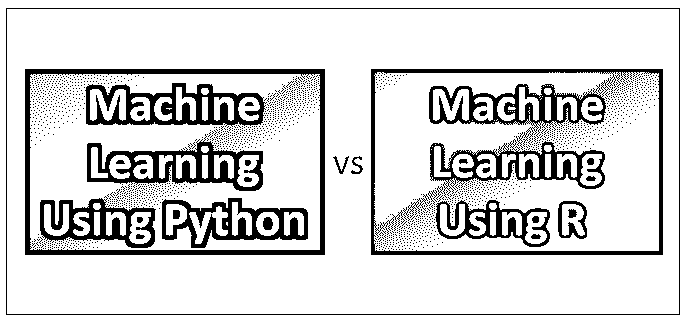
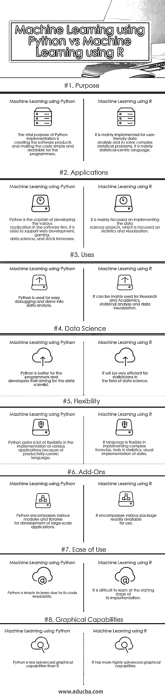

# 机器学习 Python vs R

> 原文：<https://www.educba.com/machine-learning-python-vs-r/>

## 机器学习 Python 和 R 的区别

机器学习是一种自动化计算模型构建的数据分析工具。[机器学习是一门使用算法从数据中学习并做出预测的学科](https://www.educba.com/machine-learning-tools/)。实际上，这意味着我们可以向算法提供信息，并使用它来预测未来可能发生的事情。它是人工智能的一个分支，基于系统可以从数据中学习，识别模式并在最少的人工干预下做出决定的想法。

r 和 Python 无疑是构建数据模型最受欢迎的编程语言。

<small>Hadoop、数据科学、统计学&其他</small>

r 开发于 1992 年，多年来一直是大多数数据科学家的首选编程语言。编程语言 R 是统计学家为数据分析而开发的，他们正在寻找一种开源的解决方案，可以取代 SAS 和 MATLAB 等昂贵的遗留系统。

[Python 于](https://www.educba.com/what-is-python/)1989 年开发，很可能成为强调代码可读性和效率的数据科学工作的编程语言。

### 机器学习 Python 与 R 的直接比较

下面是机器学习 Python 和 R 的 13 大对比

### 机器学习 Python 与 R 的主要区别

以下是要点列表，描述了机器学习 Python 与 R 之间的主要区别

r 和 Python 有大量的包来提升它们的性能。Net 包有助于建立神经网络模型。Caret 是另一个增强 R 的机器学习能力的包，用于预测模型的创建。PyBrain 是一个模块化的机器学习库，为机器学习任务提供了强大的算法。Scikit-learn 是最流行的用于数据挖掘和分析的 Python 机器学习库。

*   Python 推出了用于科学计算的包 NumPy /SciPy，用于制作图表的 matplotlib，用于机器学习的 scikit-learn 和用于数据操作的 pandas，而 R 提供了诸如 dplyr、plyr 和 data 之类的包。用于操作包的表，用于字符串操作的 stringer，用于数据可视化的 ggvis 和 ggplot2，以及用于机器学习的 caret。
*   Python 可以用于许多不同的目的，从 web 开发到应用程序开发，再到数据科学，而 R 则用于核心统计分析。
*   r 适合于所有类型的数据分析，而 Python 适合于实现用于生产的算法。
*   r 是需要独立计算的数据分析任务的首选语言，而 Python 在将数据分析任务与 web 集成集成时，或者在需要将统计代码集成到数据库中时，提供了更大的灵活性。
*   Python 数据可视化库包括 Seaborn、Bokeh 和 Pygal，而 R 的数据可视化库包括 ggplot2、ggvis、googleVis 和 rCharts。
*   r 提供了令人惊叹的视觉效果，比 Python 复杂的可视化要复杂得多。
*   Python 在编程界以简单著称，因此是数据分析师的首选，而 R 学习和应用起来相当具有挑战性。它要求开发人员学习和理解编码。
*   r 非常适合探索性工作、可视化、复杂分析，而 python 更适合程序员和开发人员

### 机器学习 Python 与 R 的对比表

机器学习 Python 与 r 的 8 大区别。

|  | **机器学习 Python** | **R** |
| **目的** | Python 实现的重要目的是创建软件产品，并使代码对程序员来说简单易读。 | r 主要用于用户友好的数据分析和解决复杂的统计问题。它主要是一种以统计为中心的语言。 |
| **应用程序** | Python 是软件公司中开发各种应用程序的队长。它用于支持 web 开发、游戏、数据科学和堆栈增长。 | r 主要致力于实现数据科学项目，这些项目侧重于统计和可视化。 |
| **用途** | Python 用于简单调试和深入数据分析 | r 主要用于研究和学术、统计分析和数据可视化 |
| **数据科学** | Python 更适合程序员和开发人员，而不是数据科学家。 | 对于数据科学领域的统计学家来说，r 将是非常高效的 |
| **灵活性** | 由于以生产力为中心的语言，Python 在实现各种应用程序时获得了很大的灵活性。 | r 语言可以灵活地实现复杂的公式、统计测试、数据的可视化实现。 |
| **附加组件** | Python 包含了用于开发大规模应用程序的各种模块和库。 | r 包括各种现成可用的软件包。 |
| **易用性** | Python 因其代码可读性而易于学习。 | r 在实现的起步阶段很难学。 |
| **图形功能** | Python 的图形功能不如 R 先进 | r 有更高级的图形功能 |
| **数据处理** | 重大的进步有助于加快数据处理速度。 | 重大的进步有助于加快数据处理速度。 |
| **定义** | Python 语言是由 Unix scriptwriter 开发的全服务语言 | r 是由统计主管、大数据爱好者和社会科学家设计和构建的数据分析工具。 |
| **鲁棒性** | Python 仍然是一种更成熟的编程语言，除了数据科学应用之外，它还用于许多类型的 web 和其他应用。 | Applications of R in the business world are definitely on a growth trajectory |
| **外部库** | 两种语言都有大量的外部库，Python 的更成熟一些。 | 与 Python 相比，这两种语言都有广泛的外部库，R 稍欠成熟。 |
| **大数据的性能** | 而 R 和 Python 都可以和 Hadoop 集成大数据。 | 虽然 R 和 Python 都可以与 Hadoop 集成用于大数据，但在某些情况下，R 比 Python 更快，因为有更新的 R 包。 |

### 结论

选择提供广泛特性的工具和语言总是非常棘手的。R 和 Python 之间的选择完全取决于用例及功能。这完全是根据你的要求。如果你是量化出身，最好从 r 开始，相反，如果你是计算机科学家，选择 Python 更容易。下一步-你需要考虑目的。R 和 Python 如果您的需求是数据可视化或数据分析，最好选择 R，而对于编码或项目开发，最好选择 Python。

### 推荐文章

这是一个关于机器学习 Python 和 R 之间的区别、它们的意义、直接比较、关键区别、比较表和结论的指南。您也可以阅读以下文章，了解更多信息——

1.  [机器学习与预测分析—](https://www.educba.com/machine-learning-vs-predictive-analytics/)
2.  [数据科学 vs 机器学习-](https://www.educba.com/data-science-vs-machine-learning/) [5 个最有用的区别](https://www.educba.com/data-science-vs-machine-learning/)
3.  [通过 Python 编程进行 Gnome 开发](https://www.educba.com/gnome-development-via-python-programming/)

