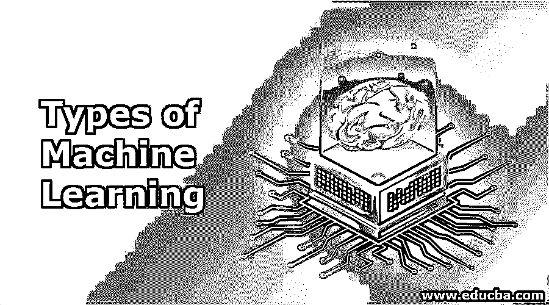
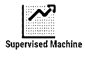
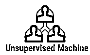
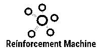
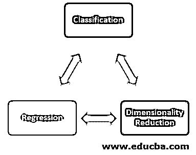

# 机器学习的类型

> 原文：<https://www.educba.com/types-of-machine-learning/>

## 机器学习类型介绍

以下文章概述了机器学习的类型。机器学习是人工智能的子领域，它专注于通过为系统提供自动学习和改进的能力来开发能够访问数据的计算机程序。

例如，在没有任何人工干预或动作的情况下在数据库中寻找模式是基于数据类型，即标记的或未标记的，并且是基于用于在给定数据集上训练模型的技术。机器学习进一步分为监督、非监督、强化和半监督学习算法；所有这些类型的学习技术都在不同的应用中使用。

<small>Hadoop、数据科学、统计学&其他</small>

### 什么是机器学习？

机器学习是[人工智能的一个小应用领域，其中](https://www.educba.com/what-is-artificial-intelligence/)机器自动从操作中学习，并调整自己以给出更好的输出。根据收集的数据，机器改进计算机程序，使之与所需的输出相一致。由于机器的这种自我学习能力，不需要对这些计算机进行显式编程。

然而，它已经在我们不知不觉中渗透到我们生活的每一个角落。实际上，我们使用的每一台机器，以及我们在过去十年见证的先进技术机器，都融入了机器学习，以提高产品质量。机器学习的一些例子是自动驾驶汽车、高级网络搜索、语音识别。

### 传统编程和机器学习的区别

常规编程=逻辑被编程+数据被输入+逻辑在数据上运行+输出

机器学习=输入数据+输入期望输出+在机器上运行，用于训练从输入到输出的算法；简而言之，让它创建自己的逻辑，以达到从输入到输出+用于预测测试数据的训练有素的算法。

### 机器学习方法

根据我们期望从算法中获得的学习类型，我们有四种主要类型的机器学习方法:

#### 1.监督机器学习

当输出被分类或标注时，使用监督学习算法。这些算法从过去输入的数据(称为训练数据)中学习，运行其分析，并使用该分析来预测已知分类中任何新数据的未来事件。测试数据的准确预测需要大量的数据来充分理解模式。通过将训练输出与实际输出进行比较，并使用误差来修改算法，可以进一步训练算法。

**现实生活中的例子:**

*   **图像分类—**该算法是从带有标签的图像数据中提取的。训练一个算法，期望该算法在新图像的情况下正确分类。
*   **市场预测—**也叫回归。历史商业市场数据被输入计算机。然后，通过分析和回归算法，根据变量预测未来的新价格。

#### 2.无监督机器学习

当我们不知道最终输出，并且分类或标记输出不受我们支配时，使用无监督学习算法。这些算法研究并生成一个函数来描述完全隐藏和未标记的模式。因此，没有正确的输出，但是它研究数据以给出未标记数据中的未知结构。

**现实生活中的例子:**

*   **聚类—**算法要求具有相似特征的数据分组在一起；这种分组称为集群。这些被证明在这些组的研究中是有帮助的，可以或多或少地应用于一个集群内的全部数据。
*   **高维数据—**高维数据通常不容易处理。在无监督学习的帮助下，高维数据的可视化成为可能。
*   **生成模型–**一旦您的算法分析并得出输入的概率分布，它就可以用于生成新数据。事实证明，这在数据缺失的情况下非常有用。

#### 3.强化机器学习

这种[类型的机器学习算法](https://www.educba.com/types-of-machine-learning-algorithms/)使用试错法，根据函数的最高效率生成输出。比较输出以找出错误并反馈给系统以改进或最大化其性能。该模型提供了奖励，这些奖励基本上是在执行特定目标时其操作中的反馈和惩罚。

#### 4.半监督机器学习

这些算法通常处理标记和未标记的数据，其中未标记的数据量比标记的数据量大。由于它与[监督和非监督学习算法](https://www.educba.com/supervised-learning-vs-unsupervised-learning/)一起工作，因此被称为半监督机器学习。使用这些模型的系统被认为具有改进的学习准确性。

**示例****–**一个图像档案只能包含一些已标记的数据，例如狗、猫、老鼠，而大量图像仍未标记。

### 基于算法输出类型的模型

以下是基于我们对算法输出类型的机器学习模型:

#### 1.分类

有一个投入类别的划分；该系统从训练数据中产生模型，其中它向这些类之一分配新的输入。它属于监督学习的范畴。一个真实的例子是垃圾邮件过滤，其中电子邮件是被分类为“垃圾邮件”或“非垃圾邮件”的输入。

#### 2.回归

回归算法也是监督学习的一部分，但区别在于输出是连续变量，而不是离散的。

**示例—**利用过去的数据预测房价。

#### 3.降维

这种类型的机器学习与输入的分析相关，并将其减少到仅与模型开发相关。特征选择，即输入选择和特征提取，是更好地理解降维所需要的进一步的主题。

基于上述不同的方法，有各种算法需要考虑。一些非常常见的算法有线性和逻辑回归、K-最近邻、决策树、支持向量机、随机森林等。在这些算法的帮助下，复杂的决策问题可以在海量数据的基础上有方向感。为了获得这种准确性和机会，需要提供额外的资源和时间。因此，与人工智能和其他技术一起使用的机器学习更有效地处理信息。

### 推荐文章

这是机器学习类型的指南。在这里，我们讨论了机器学习类型的概念，以及不同的方法和不同种类的算法模型。您也可以浏览我们推荐的其他文章，了解更多信息——

1.  [机器学习技术](https://www.educba.com/machine-learning-techniques/)
2.  [什么是机器学习？](https://www.educba.com/what-is-machine-learning/)
3.  [机器学习简介](https://www.educba.com/introduction-to-machine-learning/)
4.  [超参数机器学习](https://www.educba.com/hyperparameter-machine-learning/)

