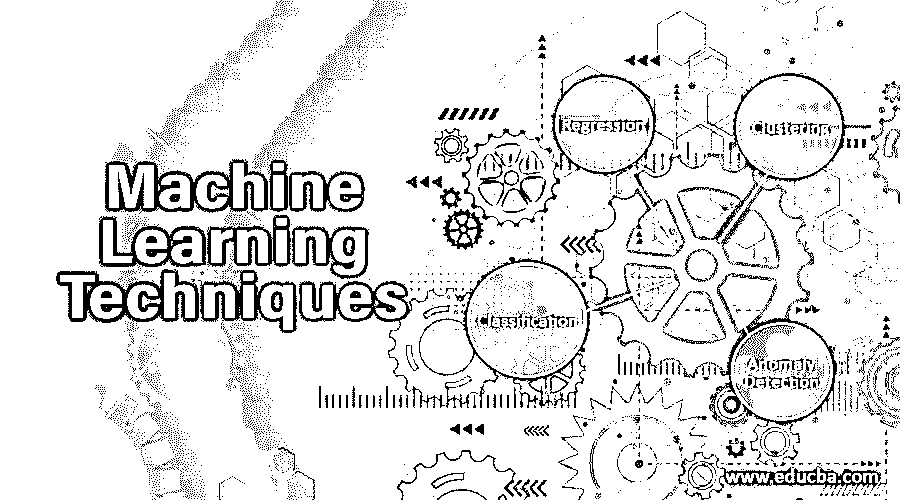
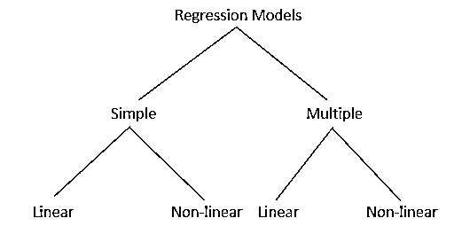

# 机器学习技术

> 原文：<https://www.educba.com/machine-learning-techniques/>

## 机器学习技术介绍

机器学习技术(如回归、分类、聚类、异常检测等。)用于建立训练数据或数学模型，使用基于计算统计的特定算法来进行预测，而不需要编程，因为这些技术在使系统具有未来感、建模和促进自动化方面具有影响力，同时降低了成本和人力。

### 机器学习技术

有一些方法对促进系统根据经验自动学习和改进是有影响的。但它们属于各种类别或类型，如监督学习、非监督学习、强化学习、表示学习等。以下是属于机器学习的技术:

<small>Hadoop、数据科学、统计学&其他</small>

#### 1.回归

回归算法主要用于对数字进行预测，即当输出是实数或连续值时。由于它属于[监督学习](https://www.educba.com/what-is-supervised-learning/)，它与经过训练的数据一起工作，预测新的测试数据。例如，年龄可以是一个连续值，因为它随时间而增加。有一些回归模型如下所示:

回归技术中一些广泛使用的算法

*   **简单线性回归模型**:是分析两个数量变量之间关系的统计方法。这种技术多用于金融领域、房地产等。
*   **套索回归**:当需要预测器的子集来最小化连续变量的预测误差时，使用最小绝对选择收缩算子或套索。
*   **逻辑回归**:在欺诈检测、临床试验等情况下进行。只要输出是二进制的。
*   **支持向量回归**:支持向量回归和 SVM 有点不同。在简单回归中，目标是最小化误差，而在 SVR 中，我们在阈值内调整误差。
*   **多元回归算法**:该技术用于多个预测变量的情况。可以用矩阵运算和 Python 的 Numpy 库进行运算。
*   **多元回归算法**:它在线性和非线性回归算法中均可处理多个定量变量。

#### 2.分类

分类模型是一种监督学习的方法，它从观察值中得出一个结论，作为一种分类形式的一个或多个结果。例如，电子邮件有收件箱、草稿、垃圾邮件等过滤器。分类模型中有许多算法，如逻辑回归、决策树、随机森林、多层感知等。在这个模型中，我们对数据进行专门分类，并相应地为这些类别分配标签。分类器有两种类型:

*   **二元分类器**:具有两个不同类别和两个输出的分类。
*   **多类分类器** s:超过 2 类的分类。

#### 3.使聚集

聚类是一种机器学习技术，涉及将数据点分类到特定的组中。如果我们有一些对象或数据点，那么我们可以应用[聚类算法](https://www.educba.com/clustering-algorithm/) (s)对它们进行分析，并根据它们的属性和特征进行分组。使用这种无监督技术的方法是因为它的统计技术。聚类算法根据训练数据进行预测，并根据相似性或不熟悉性创建聚类。

**聚类方法:**

*   **基于密度的方法**:在这种方法中，根据簇与较低密度区域的相似性和差异，簇被认为是密集区域。
*   **分层方法**:这种方法形成的簇是树状结构。该方法从前一个聚类形成树或聚类。有两种类型的层次方法:凝聚(自下而上的方法)和分裂(自上而下的方法)。
*   **划分方法**:该方法基于 k-簇划分对象，每种方法形成一个簇。
*   **Gris based methods** :在这种方法中，数据被组合到多个单元格中，形成一个网格状的结构。

#### 4.异常检测

异常检测是检测数据集中意外项目或事件的过程。使用这种技术的一些领域是欺诈检测、故障检测、系统健康监控等。异常检测可以大致分为以下几类:

1.  **点异常**:点异常是指单个数据出现意外的情况。
2.  **上下文异常**:当异常是上下文特定的，那么它被称为上下文异常。
3.  **集体异常**:当一个集合或一组相关数据项异常时，称为集体异常。

异常检测中的某些技术如下:

*   **统计方法**:通过指出偏离均值、中值、众数等统计方法的数据，帮助识别异常。
*   **基于密度的异常检测**:基于 k 近邻算法。
*   **基于聚类的异常算法**:当数据点属于同一个组时，它们被收集成一个簇，并由局部质心确定。
*   **超级向量机**:算法训练自己对正常数据实例进行聚类，并使用训练数据识别异常。

### 研究机器学习技术

机器学习利用大量算法来处理和处理大型复杂数据集，以根据需要进行预测。

例如，我们在谷歌上搜索一张公交车图片。因此，谷歌基本上获得了一些标记为巴士的例子或数据集，系统找到了像素和颜色的模式，这将有助于找到正确的巴士图像。

谷歌的系统会在图案的帮助下，对公交像图像进行随机猜测。如果出现任何错误，它会自动调整以保证准确性。最终，这些模式将被一个像人脑或深度神经网络一样建模的大型计算机系统学习，以从图像中识别准确的结果。这就是 ML 技术总是获得最佳结果的方式。

### 结论

机器学习在现实生活中有各种应用，以帮助企业、个人等。根据需要获得某些结果。为了获得最好的结果，上面已经讨论过的某些技术是很重要的。这些技术是现代的、未来的，并以更少的人力和成本促进事物的自动化。

### 推荐文章

这是机器学习技术的指南。在这里，我们讨论了机器学习的一些广泛使用的技术及其工作的基本概念。您也可以看看以下文章，了解更多信息–

1.  [合奏技法](https://www.educba.com/ensemble-techniques/)
2.  [人工智能技术](https://www.educba.com/artificial-intelligence-techniques/)
3.  [数据挖掘概念和技术](https://www.educba.com/data-mining-concepts-and-techniques/)
4.  [数据科学机器学习](https://www.educba.com/data-science-machine-learning/)
5.  [创建决策树的简单方法](https://www.educba.com/create-decision-tree/)

