# 机器学习特征选择

> 原文：<https://www.educba.com/machine-learning-feature-selection/>

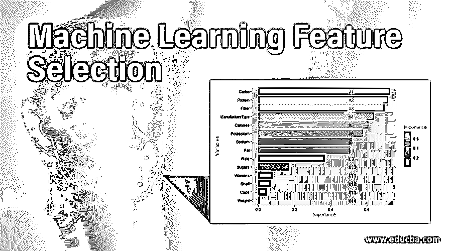

## 什么是机器学习特征选择？

特征选择是从现有特征集中的目标变量中识别关键或有影响的变量的过程。特征选择可以通过各种算法或方法来实现，如决策树、线性回归和随机森林等。这些算法通过权重计算帮助我们识别最重要的属性。

“特征选择是在现有特征中选择最有用的特征来训练模型”

<small>Hadoop、数据科学、统计学&其他</small>

### 什么是机器学习？

机器学习是一种新兴的未来技术，是创造智能自动化创新的起点。它依赖于对一段时期内发生的模式和趋势的学习。ML 的学习曲线很高，因为使用不同的编程语言和新的视角，实现会变得更好。它在互联网上有广泛的学习能力。分类、神经网络、聚类、模型预测是机器学习的核心。技术的繁荣延伸到云服务和物联网创造。

为了解决尖端机器学习技术的问题，我们需要按顺序执行几个过程。他们是，

*   **采集数据点**:将数据集导入建模环境。
*   **特征工程**:将原始数据转换成结构化格式的过程，即从原始数据中提取新的变量。使数据准备好用于模型训练。
*   **特征选择**:从数据集中的大量数据点中提取最具预测性的特征。
*   **模型选择**:通过高权重选择合适的模型进行预测。
*   **模型预测:**从预测的模型中导出结果。

我们来看看机器学习对于模型预测的重要阶段。

### 为什么特征选择在 ML 中很重要？

这一过程减少了数据分析中的物理干预。它使特征解释变得简单易用。该技术帮助我们选择与其他变量相关的最有针对性的变量。这减少了集合的维数，并提高了所选特征的精度。因此，模型性能随着所选特征而提高。

特征选择的三个主要执行是，

*   可以在将数据分成训练集和验证集之后进行特征选择。度量变量的性能并通过交叉验证删除列。
*   移除不必要的特征，即低相关变量->权重值较小。
*   使用统计方法、交叉验证、网格搜索等方法在选定的特征上建立模型。

### 如何通过特征选择来选择数据点？

让我们进行一个案例研究，利用谷物的营养成分来预测它们的健康类型。这个数据集包含了一系列含有各种营养成分的谷物，如纤维、维生素、碳水化合物和钾等。让我们在里面变戏法，以知道哪种营养素作为一个特征有很高的重要性，并看看特征选择如何在模型预测中发挥重要作用。在这里，我们将看到 R 语言中特性选择的过程。

**第一步**:数据导入 R 环境。

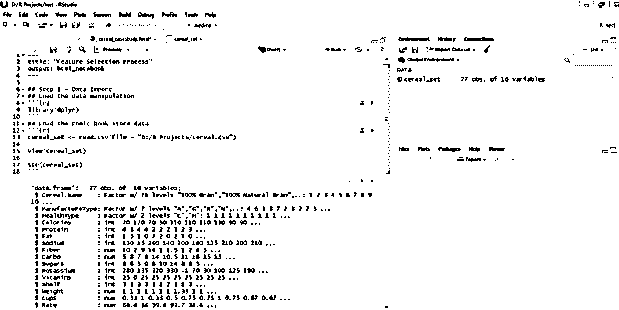

谷物数据集视图

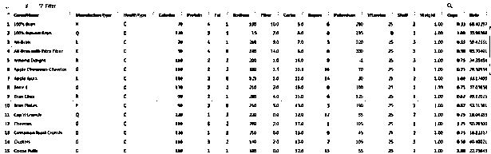

**步骤 2:** 将原始数据点转换成结构化格式，即特征工程

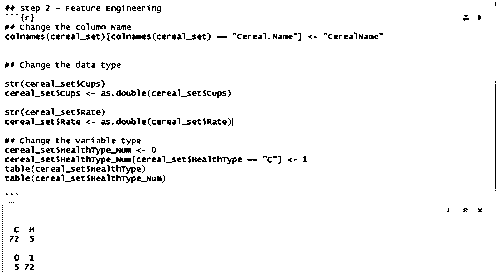

**第三步:**特征选择——挑选高度相关的变量用于预测模型

**步骤 3A:–**将数据分割成训练&验证集

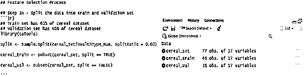

**步骤 3B:** 训练集用于使用 RandomForest 算法寻找重要性和错误率。您应该看到，randomForest 公式中删除了谷物名称和健康类型。因为算法中不支持具有不同值集的分类变量。

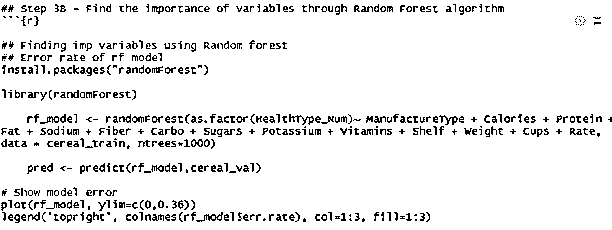

误差率用绘图来表示。它是基于相关值绘制的。红色绘图表示低相关值的数量更多。

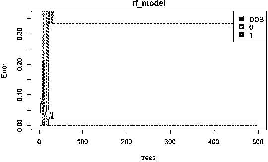

**步骤 3C:** 使用相关性和高重要性对特征进行排序。在这里，特征根据它们在训练集中的重要性进行排序。并使用 ggplot 库绘制。重要性使用 MeanDecreaseGini 绘制。

MeanDecreaseGini 是一个衡量特征纯度的指标，它暗示了特征变量是否有用。

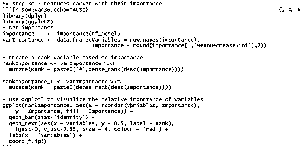

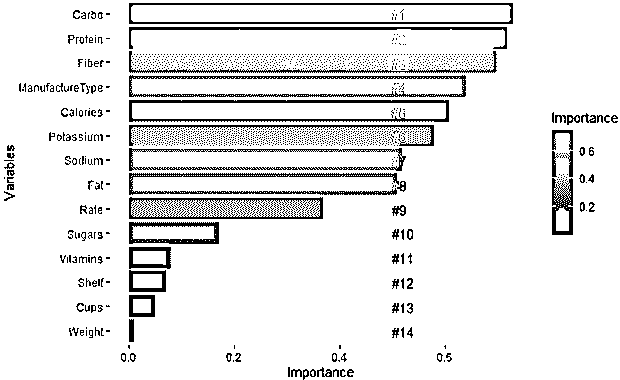

在这张图表中，我们可以看到碳水化合物、蛋白质、纤维、谷物的制造类型和卡路里是最重要的特征。这些特征极大地有助于模型预测并决定谷物的健康类型。

**步骤 3D:** 前 10 个变量按照重要性排序，向下排序。这 10 个变量被认为是选定的特征并用于模型预测。

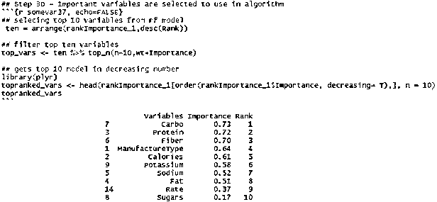

**Note:** The features can also be selected according to the usage of the model and no.of.features processed for finding importance. It truly depends on the categories and features used for solving the problem.

**步骤 3E:** 特征选择有两种方法。人们可以在这里停下来，使用从 RandomForest 中导出的最重要的特征，并形成用于模型预测的公式。

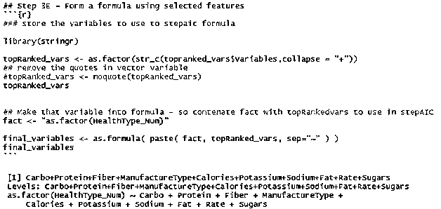

**步进 3F:** 另一种向下钻取特征的方法是步进法。该方法使用逆向工程，并进一步使用逻辑回归消除低相关性特征。这非常有助于在模型中仅使用相关性非常高的特征。这提供了非常精确的结果。

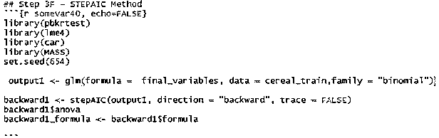

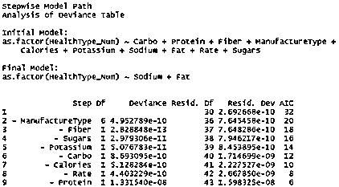

我们通过该方法中使用的变量的系数来实现特征选择。下面是对特征选择的 StepAIC 方法的总结。

这一总结是基于逻辑回归方法。

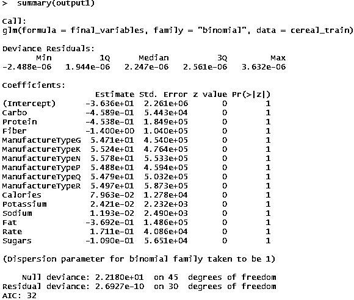

*   降低 AIC 值会产生有效的结果。
*   零偏差表示除了截距值之外，训练模型对响应的预测有多好。如果零偏差很小，则模型表现良好。p 值用于度量，并检查其与数据模型的拟合程度。
*   残差偏差表示当包括预测因子(即健康类型)时，训练模型对反应的预测程度。用来看零假设是否成立。
*   该总结基于 StepAIC 中的反向传播。使用它们的权重消除低相关值。

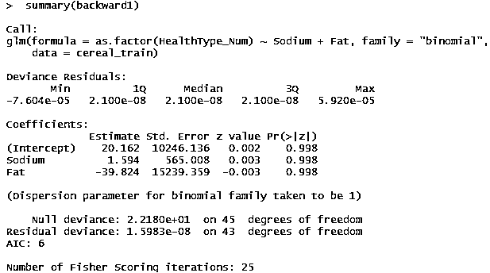

所以，钠和脂肪这两个特征被用来建模。

### 结论

特征选择根据参数调整而改变。有许多方法来处理特征选择。这里我们使用了两种方法，并且理解了选择特性和模型对于获得好的结果有多重要。这个特征选择过程在机器学习问题中起着更大的作用，以解决其中的复杂性。

### 推荐文章

这是一个机器学习特征选择的指南。这里我们讨论什么是特征选择和机器学习，以及在特征选择中选择数据点的步骤。您也可以浏览我们的其他相关文章，了解更多信息——

1.  [机器学习系统](https://www.educba.com/machine-learning-system/)
2.  [监督机器学习算法](https://www.educba.com/supervised-machine-learning-algorithms/)
3.  [机器学习功能](https://www.educba.com/machine-learning-feature/)
4.  [机器学习技术](https://www.educba.com/machine-learning-techniques/)

