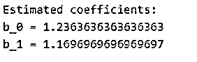

# 线性回归数据集

> 原文：<https://www.educba.com/dataset-for-linear-regression/>

## 线性回归数据集简介

线性回归的数据集被定义为在机器学习中，它是一种可以在监督学习中分类的算法，以在因变量和自变量之间找到目标变量；此外，它可以让我们在最适合某个关系的变量之间建立关系，在机器学习中，它可以用于密切关联与因变量相关的变量，并且在分析数据时可以用于大量数据，同时构建模型，它可以用于找到因变量的预期值。

### 什么是线性回归数据集？

*   线性回归是一种机器学习算法，可用于在数据集上构建模型以分析大量数据，数据集的模型给出了因变量的正确预期值，当我们试图了解预期值时，回归中的因变量是主要元素，并且可以容纳线性回归的测试数据的数据集目录称为回归。
*   线性回归可能是统计学和机器学习中最熟悉和最容易识别的算法；基本上，线性回归是为统计领域而出现的，但在进一步研究后，它作为一种模型，在理解机器学习算法所采用的输入数值变量和输出数值变量之间的关系时，变量之间的关系在本质上可以是正的或负的，其中当自变量和因变量都以图形方式增加时，可以出现正的关系，而当因变量减少和自变量增加时，出现负的关系。
*   线性回归有两种类型:简单线性回归和多元线性回归，简单线性回归需要使用其简单特征对值给出预期的响应，多元线性回归在有大量数据时使用，通过使用其两个或更多特征来预测响应值。

### 线性回归和实现的基础

线性回归的基础是从第二个变量中预测第一个变量。当我们试图预测一个变量时，它使用的标准变量是预测变量。它被称为简单回归，当我们试图预测一个或多个变量时，它被称为多元线性回归。当我们实现简单的线性回归时，数据集模型具有一些使数据集灵活和强大的特性；我们必须考虑两个变量是线性相关的，如果我们有数据集 m 和 n，并且 n 中的每个值的响应值对应于 m 中的值，那么在响应中它会根据其特征给出准确的值。

<small>Hadoop、数据科学、统计学&其他</small>

如果 m 作为 a m = [m_1，m_2，…，m_n]而 n 作为 n = [n_1，n_2，…]。n_n]

虽然这个例子是要找出 n 个观察值，但当我们在这些观察值之间绘制图形时，我们必须找出最适合的直线来找出预测值。

### 如何使用数据集进行线性回归？

*   当我们有多个输入变量时，我们可以使用多元线性回归技术，也可以使用不同的技术对数据集执行线性回归，因为我们知道线性回归技术用于查找选定值之间的线性关系，并查找一个或多个预期值。
*   在机器学习中，线性回归是可以归入监督学习算法类别的统计模型，并且我们可以使用该算法，该算法不用于预测来自不同逻辑回归的输出，而是用于预测在机器学习的分类中可能发生的具有单独输出的值。
*   让我们看一个例子，我们有一个被诊断患有血压的患者的数据集，每个患者都有他们的年龄和各自的体重；我们希望预测或预测因血压问题而来的新患者，因此我们需要将此类数据放入表格中，因此在线性回归中，第一个数据表被称为独立变量数据集，因为该变量可以解释，我们可以将该变量与预测变量进行匹配，预测数据集将被称为因变量数据集，因为该变量可以解释我们给定示例中的年龄和体重等输入变量。

### 线性回归数据集示例

下面提到了不同的例子:

简单线性回归的 Python 示例。

**代码:**

`from __future__ import division
import numpy as np
import matplotlib.pyplot as plt
import pandas as pd
def estimate_coef(x, y):
n = np.size(x)
m_x = np.mean(x)
m_y = np.mean(y)
SS_xy = np.sum(y*x) - n*m_y*m_x
SS_xx = np.sum(x*x) - n*m_x*m_x
b_1 = SS_xy / SS_xx
b_0 = m_y - b_1*m_x
return (b_0, b_1)
def plot_regression_line(x, y, b):
plt.scatter(x, y, color = "m",
marker = "o", s = 30)
y_pred = b[0] + b[1]*x
plt.plot(x, y_pred, color = "g")
plt.xlabel('x')
plt.ylabel('y')
plt.show()
def main():
x = np.array([0, 1, 2, 3, 4, 5, 6, 7, 8, 9])
y = np.array([1, 3, 2, 5, 7, 8, 8, 9, 10, 12])
b = estimate_coef(x, y)
print("Estimated coefficients:\nb_0 = {} \
\nb_1 = {}".format(b[0], b[1]))
plot_regression_line(x, y, b)
if __name__ == "__main__":
main()`

**输出:**

上面是在 python 中实现简单线性回归来寻找预期值的例子。

### 结论

本文的结论是，利用因变量和自变量之间的线性和非线性关系，可以建立线性回归模型；此外，我们已经看到了一些要点，所以如果有人想了解线性回归数据集的概念，那么这篇文章肯定会有所帮助。

### 推荐文章

这是线性回归数据集指南。在这里，我们讨论介绍，线性回归的基础知识和实施，使用和例子。您也可以看看以下文章，了解更多信息–

1.  [机器学习数据集](https://www.educba.com/machine-learning-datasets/)
2.  [火花数据集](https://www.educba.com/spark-dataset/)
3.  [数据库安全](https://www.educba.com/database-security/)
4.  [Teradata 合格](https://www.educba.com/teradata-qualify/)

