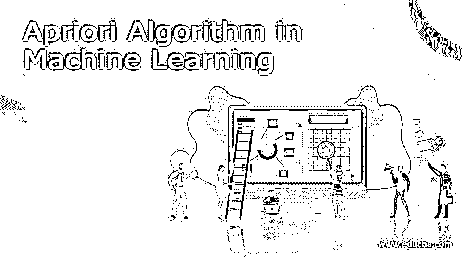

# 机器学习中的 Apriori 算法

> 原文：<https://www.educba.com/apriori-algorithm-in-machine-learning/>

## Apriori 算法简介

在机器学习技术中，我们使用不同的和大量的算法来赋予硬件或机器智能。apriori 算法就是其中之一。apriori 算法有助于产生关联规则。为了生成关联规则，它使用频繁数据集或项目集信息。通常，它被设计成可以在包含或支持事务的不同数据库上工作。根据关联规则，我们能够识别两个对象是如何强连接或弱连接的。根据工作机制，apriori 算法使用哈希树和广度优先搜索来计算项集。它将非常有效地计算项目集。大型数据集将为识别频繁项集提供迭代机制。

apriori 算法是由 Srikant 和 R. Agrawal 开发的。它是在 1994 年开发的。在初始阶段，apriori 算法主要用于购物篮分析。这将有助于客户识别可以放在一起的产品。同样的算法也将用于医疗保健行业。这将有助于确定药物反应。

<small>Hadoop、数据科学、统计学&其他</small>

### 机器学习中的 Apriori 算法

在 apriori 算法中，我们主要关心的是频繁项集。频繁项集是那些支持值大于用户定义的最小支持值或我们定义的阈值的项。为了简单起见，让我们考虑两个项目集，即 P & q。P&Q 都是频繁项目集。

让我们考虑有两个事务:P = {1，2，3，4，5}，Q = {2，3，7}。在这两个事务中，2 和 3 是公共项集。

注意:在 apriori 算法中，我们主要需要关注关联规则。为了更好地理解 apriori 算法，我们需要正确理解支持度和置信度的概念。这里，关联规则出现了。

以下是有助于理解 apriori 算法的短语列表:

阶段 1:在初始阶段，我们需要确定事务数据库中的支持项集列表。因此，我们需要选择最小支持度和置信度值。

阶段 2:我们需要在更高支持值的帮助下从事务表中获取所有支持值。支持值高于所选支持值的最小值。

阶段 3:我们需要找到所有的规则。根据这些规则，与最小置信度值或阈值相比，子集值具有更高的置信度值。

第 4 阶段:在这里，我们按照降序对规则集进行排序。

### Apriori 算法如何工作？

为了详细解释 apriori 算法，我们使用了一些数学计算集合
示例:让我们考虑一下，我们有以下数据集。它保存着事务列表。在同一个数据集中，我们发现了公共项集。根据需求，我们需要借助 apriori 算法来定义关联规则。

| 交易 ID | 项目集 |
| TID1 | p，Q |
| TID2 | 问，S |
| TID3 | q，R |
| TID4 | p，Q，S |
| TID5 | p，R |
| TID6 | q，R |
| TID7 | p，R |
| tidb | p，Q，R，T |
| TID9 | p，Q，R |

注意:根据上述交易表，最小支持值为 2，最小置信度值为 50%。

### apriori 算法的求解阶段

#### 阶段 1:计算 C1 和 L1

在初始阶段，我们构建一个表来保存支持计数值，即单个数据集中的公共项集。该表被称为 C1，即候选集。

| 项目集 | 支持计数 |
| P | six |
| Q | seven |
| 稀有 | five |
| S | Two |
| T | one |

在下一个阶段，我们将获得与最小支持计数相比具有更大支持值计数的项目集，即值为 2。它将为我们提供公共项集(即 L1)的表

| 项目集 | 支持计数 |
| P | six |
| Q | seven |
| 稀有 | five |
| S | Two |
| T | one |

#### 第二阶段:候选人 C2 将军和 L2

在这个阶段，我们将在 L1 的帮助下制作 C2。在 C2 中，我们正在创建 L1 的项集对。它将以子集的形式出现。一旦子集准备就绪，我们需要找到与数据集的主事务表相比较的支持值计数。

| 项目集 | 支持计数 |
| {P，Q} | four |
| {P，R} | four |
| {P，S} | one |
| {Q，R} | four |
| {Q，S} | Two |
| {R，S} | Zero |

我们需要再次比较 C2 支持计数和最小支持计数值。一旦比较完成，则具有较小支持值的项目集将被删除，并给出 L2 表。

| 项目集 | 支持计数 |
| {P，Q} | four |
| {P，R} | four |
| {Q，R} | four |
| {Q，S} | Two |

#### 第 3 阶段:我们生成候选人 C3 和 L3

在 C3，我们正在重复相同的过程，但这里将借助子集值 3 创建 C3 表。我们正在数据集的帮助下计算支持计数。

| 项目集 | 支持计数 |
| {P，Q，R} | Two |
| {Q，R，S} | one |
| {P，R，S} | Zero |
| {P，Q，S} | Zero |

我们需要创建 L3 级表。这里，我们使用上面的 C3 表。根据该表，我们只能得到一个项集组合，它支持的计数值等于最小支持计数。现在，L3 将只有一个分组，即{P，Q，R}。

#### 阶段 4:关联规则的发现

我们需要借助组合{P，Q，R}为关联规则创建一个新表。在调用关联规则方面，我们将在 sup (P ^Q)/P.)的帮助下调用置信度。一旦置信度调用所有规则，那么我们需要在比较最小阈值时排除置信度较低的规则，即(50%)。

p^q→R2 sup {(p ^q)^r}/sup(p ^q)= 2/4 = 0.5 = 50%
q^r→p2 sup{(q^r)^p}/sup(q ^r)= 2/4 = 0.5 = 50%
p^r→Q2 sup {(p ^r)q }/sup(p r)= 2/4 = 0.5 = 50%
r→p Q2 sup {(r(p q)}/sup(r)= 2/5 = 0.4 = 40%
p→q R2

### 结论–机器学习中的 Apriori 算法

我们已经看到了“apriori 算法”这个未切割的概念。apriori 算法将有助于产生关联规则。这将有助于确定频繁的交易项目。

### 推荐文章

这是机器学习中的 Apriori 算法指南。在这里我们讨论介绍，Apriori 算法是如何工作的？，求解阶段分别为 apriori 算法。您也可以看看以下文章，了解更多信息–

1.  [机器学习功能选择](https://www.educba.com/machine-learning-feature-selection/)
2.  [机器学习的统计数据](https://www.educba.com/statistics-for-machine-learning/)
3.  [正则化机器学习](https://www.educba.com/regularization-machine-learning/)
4.  [机器学习中的回归](https://www.educba.com/regression-in-machine-learning/)

