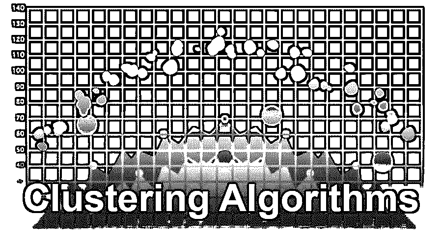

# 聚类算法

> 原文：<https://www.educba.com/clustering-algorithms/>

## 聚类算法简介

聚类算法是一种机器学习算法，可用于根据单个组和业务需求分离数据集。它是在数据科学和人工智能(AI)中实现的机器学习算法的一个流行类别。基于逻辑分组模式有两种类型的聚类算法:硬聚类和软聚类。基于计算过程的一些流行的聚类方法是 K-均值聚类、连通性模型、质心模型、分布模型、密度模型、层次聚类。聚类算法的用例是图像分割、市场分割和社会网络分析。

### 聚类算法的类型

基本上，聚类算法被细分为两个子组，它们是:

<small>Hadoop、数据科学、统计学&其他</small>

*   **硬聚类:**在硬聚类中，一组相似的数据实体完全属于一个相似的性状或聚类。如果数据实体在一定条件下不相似，则该数据实体被完全从聚类集中移除。
*   **软聚类:**在软聚类中，对每个找到相似相似数据实体的数据实体进行松弛，形成一个聚类。在这种聚类中，可以根据相似性在多个聚类集中找到唯一的数据实体。

### 什么是聚类方法？

每种聚类方法都遵循一组规则，这些规则定义了数据实体之间的相似性。目前市场上有数百种聚类方法。

所以让我们来考虑一下现在非常流行的一些问题:

#### 1.连通性模型

如其标题所示，在该机制中，算法基于数据点在数据空间中更接近的概念，在集合数据实体的组中找到最近的相似数据实体。因此，距离相似数据实体较近的数据实体将比距离较远的数据实体表现出更大的相似性。这个机制也有两种方法。

在第一种方法中，该算法开始将一组数据实体划分到一个单独的群集中，然后根据距离标准对它们进行排列。在另一种方法中，由于距离函数是基于用户标准的主观选择，因此该算法将所有数据实体子集化到特定聚类中，然后根据距离标准将它们聚集。

#### 2.质心模型

在这种类型的迭代算法中，首先考虑某个质心点，然后将相似的数据实体根据它们相对于该质心点的接近程度分成一个簇。不幸的是，最流行的 K-Means 聚类算法在这种类型的聚类算法中并不成功。还有一点需要注意的是，质心模型中没有预定义的聚类，因此我们对输出数据集进行了分析。

#### 3.分销模式

在这种类型的算法中，该方法发现一个簇中的每个数据实体属于相同或相同分布(如高斯或正态)的可能性有多大。这种类型的算法的一个缺点是数据集实体在这种类型的聚类中必须经受过拟合。

#### 4.密度模型

使用该算法，数据集相对于数据空间中不同密度的数据区域被隔离，然后数据实体被分配特定的聚类。

#### 5.k 表示聚类

这种类型的聚类用于在多个数据实体集的集合中的每次迭代之后找到局部最大值。

该机制包括以下 5 个步骤:

*   首先，我们必须在这个算法中定义我们想要的集群数量。
*   每个数据点被随机分配给一个聚类。
*   然后我们必须在其中计算质心模型。
*   在此之后，相对数据实体被重新分配给其最近的或最接近的簇。
*   重新排列群集质心。
*   重复前两步，直到我们得到想要的输出。

#### 6.分层聚类

这种类型的算法类似于 k-means 聚类算法，但它们之间有细微的差别，即:

*   K- means 是线性的，而层次聚类是二次的。
*   在不太可能使用 k-means 的层次聚类中，结果是可重复的，当一个算法被多次调用时，会给出多个结果。
*   分层聚类适用于所有形状。
*   当您获得想要的结果时，可以随时中断层次聚类。

### 聚类算法的应用

现在是时候了解聚类算法的应用了。它有一个非常大的特点。

聚类算法用于各种领域，包括:

*   它用于异常检测。
*   它用于图像分割。
*   它用于医学成像。
*   它用于搜索结果分组。
*   它用于社会网络分析。
*   它用于市场细分。
*   它用于推荐引擎。

聚类算法是机器学习的革命性方法。它可以用来提升监督机器学习算法的准确性。我们可以在各种机器学习算法中使用这些聚类的数据实体，以获得高精度的监督结果。准确的说可以用于多种机器学习任务。

### 结论

因此，它在各种领域都有大量的应用，如地图绘制、客户报告等。此外，使用聚类，我们可以很容易地增加机器学习方法的准确性。所以考虑到未来的方面，我可以说这种算法几乎被用在软件开发领域的每一项技术中。因此，任何有兴趣在机器学习领域从事[职业的人都需要深入了解聚类算法，因为它与机器学习和数据科学直接相关。除此之外，在每种技术中拥有所需的技术总是返回一个好的方法是很好的。](https://www.educba.com/careers-in-machine-learning/)

### 推荐文章

这是聚类算法的指南。这里我们已经讨论了聚类算法的介绍及其类型、方法和应用。您也可以阅读以下文章，了解更多信息——

1.  [神经网络算法](https://www.educba.com/neural-network-algorithms/)
2.  [数据挖掘算法](https://www.educba.com/data-mining-algorithms/)
3.  [什么是数据挖掘中的聚类？](https://www.educba.com/what-is-clustering-in-data-mining/)
4.  [什么是 AWS Lambda？](https://www.educba.com/what-is-aws-lambda/)

