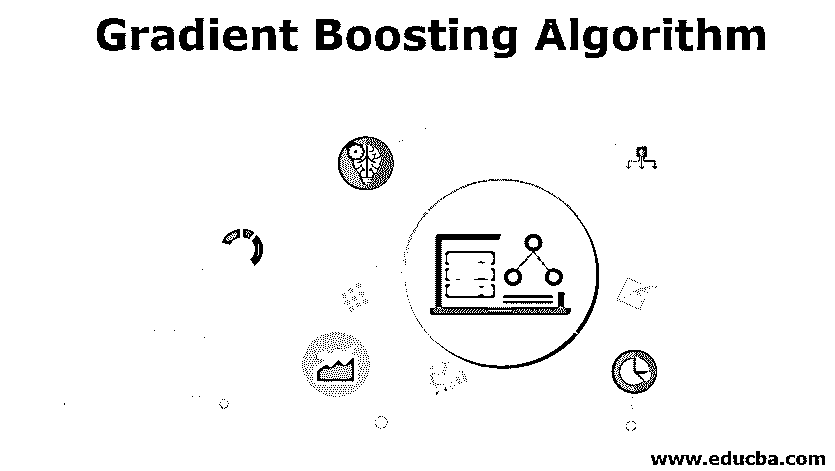

# 梯度推进算法

> 原文：<https://www.educba.com/gradient-boosting-algorithm/>

## 梯度推进算法简介

将弱学习者转变为强学习者的技术被称为强化。梯度推进算法过程基于这种执行理论。Ada boosting 算法可用于解释和轻松理解将 boosting 注入数据集的过程。

### 决策图表

[决策树是一种](https://www.educba.com/what-is-decision-tree/)判断支持工具，它通过隐含树状结构及其可能的后果，以及可能的事件结果、资源成本等来确定决策。这种技术允许他们显示对条件输出进行操作的控制语句。

<small>Hadoop、数据科学、统计学&其他</small>

研究业务广泛使用这些决策树，特别是在决策分析中；它还允许他们达到一个目标，也是机器学习中令人钦佩的工具。

### AdaBoost 算法

[AdaBoost 算法从准备决策树开始](https://www.educba.com/adaboost-algorithm/)，在决策树中，每个观察值都被分配了一个相等的权重。在评估了主树之后，我们提升了那些很难分类的解释的权重，并从属于那些很容易分类的解释的权重。因此，第二棵树就是在这种有偏见的数据基础上发展起来的。在这里，设计是为了更好地实现主树的预言。

然后从这种创新的 2-树收集模型计算分类误差，并培养第三树以预见修改的残差。上述过程在几个实例中重复。在前面的树中没有很好定义的观察值是使用后面的树来确定的。因此，最终装配模型的预测是由早期树模型结束的预测的偏见图。

### 训练梯度推进算法模型

为了用 R 语言指示一个 gbm 模型，必须安装 GBM 库，并且实例化调用程序对这个已安装的 GBM 库的调用。

此外，必须指定所需的参数；主要论点如下:

*   公式
*   响应变量的分布
*   预测变量
*   响应变量

GBM 模型中常用的分布有伯努利分布、泊松分布等。

最后，数据和 n.trees 参数被默认指定，gbm 模型将理所当然地采用 100 棵树，这可以提供我们的 gbm 音乐会的良好质量近似。

**代码#1:**

`install.packages ("gbm")
library(gbm)
GBM <- gbm( formula = response ,
distribution = " bernoulli " ,
data = train
n.trees = 3000)`

下一步是将实际数据集分为训练数据集和测试数据集，这是通过使用 createDataPartition()函数实现的。这种拆分在后面的部分将非常有助于使用已训练的训练集来训练测试集，并且在此之上，确定原始数据的实际预测。

**代码#2:**

`TRAIN <- read.csv("Train_dd.csv")
set.seed(77820)
intrain <- createDataPartition( y = Train$survived,
list = false )
Train <- Train[inTrain] Train <- Train[-inTrain]`

接下来的一步是通过我们提供的培训来指导 gbm 模型。而所有附加的参数都是前面几节中提到的。还提到了另外两个参数——交互作用、深度和收缩。

1.交互深度拼出每棵树的最大深度。

2.智能速度测量是利用收缩率实现的。这里，使用这种收缩来减少基本学习者树中的所有补充值。

此外，这种技术允许显示对条件输出进行操作的控制语句。研究业务广泛使用这些决策树，特别是在决策分析中；它还允许我们达到一个目标，也是机器学习中一个令人钦佩的[工具。](https://www.educba.com/machine-learning-tools/)

### GBM 模型输出

GBM 模型的输出包含执行所隐含的树的总数的细节。这将有助于预测模型中预测变量的影响；此外，变量重要性表和模型图可以从 GBM 输出的汇总函数中导出。

#### 使用 GBM 模型预测()方法

因此，为了在这里的关键数据之上进行预测，GBM 模型与其他模型一样，包含了 predict 方法。此外，在该方法的参数部分，必须手动提及所使用的决策树的总数。

**代码:**

`predictions <- predict( object = simpleGBMmodel,
newdata = test ,
n.trees = 1)`

### GBM 模型改进

**树约束**

*   重要的是，弱学习者掌握了技能，但仍然很弱。

**加权更新**

*   从每棵树的预测中应用顺序加法
*   每棵树捐赠到这个数量需要是大规模的，以减缓算法学习。这个过程叫做收缩。

**随机梯度推进算法**

*   这个等价的利润可以用来减少被树包围的联想。

**惩罚梯度提升算法**

*   参数化树可以用附加约束来填充；经典决策树不能作为弱学习器。取而代之的是一个定制的回归树，它在叶节点中有数值。

### 推荐文章

This has been a guide to Gradient Boosting Algorithm. Here we discuss the basic concept, decision tree, adaBoost algorithm, training GBM model, GBM model improvements, along with some sample code. You can also go through our other suggested articles to learn more –

1.  [决策树算法](https://www.educba.com/decision-tree-algorithm/)
2.  [机器学习算法](https://www.educba.com/machine-learning-algorithms/)
3.  [XGBoost 算法](https://www.educba.com/xgboost-algorithm/)
4.  [数据科学算法](https://www.educba.com/data-science-algorithms/)

