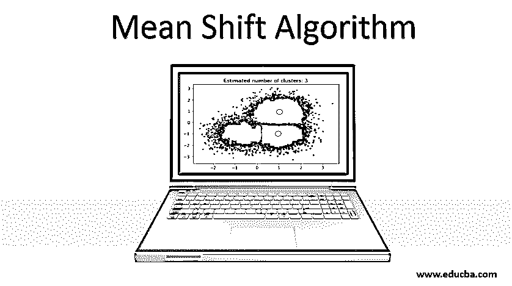
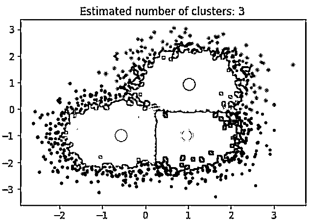
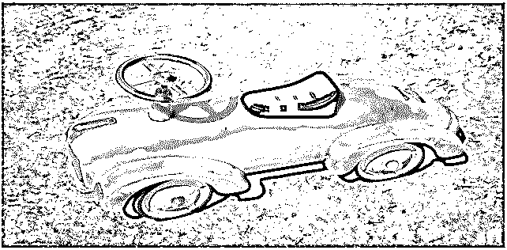

# 均值漂移算法

> 原文：<https://www.educba.com/mean-shift-algorithm/>

## 均值漂移算法的定义

Mean Shift 算法是聚类算法中的一种，它与作为开发机器学习的主要参数的最高密度点或模式值相关联。这是一种无监督的机器学习算法。该算法基于被称为 KDE 的核密度估计的概念。它也被称为模式搜索算法。内核与数据点权重相关的数学计算相关联。主要有两种流行的与均值漂移算法相关联的核函数，例如平坦核和高斯核。这种算法主要用于计算机视觉和图像分割。

### 均值漂移算法聚类

Fukunaga 和 Hostetler 发现了一种无监督学习技术来寻找聚类:

<small>Hadoop、数据科学、统计学&其他</small>

*   均值偏移也称为模式搜索算法，它通过将数据点向高密度区域偏移的方式将数据点分配给聚类。数据点的最高密度被称为该区域中的模型。它广泛应用于计算机视觉和图像分割领域。
*   KDE 是一种估计数据点分布的方法。它的工作原理是在每个数据点上放置一个内核。数学术语中的核是一个加权函数，它将对各个数据点应用权重。将所有单独的内核相加产生概率。

**要求核函数满足以下条件:**

*   第一个要求是确保核密度估计是归一化的。
*   第二个要求是 KDE 与空间的对称性有很好的联系。

### 两个流行的内核函数

下面是其中使用的两个流行的内核函数:

1.  扁平内核
2.  高斯核

*   基于所使用的核参数，所得到的密度函数是不同的。如果没有提到核参数，默认情况下调用高斯核。KDE 利用概率密度函数的概念，这有助于找到数据分布的局部最大值。该算法的工作原理是使数据点相互吸引，从而允许数据点朝向高密度区域。
*   试图向局部最大值收敛的数据点将属于同一聚类组。与 K-均值聚类算法相比，均值偏移算法的输出不依赖于对数据点形状和聚类数量的假设。聚类的数量将由关于数据的算法来确定。
*   为了执行算法的实现，我们使用了 python 包 SKlearn。

### 均值漂移算法的实现

下面是算法的实现:

#### 示例#1

基于 Sklearn 教程的均值漂移聚类算法。第一个代码片段将实现一个均值漂移算法来寻找二维数据集的聚类。用于实现均值漂移算法的包。

**代码:**

`fromcluster importMeanShift, estimate_bandwidth
from sklearn.datasets.samples_generator import make_blobs as mb
importpyplot as plt
fromitertools import cycle as cy`

需要注意的一点是，我们将使用 sklearn 的 make_blobs 库来生成以 3 个位置为中心的数据点。为了将均值漂移算法应用于生成的点，我们必须设置代表长度之间相互作用的带宽。Sklearn 的库内置了估算带宽的函数。

**代码:**

`#Sample data points
cen = [[1, .75], [-.75, -1], [1, -1]] x_train, _ = mb(n_samples=10000, centers= cen, cluster_std=0.6)
# Bandwidth estimation using in-built function
est_bandwidth = estimate_bandwidth(x_train, quantile=.1,
n_samples=500)
mean_shift = MeanShift(bandwidth= est_bandwidth, bin_seeding=True)
fit(x_train)
ms_labels = mean_shift.labels_
c_centers = ms_labels.cluster_centers_
n_clusters_ = ms_labels.max()+1
# Plot result
figure(1)
clf()
colors = cy('bgrcmykbgrcmykbgrcmykbgrcmyk')
fori, each inzip(range(n_clusters_), colors):
my_members = labels == i
cluster_center = c_centers[k] plot(x_train[my_members, 0], x_train[my_members, 1], each + '.')
plot(cluster_center[0], cluster_center[1],
'o', markerfacecolor=each,
markeredgecolor='k', markersize=14)
title('Estimated cluster numbers: %d'% n_clusters_)
show()`

上面的代码片段执行聚类，算法找到了以我们生成的每个斑点为中心的聚类。从下图中我们可以看到，片段所绘制的图像显示了均值漂移算法能够识别运行时所需的聚类数，并计算出适当的带宽来表示交互长度。

**输出:**

#### 实施例 2

基于计算机视觉中的图像分割。第二个片段将探讨深度学习中使用的均值漂移算法如何对彩色图像进行分割。我们利用均值漂移算法来识别空间聚类。在前面的片段中，我们使用了二维数据集，而在这个例子中，我们将探索三维空间。图像的像素将被视为数据点(r，g，b)。我们需要将图像转换为数组格式，以便它的每个像素代表我们要分割的图像中的数据点。在空间中对颜色值进行聚类会返回一系列聚类，其中聚类中的像素将类似于 RGB 空间。用于实现均值漂移算法的包:

**代码:**

`importnumpy as np
fromcluster importMeanShift, estimate_bandwidth
fromdatasets.samples_generator importmake_blobs
importpyplot as plt
fromitertools import cycle
fromPIL import Image`

执行原始图像分割的以下代码片段:

`#Segmentation of Color Image
img = Image.open('Sample.jpg')
img = np.array(img)
#Need to convert image into feature array based
flatten_img=np.reshape(img, [-1, 3])
#bandwidth estimation
est_bandwidth = estimate_bandwidth(flatten_img,
quantile=.2, n_samples=500)
mean_shift = MeanShift(est_bandwidth, bin_seeding=True)
fit(flatten_img)
labels= mean_shift.labels_
# Plot image vs segmented image
figure(2)
subplot(1, 1, 1)
imshow(img)
axis('off')
subplot(1, 1, 2)
imshow(np.reshape(labels, [854,1224]))
axis('off')`

生成的图像表明，这种识别图像形状和确定空间聚类的方法可以在没有任何图像处理的情况下有效地完成。

**输出:**

### 均值漂移算法的优势及应用

下面是均值算法的优点和应用:

*   它被广泛用于解决计算机视觉，在那里它被用于图像分割。
*   数据点的实时聚类，而不提及聚类的数量。
*   在图像分割和视频跟踪方面表现出色。
*   对异常值更稳健。

### 均值漂移算法的优点

下面是优点均值漂移算法:

*   该算法的输出与初始化无关。
*   该过程是有效的，因为它只有一个参数-带宽。
*   对数据簇的数量和形状没有任何假设。
*   它比 K-Means 聚类有更好的性能。

### 均值漂移算法的缺点

下面是均值漂移算法的缺点:

*   对于大型功能而言，价格昂贵。
*   与 K-均值聚类相比，它非常慢。
*   算法输出取决于参数带宽。
*   输出取决于窗口的大小。

### 结论

虽然这是一种直接的方法，主要用于解决与图像分割、聚类相关的问题。与 K-Means 相比，它比较慢，而且计算量很大。

### 推荐文章

这是一个均值漂移算法的指南。这里我们讨论与图像分割、聚类、收益和两个核函数相关的问题。您也可以浏览我们的其他相关文章，了解更多信息-

1.  [K 均值聚类算法](https://www.educba.com/k-means-clustering-algorithm/)
2.  [R 中的 KNN 算法](https://www.educba.com/knn-algorithm-in-r/)
3.  [什么是遗传算法？](https://www.educba.com/what-is-genetic-algorithm/)
4.  [内核方法](https://www.educba.com/kernel-methods/)

