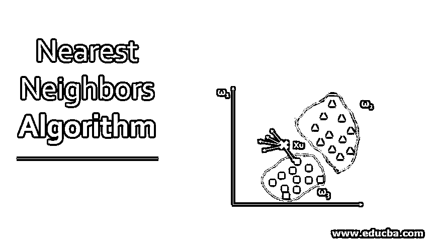
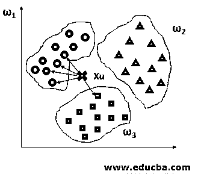
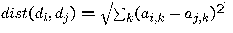
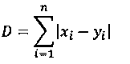
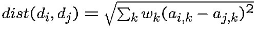
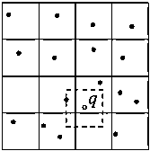

# 最近邻算法

> 原文：<https://www.educba.com/nearest-neighbors-algorithm/>

## 最近邻算法简介

k 近邻(KNN)算法基本上是机器学习中的一种分类算法，属于监督学习的范畴。然而，它也可以用于回归问题。自 1970 年以来，KNN 算法已被用于许多应用中，如模式识别、数据挖掘、统计估计、入侵检测等等。由于它是非参数的，也就是说，它不对数据的分布做任何潜在的假设，所以它在现实生活中是可任意使用的。

### 最近邻分类算法

分类问题下的 KNN 基本上将整个数据分为训练数据和测试样本数据。评估训练点和样本点之间的距离，距离最小的点称为最近邻点。KNN 算法基于多数预测结果。

<small>Hadoop、数据科学、统计学&其他</small>

下面举个例子，让我们看看 KNN 背后的想法:

*   让我们取三个不同的类，我们需要为未知数据 x u. 找到一个类标签
*   在这种情况下，让我们找到欧几里德距离和 k 作为 5 个最近的邻居。
*   从上图我们可以观察到，最近的 5 个邻居中，4 个属于ω1 类，1 个属于ω 3 类，所以 x u 被赋给ω 1 。

基本 KNN 算法存储训练集中的所有示例，这产生了很高的存储需求(和计算成本)。然而，不需要存储整个训练集，因为示例可能包含高度冗余的信息。大多数时候，几乎所有与分类目的相关的信息都位于决策边界附近。

### 最近邻算法怎么实现？

在 KNN，全部数据被分为训练样本数据和测试样本数据。

在分类问题中，使用以下步骤实现 k 最近算法:

*   为 k 选择一个值，其中 k 是特征空间中训练样本的数量。
*   从所有训练示例中计算未知数据点的距离。
*   在训练数据中搜索与未知数据点的测量值最接近的 k 个观察值。
*   计算未知数据点和训练数据之间的距离。
*   具有最小值的训练数据将被声明为最近邻。

在 KNN 回归问题中，唯一的区别是评估训练点和样本点之间的距离，并且具有最低平均距离的点被声明为最近邻。它根据总和的平均值预测结果。

### K 值怎么选？

因此，k 的值可以根据需要适当选择。

*   如果 k 选择得较大，它将对噪声不太敏感，从而提高性能。
*   如果 k 选择得小，它将能够捕获特征空间中存在的精细结构。如果 k 太小，可能会导致过拟合，即算法在训练集上表现出色，而在看不见的测试数据上性能下降

#### 距离度量

可以通过以下方式计算距离:

**a .欧几里德距离**

**b .曼哈顿距离**

**c .加权距离**

### 权重如何选择？

对于分类和回归问题，加权距离法都可以用来计算距离。分配表示邻居贡献的权重，使得更近的邻居被分配更多的权重，显示出比平均值更多的贡献。

重量可以选择为:

*   w i = 1/ k
*   和\ \ x和中的“T5”
*   wI∞k rank | | xIxo| |

#### 改进

1.第一种技术表明，通过向最近邻提供不同的权重，可以实现预测的改进。在这种情况下，重要的属性被赋予较大的权重，不太重要的属性被赋予较小的权重。

2.有两种经典算法可以提高最近邻搜索的速度。

**举例:**

我们已经给出了 D 维空间中的一组 N 个点和一个未标记的例子 q。我们需要找到最小化到 q 的距离的点。KNN 方法对于 N 和 D 的大值变得不切实际

有两种经典算法可以加速最近邻搜索。

**1。分桶:**在分桶算法中，空间被划分为相同的单元，每个单元中的数据点被存储在一个列表 n 中。单元按照与点 q 的距离递增的顺序被检查，并且对于每个单元，计算其内部数据点与点 q 之间的距离。当点 q 与单元之间的距离超过与已经访问过的最近点之间的距离时，搜索终止。

**2。k-d 树:**k-d 树是二叉查找树在高维空间中的推广。这里，k-d 树中的每个内部节点与正交于坐标轴之一的超矩形和超平面相关联。超平面将超矩形分成两部分，这两部分与子节点相关联。分割过程继续进行，直到超矩形中数据点的数量低于某个给定的阈值 n

### 最近邻算法的优缺点

下面给出了优点和缺点:

#### 优势:

*   理解和实现起来非常简单。
*   对噪声数据具有鲁棒性。
*   决策边界可以是任意形状。
*   它只需要调整几个参数。
*   KNN 分类器可以用很少的成本更新。

#### 缺点:

*   K-NN 计算量很大。
*   它是一个懒惰的学习者，即它在运行时使用所有的训练数据，因此很慢。
*   对于每个要分类的实例，复杂度是 O(n)。
*   维度的诅咒:距离可能被不相关的属性所支配。

### 结论

随着 K 的增加，我们在不同的分类中得到更平滑、更明确的边界。此外，随着训练集中数据点数量的增加，上述分类器的准确性也会增加。

### 推荐文章

这是最近邻算法的指南。这里我们讨论最近邻算法的分类和实现以及它的优缺点。您也可以阅读以下文章，了解更多信息——

1.  [MD5 算法的使用](https://www.educba.com/md5-alogrithm/)
2.  [了解 K- Means 聚类算法](https://www.educba.com/k-means-clustering-algorithm/)
3.  [了解强化学习](https://www.educba.com/what-is-reinforcement-learning/)
4.  [带步骤的算法示例](https://www.educba.com/c-plus-plus-algorithm/)

