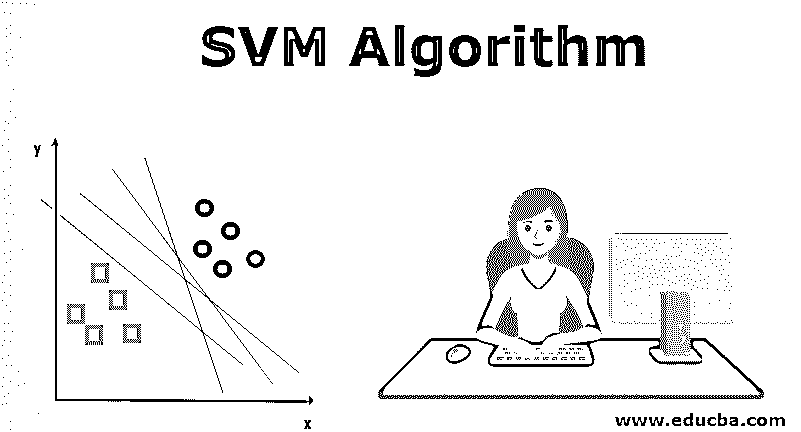
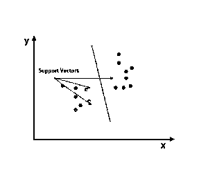
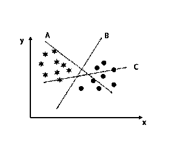
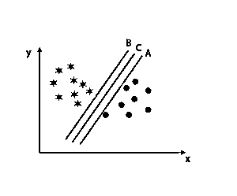
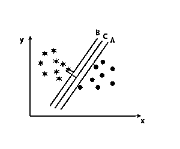
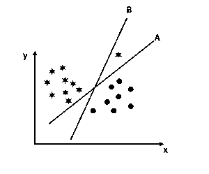
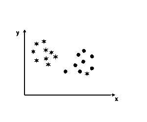
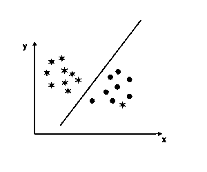
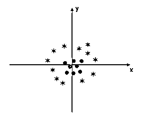
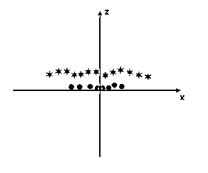

# SVM 算法

> 原文：<https://www.educba.com/svm-algorithm/>

## 什么是 SVM 算法？

SVM 代表支持向量机。SVM 是一种受监督的机器学习算法，通常用于分类和回归挑战。SVM 算法的常见应用是入侵检测系统、手写识别、蛋白质结构预测、检测数字图像中的隐写术等。

在 SVM 算法中，每个点被表示为 n 维空间中的一个数据项，其中每个特征的值是特定坐标的值。

<small>Hadoop、数据科学、统计学&其他</small>

在标绘之后，通过找到区分两个类别的炒作平面来执行分类。参考下图来理解这个概念。

支持向量机算法主要用于解决分类问题。支持向量只不过是每个数据项的坐标。支持向量机是使用超平面区分两类的前沿。

### SVM 算法是如何工作的？

在上面的部分中，我们已经讨论了使用超平面的两个类的区别。现在我们要看看这个 SVM 算法实际上是如何工作的。

#### 场景 1:确定正确的超平面

这里我们取了三个超平面，即 A、B 和 c。现在我们必须确定正确的超平面来对恒星和圆进行分类。

为了确定正确的超平面，我们应该知道经验法则。选择区分两个类别的超平面。在上面提到的图像中，超平面 B 非常好地区分了两个类。

#### 场景 2:确定正确的超平面

这里我们有三个超平面，即 A、B 和 c。这三个超平面已经很好地区分了类别。

在这种情况下，我们增加最近的数据点之间的距离，以确定正确的超平面。这个距离只不过是一个边际。参考下图。

在上面提到的图像中，超平面 C 的边距高于超平面 A 和超平面 b。所以在这种情况下，C 是右超平面。如果我们选择一个具有最小边界的超平面，就会导致错误分类。因此，我们选择了具有最大裕度的超平面 C，因为它具有鲁棒性。

#### 场景 3:确定正确的超平面

注意:要识别超平面，请遵循前面章节中提到的相同规则。

从上图可以看出，超平面 B 的边距高于超平面 A 的边距；这就是为什么有些人会选择超平面 B 作为权利。但是在 SVM 算法中，它在最大化间隔之前选择分类准确的超平面。在这种情况下，超平面 A 已经准确地进行了分类，超平面 b 的分类存在一些错误。因此，A 是正确的超平面。

#### 场景 4:将两个类分类

正如你在下图中看到的，我们无法用一条直线来区分两个类别，因为一颗恒星在另一个圆形类别中是异常值。

在这里，一个明星在另一个班级。对于星类，这颗星是异常值。由于 SVM 算法的鲁棒性，它将找到具有较高边缘的正确超平面，而忽略离群点。

#### 场景 5:精细超平面区分等级

到目前为止，我们已经研究了线性超平面。在下面提到的图像中，我们没有类之间的线性超平面。

为了对这些类别进行分类，SVM 引入了一些额外的特征。在本场景中，我们将使用 z=x^2+y^2.的这一新功能

绘制 x 轴和 z 轴上的所有数据点。

**注**

*   z 轴上的所有值都应该是正的，因为 z 等于 x 的平方和 y 的平方之和。
*   在上面提到的图中，红色圆圈靠近 x 轴和 y 轴的原点，导致 z 的值较低，而星形正好与圆圈相反，它远离 x 轴和 y 轴的原点，导致 z 的值较高。

在 SVM 算法中，很容易使用两个类之间的线性超平面进行分类。但这里出现的问题是，我们是否应该加入 SVM 的这个特征来识别超平面。所以答案是否定的，为了解决这个问题，SVM 有一种技术，通常被称为内核技巧。

内核技巧是将数据转换成合适形式的函数。在 SVM 算法中使用了各种类型的核函数，即多项式、线性、非线性、径向基函数等。这里使用核技巧，将低维输入空间转换成高维空间。

当我们看超平面时，轴和 y 轴的原点看起来像一个圆。参考下图。

### SVM 算法的优点

*   即使输入数据是非线性和不可分的，支持向量机也能产生准确的分类结果，因为它们具有鲁棒性。
*   决策函数使用称为支持向量的训练点子集；因此，它是内存高效的。
*   用合适的核函数解决任何复杂的问题都是有用的。
*   在实践中，SVM 模型是通用的，在 SVM 过度拟合的风险较小。
*   支持向量机在文本分类和寻找最佳线性分隔符时非常有用。

### 骗局

*   处理大型数据集时，需要很长的训练时间。
*   很难理解最终的模式和个人影响。

### 结论

已经引导到支持向量机算法，这是一种机器学习算法。本文详细讨论了什么是 SVM 算法，它是如何工作的，以及它的优点。

### 推荐文章

这是 SVM 算法的指南。这里我们分别讨论它与 SVM 算法的一个工作场景、优缺点。您也可以阅读以下文章，了解更多信息——

1.  [什么是机器学习？](https://www.educba.com/what-is-machine-learning/)
2.  [机器学习工具](https://www.educba.com/machine-learning-tools/)
3.  [c++算法的例子](https://www.educba.com/c-plus-plus-algorithm/)
4.  [什么是数字图像？](https://www.educba.com/what-is-digital-image/)

