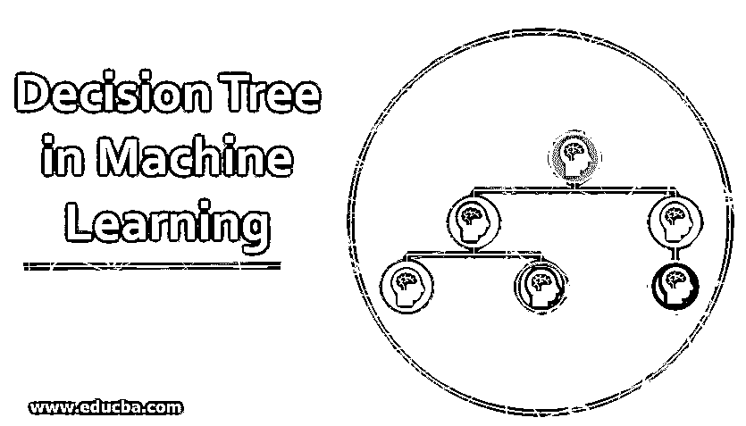
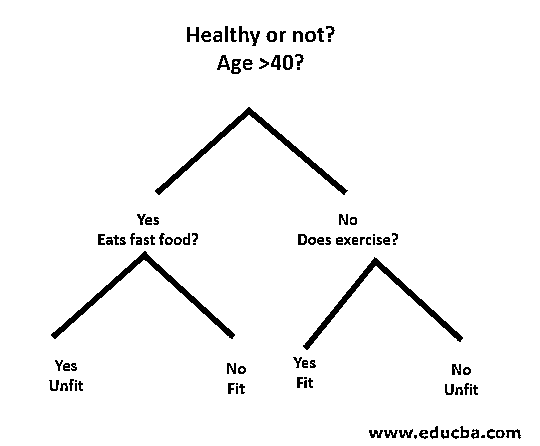

# 机器学习中的决策树

> 原文：<https://www.educba.com/decision-tree-in-machine-learning/>

## 机器学习中的决策树介绍

机器学习中的决策树是分类算法的一部分，其也使用分类规则(从根到叶节点开始)提供回归问题的解决方案；其结构类似于流程图，其中每个内部节点表示对特征的测试(例如，随机数是否大于一个数)，每个叶节点用于表示类标签(在做出所有决定后需要计算的结果)，分支表示导致类标签的特征的合取合取。

[机器学习中的决策树让](https://www.educba.com/what-is-machine-learning/)在现代世界有了广阔的领域。最大似然法中有很多算法在我们的日常生活中被使用。其中一个重要的算法是决策树，用于分类和回归问题的解决方案。由于它是一个预测模型，决策树分析是通过一种算法方法来完成的，在这种方法中，数据集根据条件被分成子集。顾名思义，它是一个树状模型，采用 if-then-else 语句的形式。树越深，节点越多，模型就越好。

<small>Hadoop、数据科学、统计学&其他</small>

### 机器学习中决策树的类型

决策树是一个树状图形，从根节点到叶节点进行排序，直到达到目标。在基于监督算法的决策和分类中，它是最流行的一种。它是通过递归划分来构造的，其中每个节点充当某些属性的测试用例，并且从该节点导出的每个边是测试用例中的可能答案。根节点和叶节点都是算法的两个实体。

让我们借助一个如下的小例子来理解:

在这里，根节点是你是否小于 40。如果是，那你吃快餐吗？如果是，那么你不适合，否则，你适合。如果你超过 40 岁了，你还锻炼吗？如果是，那么你是健康的，否则，你是不健康的。这基本上是一个二元分类。

决策树有两种类型:

1.  **分类树:**上面的例子是一个基于类别的分类树。
2.  **回归树**:在这类算法中，决策或结果是连续的。它有一个单一的数字输出，有更多的输入或预测。

在决策树中，典型的挑战是识别每个节点的属性。这个过程称为属性选择，有一些方法可以用来识别属性。

**a .信息增益(IG)**

信息增益衡量单个特征提供了多少关于类的信息。它充当构造决策树的主关键字。具有最高信息增益的属性首先分裂。所以，决策树总是最大化信息增益。当我们使用一个节点将实例划分成更小的子集时，熵就会发生变化。

**熵:**是随机变量中不确定性或杂质的度量。熵决定了决策树如何将数据分成子集。

信息增益和熵的等式如下:

**信息增益=** 熵(父级)-[加权平均*熵(子级)]

**熵:** ∑p(X)log p(X)

这里的 P(X)是给定类中例子的分数。

**b .基尼指数**

基尼指数是决定随机选择的元素被错误识别的频率的指标。它明确指出，基尼系数低的属性优先考虑。

**基尼指数:** 1-∑ p(X)^2

**拆分创建**

1.  要进行分割，首先，我们需要计算基尼系数。
2.  使用具有属性的索引和该属性的拆分值的行列表来拆分数据。在找到左右数据集后，我们可以通过第一部分的基尼系数得到分割值。现在，分割值将决定属性的位置。
3.  下一步是评估所有的拆分。最佳可能值是通过评估拆分的成本来计算的。最佳分割被用作决策树的一个节点。

### 构建一棵树——机器学习中的决策树

构建决策树有两个步骤。

#### 1.终端节点创建

在创建终端节点时，最重要的是注意我们是否需要停止生长树或继续生长。为此，可以采用以下方法:

*   最大树深度:当树达到最大节点数时，执行在此停止。
*   最小节点记录:可以定义为一个节点需要的最少模式。然后，我们可以在获得最小节点记录后立即停止添加终端节点。

#### 2.递归分裂

一旦创建了节点，我们就可以通过拆分数据集并多次调用同一个函数来递归地创建一个子节点。

**预测**

树建立后，使用递归函数进行预测。对左或右子节点再次遵循相同的预测过程，依此类推。

### 决策树的优点和缺点

下面给出了一些优点和缺点:

#### 优势

决策树在机器学习中有如下一些优势:

*   **综合:**它考虑了决策的每一个可能的结果，并相应地追溯到结论的每一个节点。
*   **具体:**决策树为每个问题、决策和结果分配一个具体的值。它减少了不确定性和模糊性，也增加了清晰度。
*   **简单:**决策树是最简单可靠的算法之一，因为它没有复杂的公式或数据结构。计算只需要简单的统计学和数学。
*   多用途:决策树可以用数学手工构建，也可以和其他计算机程序一起使用。

#### 不足之处

决策树在机器学习中有如下一些缺点:

*   决策树不太适合需要适当值的评估和财务任务。
*   与其他计算算法相比，这是一种容易出错的分类算法。
*   这在计算上是昂贵的。在每个节点上，在确定最佳分割之前，必须对候选分割进行排序。由于决策树的评估成本太高，许多商业实体在财务任务中会采用其他替代方案。
*   在处理连续变量时，决策树不是最佳解决方案，因为它在对变量进行分类时容易丢失信息。
*   它有时是不稳定的，因为数据集中的小变化可能导致新树的形成。

### 结论——机器学习中的决策树

决策树作为最重要的监督算法之一，在现实生活中的决策分析中起着至关重要的作用。作为一种预测模型，它被用于许多领域，因为它的分割方法有助于通过分类或回归方法根据不同的条件确定解决方案。

### 推荐文章

这是机器学习中的决策树指南。这里我们讨论机器学习中决策树的简介、类型、拆分创建和构建树。您也可以浏览我们推荐的其他文章，了解更多信息——

1.  [Python 数据类型](https://www.educba.com/python-data-types/)
2.  [Tableau 数据集](https://www.educba.com/tableau-data-sets/)
3.  [Cassandra 数据建模](https://www.educba.com/cassandra-data-modeling/)
4.  [决策表测试](https://www.educba.com/decision-table-testing/)

