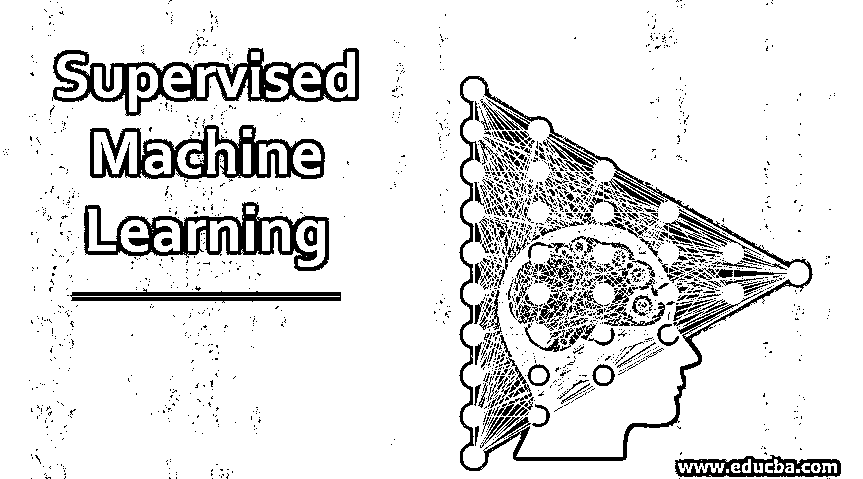
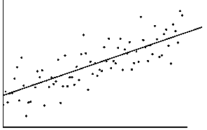
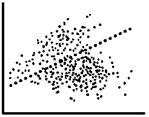
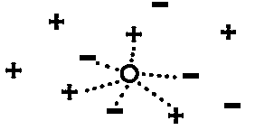
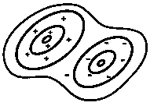
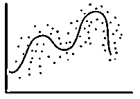

# 监督机器学习

> 原文：<https://www.educba.com/supervised-machine-learning/>

## 监督机器学习简介

监督机器学习是一种学习模型，在这种模型中，我们通过输入和期望的输出来训练机器。基本上，我们将使用一组输入变量(x)和相应的输出变量(Y)来训练模型，并尝试使用 Y = f(x)等函数来创建它们之间的关系。我们让机器通过使用这些参数来学习，以便它能够检测更准确的输出，即使是新的输入参数。因此，这种类型的机器学习被称为监督机器学习，实际上是最常用的学习算法。

### 有监督的机器学习是如何工作的？

在监督机器学习模型中，我们会给出一组输入数据标签和相应的输出标签，以便模型可以从中学习，并在给出新输入时进行准确预测。基本上，这是一个模型，它将获取已知的输入和输出，并训练该模型来准确预测未来的输入数据。这就像一个从输入数据标签中学习的算法，输入数据标签就像一个监督学生学习的老师(这里是一台机器)。

<small>Hadoop、数据科学、统计学&其他</small>

因为我们已经知道给定输入的答案，但我们希望机器迭代地预测答案，直到我们从算法或模型中获得合理的性能。在每次迭代期间，它将预测输出，并基于此，我们将向模型提供反馈，或者根据预测的需要进行修正。在算法训练期间，它创建或定义输入和输出参数之间的规则。例如，当一个新的图像中有数字时，我们将使用带有标签的手写数字及其输出标签来训练模型，该模型能够预测准确的标签。

监督机器学习使用两种技术分类和回归。

*   **分类:**就像是对或错的陈述，例如电子邮件是否是垃圾邮件，肿瘤是否是良性的。
*   **回归:**像温度预测、产量预测这种真正像重量、当天币值、交易预测等的持续预测。

有许多算法将在监督机器学习下使用分类和回归技术，如线性回归、逻辑回归、决策树、随机森林和支持向量机等。

### 监督机器学习算法

以下是受监督的机器学习算法列表:

#### 1.线性回归

在线性回归中，我们将有一组输入变量，用于确定一组输出变量。假设 X 是学历，Y 是年收入，现在我们需要找到它们之间的关系，形式为 y = a+bx，其中 a 和 b 是系数，线性回归需要通过画一条穿过大多数数据点的线来找到。以便我们可以预测给定输出的准确输出，误差更小。

#### 2.逻辑回归

在逻辑回归中，我们通过使用转换函数在输入数据之间画一条线，将输入数据分为两类，如真或假。逻辑回归函数看起来像 h(x) = 1/ 1 + e^-x.这个模型是基于二进制的类或其他的概率。它主要用于二元分类问题，在这种情况下，我们可以用一条线来分隔数据，并作为评估复杂问题的基线。它的概率不是 0 就是 1；如果它是 1，那么它是一个默认的类。比如预测一封邮件是不是垃圾邮件，变成垃圾邮件会是 1，不是是 0。

#### 3.k 最近邻(KNN)

在 KNN，它根据数据集中最近的邻居对对象进行分类。它假设离它最近的对象将与该对象相似，并使用不同的方法来寻找最近的邻居，例如欧几里德、余弦、汉明距离、城市街区等。当我们希望有一个基准学习规则算法时，当没有内存使用限制时，以及当训练模型的预测速度是一个低关注点时，它可以被最好地使用。它使用整个数据集作为训练集，而不是将其分成训练和测试数据集。当一个新的数据集需要一个输出时，该算法遍历整个数据集并找到 k-最近邻，其中 k 是由用户给定的。

#### 4.朴素贝叶斯

在朴素贝叶斯回归技术中，它计算某一事件已经发生的概率。这里事件是一个变量，已经发生的事件是一个假设，贝叶斯定理是 p(h/d) = p(d/h) * p(h)/p(d)。它根据特定类别的高概率对新输入数据进行分类。当我们有一个包含更多参数的小数据集，需要一个易于解释的分类器，当我们知道将会出现训练数据集中没有的场景(如医疗或金融应用等)时，最适合使用它。

#### 5.非线性回归

在非线性回归技术中，它是一种统计建模技术，有助于描述模型为参数的实验数据中的非线性关系。非线性指的是拟合函数，它是诸如 y = b0 +b1x + b2x^2 的参数的非线性函数，其中 b0、b1、b2 是拟合参数，而拟合参数的非线性回归是 y = (b0x^b1)/(x+b2).当数据有更多的非线性趋势，无法转换到线性空间时，最好使用它。

### 监督机器学习的优点和缺点

以下是监督机器学习的优点和缺点:

#### 优势:

下面给出了一些优点:

*   在这方面，与无监督学习相比，我们可以很容易地理解发生了什么。
*   即使在训练之前，我们也可以通过查看数据来知道模型中有多少个类。
*   这对于分类问题非常有用，并且不需要保存训练数据。一旦训练完成，我们可以以数学形式保存所需的参数。
*   它可以从给定的数据集和相应的标签中预测大数值。

#### 缺点:

下面给出了一些缺点:

*   它不能处理或解决机器学习中最复杂的问题/任务。
*   它可以像无监督学习一样，只预测已知数据，不预测未知数据。
*   它不能通过形成聚类或通过分类自己找到特征。
*   如果相应的类不在训练数据集中，它就不能给出准确的结果。

### 结论

最后，这都是关于监督机器学习的。到目前为止，我们已经看到了监督机器学习是什么，它是如何工作的，监督学习的不同算法，以及它的优点和缺点。

### 推荐文章

这是一个指导监督机器学习的指南。在这里，我们讨论监督机器学习的工作，算法，优点和缺点。您也可以浏览我们推荐的其他文章，了解更多信息——

1.  [监督机器学习算法](https://www.educba.com/supervised-machine-learning-algorithms/)
2.  [无监督机器学习](https://www.educba.com/unsupervised-machine-learning/)
3.  什么是监督学习？
4.  [监督学习 vs 深度学习](https://www.educba.com/supervised-learning-vs-deep-learning/)

