# 监督机器学习算法

> 原文：<https://www.educba.com/supervised-machine-learning-algorithms/>

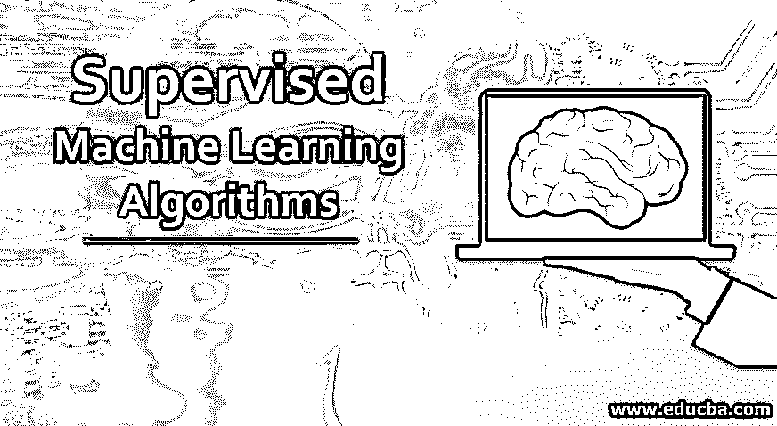

## 监督机器学习算法简介

监督机器学习被定义为机器学习技术的子领域，其中我们使用标记数据集来训练模型，预测输出值并将其输出与预期的正确输出进行比较，然后计算误差以相应地修改模型。此外，当使用这种学习方法对系统进行足够的训练时，它变得足够有能力从任何新的输入中提供目标值。

根据他们的学习方法将其分为三类，即

<small>Hadoop、数据科学、统计学&其他</small>

1.  监督学习
2.  无监督学习
3.  强化学习

在本文中，我们将研究监督学习，并了解其不同类型的学习算法。

### 监督学习算法

当我们通过显式提供标签来训练算法时，这被称为监督学习。这种类型的算法使用可用的数据集来训练模型。该模型具有以下形式。

Y=f(X)其中 X 是输入变量，y 是输出变量，f(X)是假设。

监督机器学习算法的目标是找到近似的假设。以便当有新的输入数据时，可以预测输出 y。监督机器学习的应用是预测一封邮件是不是垃圾邮件，或者在你的智能手机中进行人脸解锁。

### 监督机器学习算法的类型

监督机器学习根据其输出分为两个部分:

1.  **回归**
2.  **分类**

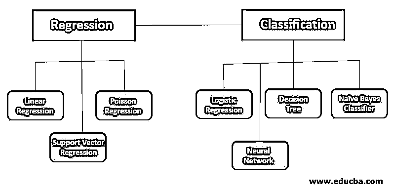

#### 1.回归

在回归中，输出变量是数字的(连续的)，即我们训练假设(f(x))以获得输入数据(x)的连续输出(y)。由于输出被告知实数，回归技术被用于预测数量、大小、值等。

例如，给定包含房屋特征(如面积、楼层等)的数据集，我们可以使用它来预测房屋的价格。

几种流行的回归算法是:

*   线性回归
*   [支持向量回归](https://www.educba.com/support-vector-regression/)
*   泊松回归

##### a.线性回归

回归算法的最简单形式。在这里，我们有两个变量；一个是独立的，即预测的输出，另一个是依赖的，这是特征。假设这两个变量之间的关系是线性的，即可以用直线将它们分开。这个函数的目标是通过保持尽可能小的误差来得到划分这两个变量的线。误差是点和线之间的欧几里德距离之和。

当它只有一个独立变量时，则称为简单线性回归，由下式给出:

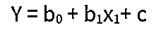

而当自变量多于一个时，称为[多元线性回归](https://www.educba.com/multiple-linear-regression/)。由下式给出

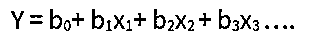

在这两种情况下，上面的方程 y 是因变量，而 x 是自变量。

##### b.支持向量机

这是一种分类算法。在支持向量机中，当我们只有两个因变量，即只有两个类别要预测时，我们使用一个超平面来分类因变量；那么，这个超平面只不过是一条直线。

SVM 的目标是得到一个超平面，使得一个类的所有自变量都在一边。一个最佳的 SVM 函数将产生一个超平面，它与两个类的距离相等。

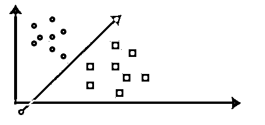

##### c.泊松回归

它的工作原理是泊松分布，因此因变量(y)的值是一个小的非负整数，如 0，1，2，3，4 等。假设大量计数不会频繁发生。由于这个事实，泊松回归类似于逻辑回归，但是因变量不限于特定值。

#### 2.分类

在分类中，输出变量是离散的。即，我们以获得输入数据(x)的离散输出(y)的方式训练假设(f(x))。输出也可以称为一个类。比如以上面的房价为例，我们可以用分类来预测房价会在上面还是下面，而不是得到确切的数值。所以我们有两类，一类是价格在上面的，另一类是价格在下面的。

分类用于语音识别、图像分类、自然语言处理等。

几种流行的分类算法是:

*   逻辑回归
*   神经网络
*   决策图表
*   朴素贝叶斯分类器

##### a.逻辑回归

这是一种分类算法。它用于根据给定的独立变量估计离散值。通过使用 logit 函数，它有助于确定函数出现的概率。这些技术的假设的输出(y)在 0 到 1 之间。

逻辑回归中使用的函数由下式给出:

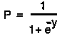

其中 y 是线上的方程式。由于此功能，该值在 0 到 1 之间变化。这个函数也称为 sigmoid 函数。

##### b.神经网络

神经网络是一种至少有 3 层的分类算法。输入-隐藏-输出。

隐藏层的数量可以根据问题的应用而变化。每个隐藏层都试图检测输入的模式。当检测到模式时，它被转发到网络中的另一个隐藏层，直到输出层。请看下图。

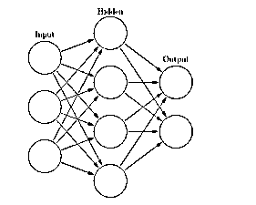

图中的圆圈确定了存储特征的神经元(仅在输入层)，即自变量。

假设我们有一个 32×32 的数字图像，那么为了对这个数字进行分类，我们[可以使用神经网络](https://www.educba.com/what-is-neural-networks/)。我们将把图像传递给输入层。由于图像的像素数为 32×32 = 1024，因此输入层将有 1024 个神经元。隐藏层中神经元的数量可以调整，但对于输出层，它必须是 10，因为在本例中，该数量可以是 0-9 之间的任何值。

输出层的节点包含概率。哪个节点最有可能成为结果类？

##### c.决策图表

决策树之所以得名，是因为它以树结构的形式构建分类或回归模型。它将数据集分解成一个更小的子集，并将决策与其相关联。结果，我们得到了一个包含决策节点和叶节点的树。一个决策节点可以有两个或更多分支，并且将引导您到叶节点。叶节点用于表示分类或决策。它使用 if-then-else 决策规则来估计结果。我们在树中越往下，它的规则将变得越复杂，这也将导致更适合的模型。

##### d.朴素贝叶斯分类器

nave base 是分类算法的集合，即基于贝叶斯定理的[。它们都基于相同的原理工作，即没有一个功能是相互依赖的。让我们看看它的学习模型会是什么样子。假设我们必须使用两个特征 A，B，即 P(A，B)来执行预测，那么我们可以将它写成](https://www.educba.com/bayes-theorem/)

P(A，B) = P(A)P(B ),因为两者彼此独立。

因此，我们可以说:

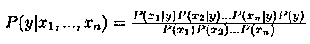

可以写成:

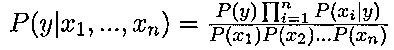

因为分母保持不变，我们可以去掉它，这样我们就得到

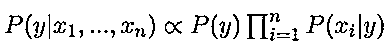

最后，我们只需要一个分类模型。上面的等式将给出每一类的概率。我们只需要得到概率最大的类。因此 y 将是:

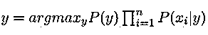

因此，该分类模型可用于类别预测。注意，P(y)是类的概率，而 P(x i | y)是条件概率

### 结论

在这篇文章中，我们得到了一个监督学习算法的概念，它的类型和不同的算法。虽然还有许多其他的算法需要讨论，但是了解所有这些算法将有助于你开始机器学习的旅程。

### 推荐文章

这是一个指导监督机器学习算法。这里我们详细讨论什么是监督学习算法和监督学习算法的类型。您也可以浏览我们推荐的其他文章，了解更多信息——

1.  [深度学习算法](https://www.educba.com/deep-learning-algorithms/)
2.  [SHA 算法](https://www.educba.com/sha-algorithm/)
3.  [Java 中的快速排序算法](https://www.educba.com/quick-sorting-algorithms-in-java/)
4.  [各类机器学习数据集指南](https://www.educba.com/machine-learning-datasets/)
5.  [在数据结构中实现快速排序的例子](https://www.educba.com/quick-sort-in-data-structure/)

