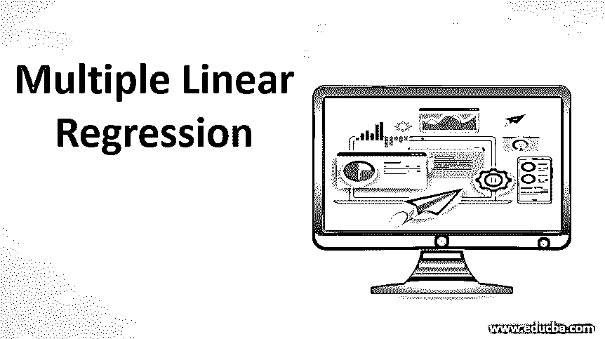
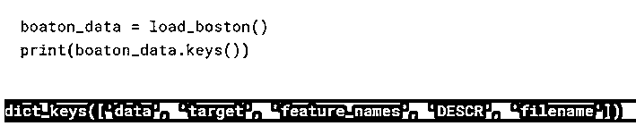
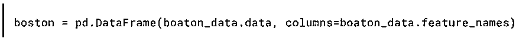
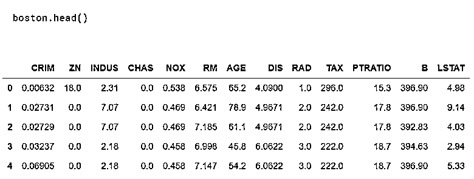
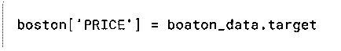
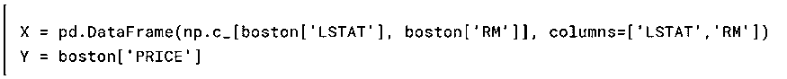
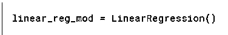
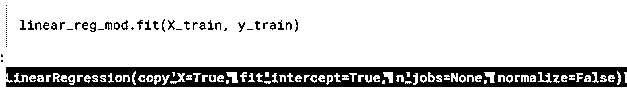
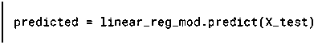
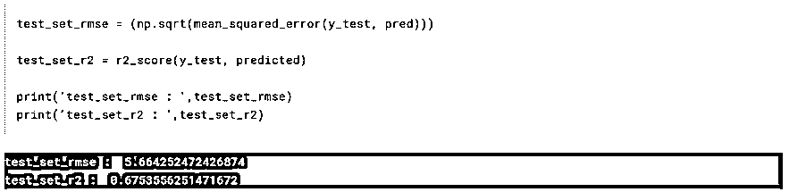

# 多元线性回归

> 原文：<https://www.educba.com/multiple-linear-regression/>

## 多元线性回归简介

在机器学习中，线性回归是一种监督学习算法，用于预测具有恒定斜率的连续输出。这意味着线性回归的预测值将在一个特定的范围内，它不会尝试将它们分类。

线性回归分为两种类型:

<small>Hadoop、数据科学、统计学&其他</small>

*   **简单线性回归:**只有一个自变量存在。
*   **多元线性回归:**存在多个自变量。

在大多数应用程序中，用于预测因变量的特征数量不止一个，因此在本文中，我们将介绍多元线性回归，并使用 python 来实现它。

### 多元线性回归的解释

*   多元线性回归是简单线性回归模型的扩展，其中有多个自变量(特征)用于预测因变量。
*   假设一个分析师想知道房子的价格，那么他的线性方程将土地面积作为自变量，价格作为因变量。但实际上，更多的功能影响着房子的价格。房子的价格取决于其他预测因素，如房子的楼层、卧室数量、房子的年龄等。为了理解涉及多个独立变量的关系，我们使用多元线性回归。
*   MLR 用于确定多个独立变量之间的数学关系。一旦确定了每个独立变量的因子或系数，就可以使用这些信息来准确预测结果。由模型创建的关系被告知最接近所有个体数据点的线性(直)线。

了解多元线性回归可以让我们理解其背后的数学原理。

### 多元线性回归方程

下面我们解释多元线性回归中的方程:

#### 1.假设

多元线性回归的假设或模型由以下等式给出:

**h(x) = θ0 + θ1×1 + θ2×2 + θ3×3…θnxn**

在哪里，

*   x i 是第 I 个特征或自变量
*   θ i 是第 i 个特征的权重或系数

**Note:** That x0 = 1 and θ0 is the bias term.

这个线性方程用于近似所有单个数据点。如果只有一个特征，那么这个等式会产生一条直线。

#### 2.价值函数

我们的目标是找到假设的最佳权重，使计算值和实际值之间的差异最小。实际值和计算值之间的差异称为成本。成本有助于确定模型的整体功能。

因此，多元回归的成本由以下等式给出:

**J (θ) = 1/2m ∑mi=1(hθ(x(i)) – y(i))2**

在哪里，

*   **J(c):** 成本函数
*   **m:** 训练数据集的个数
*   **h(θ):** 假设
*   **θ:** 重量
*   **y:** 标签

#### 3.梯度下降

接下来是梯度下降，需要它来更新权重值。梯度下降利用了成本函数的偏导数。

多元线性回归的梯度下降由下式给出:

**θj = θj – ∝*J (θ)    (Simultaneously Update for Every j = 0,…n)**

在哪里，

*   **∧:**为学习率。

#### 4.正常化

它用于加速梯度下降过程的计算。为此，我们需要确保所有特性都在特定范围内。这在具有高标准偏差或不同属性范围的数据集中非常重要。因此，首先我们必须在-1 到 1 的范围内引入特性。

为了执行归一化，我们可以使用特征缩放和均值归一化。它由以下等式给出:

**xi = (xi – µ****i****) / (max(xi) – min(xi))**

这就是我们在简化方程以拟合多元线性回归中的参数时需要执行的三个主要步骤。

### 实施多元线性回归

我们现在将看到使用 python 的 scikit-learn 模块实现 MLR。因为它包含了包括线性回归在内的大多数模型的优化实现，所以尽管创建了自己的模型，还是建议使用它们。为了实现代码，我使用了 Kaggle 的工作空间。实施中涉及的步骤有:

*   导入库
*   导入数据集
*   数据预处理
*   将数据分成测试集和训练集
*   培训模式
*   评估模型

#### 1.导入库

*   为了实现多元线性回归模型，我们将借助 scikit-learn 模块，因为它预装了一些样本数据集和有用的函数。

#### 2.导入数据集

*   下一步是导入数据集。由于 scikit 已经有了样本数据集，我们将使用波士顿住房数据集。该数据集包含波士顿住宅的信息。数据集中的要素用于预测房屋价格。让我们创建数据集的实例，看看它包含什么功能:

数据集包含以下信息:

*   **数据:**房子的实际信息。
*   **标的:**房子的价格。
*   **特征名称:**数据包含的信息的特征名称。
*   **DESCR:** 是用来描述数据集特征的命令。

#### 3.数据预处理

*   现在将创建一个数据的 DataFrame 对象，使用 panda 的库，将特征名作为标题。

*   您可以使用熊猫的 head 命令来检查加载的数据

*   我们想预测房子的价格，但在我们当前的数据框架中，我们没有这些信息。因此，我们需要一个新列来存储数据集中的信息。

*   通常，我们必须执行多种数据预处理技术，但这是另一篇文章的内容。我将直接采用相关性更强的特征，即“LTSAT”和“RM”(房间数量)。因此，我们将使用这两个特征来执行线性回归。

*   x 值将包含独立值，而 Y 变量将存储目标值。

#### 4.将数据分成测试集和训练集

*   现在我们将数据分为训练集和测试集。让我们保留 80%的数据用于训练，剩下的 20%用于测试。

#### 5.培训模式

*   现在我们需要使用 scikit-Learn 创建模型的实例。我们只需调用 LinearRegression()就可以做到这一点。

*   创建实例后，我们可以根据训练数据拟合模型

*   好了，我们的模型已经装好了。现在，我们可以通过调用 predict 命令来使用它进行预测。我们将对测试数据进行预测

#### 6.评估模型

*   使用 RMSE 和 R2 指标，我们将根据实际值计算预测值。RMSE 和 R2 是用于评估回归任务的两个流行指标。
*   rmse 值越低，拟合越好，R2 值越接近 1，则模型拟合越好。

*   对于我们的模型，rmse 和 r2_score 的结果分别为 5.66 和 0.67。
*   可以考虑尝试更多的功能来提高模型的准确性。

### 结论

在本文中，我们理解了多元线性回归及其使用 python 的数学和实际实现。既然您已经完成了本文，我建议您尝试使用不同的数据集，并尝试提高准确性。

### 推荐文章

这是多元线性回归指南。这里我们讨论解释，用多元线性回归中不同形式的方程和例子来实现。您也可以浏览我们的其他相关文章，了解更多信息——

1.  [R 中的简单线性回归](https://www.educba.com/simple-linear-regression-in-r/)
2.  [OLS 回归于 R](https://www.educba.com/ols-regression-in-r/)
3.  [统计分析回归](https://www.educba.com/statistical-analysis-regression/)
4.  [什么是线性回归？](https://www.educba.com/what-is-linear-regression/)

