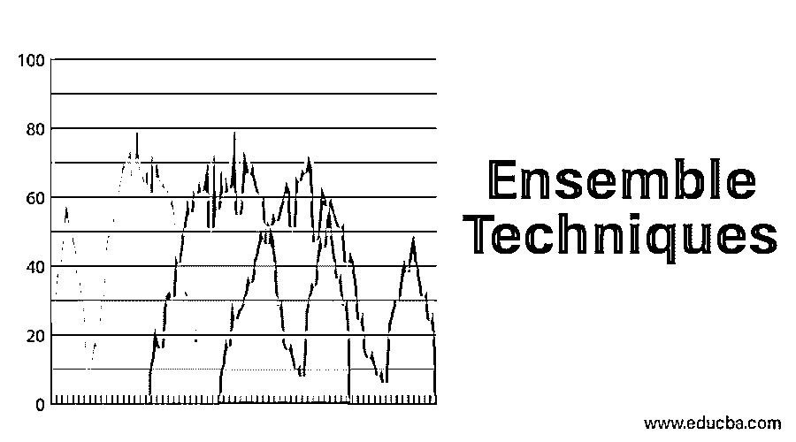
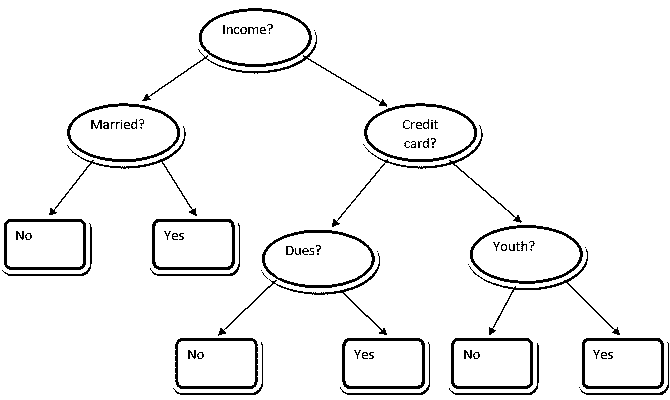
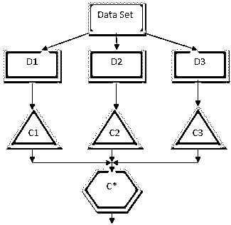
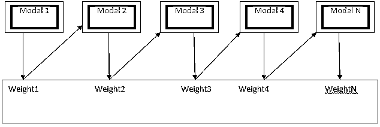

# 集成技术

> 原文：<https://www.educba.com/ensemble-techniques/>

## 集成技术介绍

集成学习是机器学习中的一种技术，它利用几个基本模型的帮助，并组合它们的输出来产生优化的模型。这种类型的机器学习算法有助于提高模型的整体性能。这里最常用的基本模型是决策树分类器。决策树基本上作用于几个规则，并提供预测输出，其中规则是节点，它们的决策将是它们的子节点，叶节点将构成最终决策。如决策树示例所示。

<small>Hadoop、数据科学、统计学&其他</small>

上面的决策树基本上讲的是一个人/客户能不能贷款。贷款资格“是”的规则之一是，如果(收入=是&&结婚=否)，那么贷款=是，这就是决策树分类器的工作方式。我们将把这些分类器合并成一个多基础模型，并结合它们的输出来建立一个最佳预测模型。图 1.b 显示了集成学习算法的整体情况。

### 集成技术的类型

不同类型的合奏，但我们主要关注以下两种类型:

*   制袋材料
*   助推

这些方法有助于减少机器学习模型中的方差和偏差。现在让我们试着理解什么是偏差和方差。偏差是由于我们算法中不正确的假设而产生的误差；高偏差表明我们的模型过于简单/不合适。方差是由于模型对数据集中非常小的波动的敏感性而引起的误差；高方差表明我们的模型高度复杂/过度拟合。一个理想的 ML 模型应该在偏差和方差之间有一个适当的平衡。

### 引导汇总/打包

Bagging 是一种集合技术，有助于减少我们模型中的方差，从而避免过度拟合。Bagging 是并行学习算法的一个例子。装袋工作基于两个原则。

*   **Bootstrapping:** 从原始数据集出发，考虑不同样本群体的替换。
*   **聚合:**对所有分类器的结果进行平均，并提供单一输出，为此，它在分类的情况下使用多数表决，在回归问题的情况下使用平均。使用 bagging 概念的著名机器学习算法之一是随机森林。

#### 随机森林

在随机森林中，从具有替换的群体中抽取随机样本，并且从所有特征的集合中选择特征的子集，构建决策树。从这些特征子集中，给出最佳分割的特征被选为决策树的根。必须不惜任何代价随机选择特征子集，否则我们将最终只产生相关的树，并且模型的方差不会得到改善。

现在我们已经用从人群中抽取的样本建立了模型，问题是我们如何验证这个模型？由于我们正在考虑替换的样品，因此所有的样品都不会被考虑，其中一些不会被包括在任何包中，这些被称为包外样品。我们可以用这个 OOB(袋外)样本来验证我们的模型。在随机森林中要考虑的重要参数是样本数和树数。让我们把“m”看作特性的子集,“p”是特性的全集，现在作为一个经验法则，选择它总是最理想的

*   对于分类问题，m 为√,最小节点大小为 1。
*   对于回归问题，m 为 P/3，最小节点大小为 5。

当我们处理一个实际问题时，m 和 p 应作为调整参数。一旦 OOB 误差稳定，就可以终止训练。随机森林的一个缺点是，当我们的数据集中有 100 个特征时，只有几个特征是重要的，那么这个算法的性能会很差。

### 助推

Boosting 是一种顺序学习算法，有助于减少我们的模型中的偏差和某些监督学习情况下的差异。这也有助于将弱学习者转化为强学习者。Boosting 的工作原理是将弱学习者按顺序放置，并在每一轮后给每个数据点分配一个权重；在前一轮中，更多的权重被分配给错误分类的数据点。这种训练数据集的顺序加权方法是与 bagging 方法的关键区别。

图 3.a 显示了升压的一般方法

在分类的情况下，基于加权多数投票，在回归的情况下，基于加权和，组合最终预测。最广泛使用的升压算法是自适应升压(Adaboost)。

#### 自适应增压

Adaboost 算法涉及的步骤如下:

1.  对于给定的 n 个数据点，我们定义目标样本，并将所有权重初始化为 1/n
2.  我们使分类器适合数据集，并选择具有最小加权分类误差的分类
3.  我们通过基于准确度的经验法则为分类器分配权重，如果准确度超过 50%，则权重为正，反之亦然。
4.  我们在迭代结束时更新分类器的权重；我们为错误分类的点更新更多的权重，以便在下一次迭代中正确分类。
5.  在所有的迭代之后，我们得到基于多数投票/加权平均的最终预测结果。

Adaboosting 对弱(不太复杂)学习器和高偏差分类器有效。Adaboosting 的主要优点是速度快，没有类似于 bagging 情况的调整参数，并且我们不对弱学习者做任何假设。在下列情况下，这种技术不能提供准确的结果

*   我们的数据中有更多的异常值。
*   数据集不足。
*   弱学习者非常复杂。

它们也容易受到噪音的影响。作为提升的结果而产生的决策树将具有有限的深度和高精度。

### 结论

集成学习技术被广泛用于提高模型精度；我们必须根据我们的数据集决定使用哪种技术。但是在一些可解释性很重要的情况下，这些技术并不是首选，因为我们以性能改进为代价失去了可解释性。这些在医疗保健行业中有着巨大的意义，在这一行业中，性能的微小改进是非常有价值的。

### 推荐文章

这是一个合奏技巧指南。在这里，我们讨论了基本概念和两个主要类型的集成技术，并详细解释。您也可以浏览我们的其他相关文章，了解更多信息——

1.  [机器学习技术](https://www.educba.com/machine-learning-techniques/)
2.  [团队建设技巧](https://www.educba.com/team-building-techniques/)
3.  [数据科学算法](https://www.educba.com/data-science-algorithms/)
4.  [最常用的集成学习技术](https://www.educba.com/bagging-and-boosting/)

