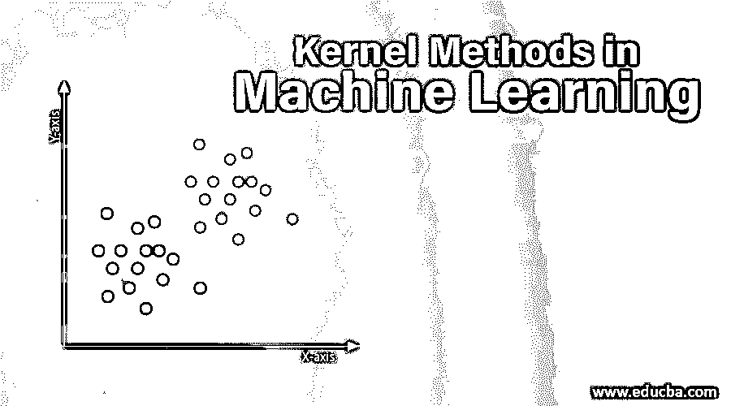
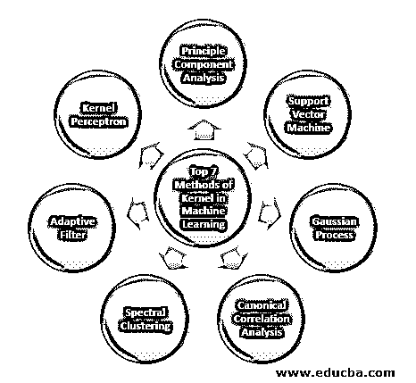

# 机器学习中的核方法

> 原文：<https://www.educba.com/kernel-methods-in-machine-learning/>

## 机器学习中的核方法介绍

机器学习中的核方法被定义为用于模式分析的一类算法，其用于通过使用用户指定的特征图将数据的原始表示显式地转换为特征向量表示，来研究和发现数据集中的一般类型的关系(例如相关性、分类、排序、聚类、主成分等)，使得这些数据的高维隐式特征空间可以通过计算数据在该特定空间中的坐标来操作。

用于模式分析的算法。在一般模式中，分析是为了在数据集中找到关系。这些关系可以是聚类、分类、主成分、相关性等。解决这些模式分析任务的大多数算法需要原始表示的数据被显式地转换成特征向量表示。这种转换可以通过用户指定的特征映射来完成。因此，可以认为内核方法只需要用户指定的内核。

<small>Hadoop、数据科学、统计学&其他</small>

术语核心方法来自于他们使用核心函数的事实，这允许他们在高维隐式特征空间中执行操作，而不需要计算该空间中数据的坐标。相反，他们只是计算特征空间中所有数据对的图像之间的内积。

与坐标的显式计算相比，这些类型的操作在大多数情况下在计算上更便宜。这种技术被称为“内核技巧”。通过对模型应用核技巧，可以将任何线性模型转换成非线性模型。

机器学习中可用的核方法是主成分分析(PCA)、谱聚类、支持向量机(SVM)、典型相关分析、核感知器、高斯过程、岭回归、线性自适应滤波器等等。让我们对其中的一些内核方法有一个高层次的理解。

### 机器学习中的 7 大核心方法

下面是内核在机器学习中提到的方法:

#### 1.主成分分析

主成分分析(PCA)是一种从可能的高维数据集中提取结构的技术。通过使用估计主分量的迭代算法或通过求解特征值问题，很容易实现这一点。PCA 是描述数据的坐标系的正交变换。通过在数据主轴上的投影获得新的坐标系。少量的主成分通常足以解释数据中的大部分结构。其主要应用之一是执行[探索性数据分析](https://www.educba.com/exploratory-data-analysis/)以制作预测模型。它主要用于可视化种群间的亲缘关系和遗传距离。

#### 2.支持向量机

SVM 可以被定义为用于分离超平面的分类器，其中超平面是比环境空间小一维的子空间。该数学空间的维度被定义为指定任意点所需的最小坐标数，而周围空间是围绕该数学对象的空间。现在数学对象可以理解为一个抽象的对象，它不存在于任何时间和地点，而是作为一类事物而存在。

#### 3.高斯过程

高斯过程以 Cark Friedrich Gauss 命名，因为它使用高斯分布(正态分布)的符号。它是一个随机过程，意味着由时间或空间索引的随机变量的集合。在高斯过程中，随机变量具有多元正态分布，即它的所有有限线性组合都是正态分布的。高斯过程使用从正态分布继承的属性，因此在统计建模中很有用。涉及这种核方法的机器学习算法使用懒惰学习的度量和点之间的相似性来预测来自训练数据的看不见的点的值。这个预测不仅是估计，而且是当时的不确定性。

#### 4.典范相关分析

典型相关分析是一种从互协方差矩阵推断信息的方法。它也被称为规范变量分析。假设我们有随机变量的两个向量 X，Y，比如两个向量 X = (X1，…，Xn)和向量 Y = (Y1，…，Ym)，并且变量具有相关性，那么 CCA 将计算彼此之间具有最大相关性的 X 和 Y 的线性组合。

#### 5.谱聚类

在图像分割的应用中，谱聚类被称为基于分割的对象分类。在谱聚类中，在以更少的维度进行聚类之前执行维度减少，这是通过使用数据的相似性矩阵的特征值来完成的。它源于图论，在图论中，这种方法用于识别图中基于连接它们的边的节点社区。这种方法足够灵活，允许我们对非图形数据进行聚类。

#### 6.适应滤波器

自适应滤波器使用线性滤波器，该线性滤波器包括由可变参数和方法控制的传递函数，这些方法将用于按照优化算法调整这些参数。这种优化算法的复杂性是所有自适应滤波器都是数字滤波器的原因。在那些预先没有关于期望的处理操作的先验信息或者它们正在改变的应用中，需要自适应滤波器。

成本函数用于闭环自适应滤波器，因为它对于滤波器的最佳性能是必要的。它确定如何修改滤波器传递函数以降低下一次迭代的成本。最常见的函数之一是误差信号的均方误差。

#### 7.内核感知器

在机器学习中，核心感知器是一种流行的[感知器学习算法](https://www.educba.com/perceptron-learning-algorithm/)，它可以学习核心机器，例如非线性分类器，它使用核心函数来计算训练样本看不到的那些样本的相似性。这个算法发明于 1964 年，是第一个核分类学习器。

大多数讨论的核算法都是基于凸优化或特征问题，并且在统计上是有充分依据的。利用统计学习理论分析了它们的统计特性。

谈核方法的应用[领域](https://www.educba.com/kernel-methods/)它是多样的，包括地质统计学、克里金法、反距离加权、3D 重建、生物信息学、化学信息学、信息提取和手写识别。

### 结论

我总结了机器学习中核心方法的一些术语和类型。由于篇幅有限，本文并不全面，只是想让您了解什么是内核方法以及它们类型的简短总结。但是，覆盖这篇文章会让你在机器学习领域迈出第一步。

### 推荐文章

这是一个机器学习内核方法的指南。这里我们讨论机器学习中的 7 种核心方法。你也可以看看下面这篇文章。

1.  [单片内核](https://www.educba.com/monolithic-kernel/)
2.  [机器学习中的聚类](https://www.educba.com/clustering-in-machine-learning/)
3.  [数据科学机器学习](https://www.educba.com/data-science-machine-learning/)
4.  [无监督机器学习](https://www.educba.com/unsupervised-machine-learning/)
5.  PHP 过滤器|如何使用各种过滤器来验证用户输入？
6.  [机器学习生命周期完整指南](https://www.educba.com/machine-learning-life-cycle/)

