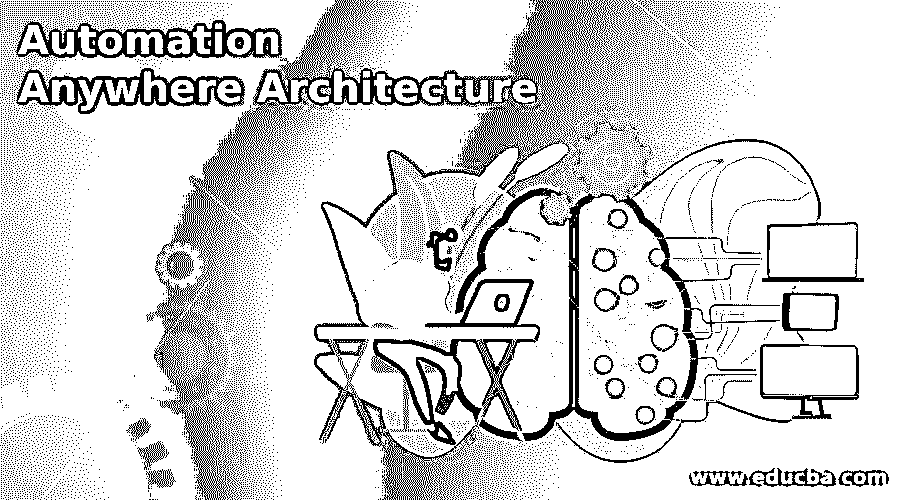
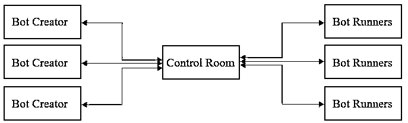

# 自动化随处架构

> 原文：<https://www.educba.com/automation-anywhere-architecture/>

## Automation Anywhere 架构简介

Automation anywhere 架构被定义为描述 automation anywhere 工具的系统实现的过程或规则的集合。Automation anywhere 是与机器人流程自动化工具一起使用的功能，该工具处理易于构建且高度可扩展的软件，该软件能够模仿人类动作，并且基于隐喻软件根，能够以更快的速度执行各种定义的动作，而不会出现太多或非常少的错误。有各种 RPA 工具可以像 automation anywhere 一样实现任务自动化，但该软件特别提供了更好的性能和灵活性，可以同时与各种平台和规模集成。

### 随处自动化架构

在我们开始架构之前，我们需要知道自动化架构的原则是分布式架构。在这种类型的体系结构中，有不同的组件同步工作，并通过网络进行通信以达到目的或目标。

<small>Hadoop、数据科学、统计学&其他</small>

该架构具有以下属性，这些属性对于 Automation Anywhere 继承来说同样重要，以便它能够根据需求工作，它们是:

*   信息的处理不局限于一台机器，而是分布在网络上的其他计算机上。
*   元素之间发生的交互类型是客户机-服务器体系结构的类型，这种客户机-服务器概念是多层体系结构形成的基础。
*   支持分布式体系结构的技术体系结构多种多样，其中一些是。NET、安讯士 Java Web 服务、J2EE 等。
*   中间件的概念是在应用程序和网络之间提供一个缓冲区，这是分布式体系结构的 USP。这种类型的计算机软件存在于系统的中间，并且能够管理分布式系统中的不同元件，尤其是任何地方的自动化元件。

由于其透明性、可靠性和可用性，分布式体系结构成为许多衍生体系结构的基本原则。

保持上面列出的特征，我们最终得到 automation anywhere 工具的架构，如下图所示。

在上图中，我们看到有 3 个元素构成了 automation anywhere 架构。

现在，让我们看看每一个元素，看看它们在将体系结构变成分布式体系结构标准中的作用。

#### 1.机器人创造者

作为开发过程的一部分，automation anywhere 工具中的自动化是由机器人执行的，该桌面应用程序负责创建、编辑和执行机器人。该元素被许可用于每个机器人，并且系统包括用于机器人的执行和测试的运行时间。基于桌面的应用程序具有上传和下载机器人的权限。

一旦机器人被配置，各自的开发人员可以访问他们相应的机器人，创建他们各自的任务，并一次执行所有的任务。就分布式体系结构而言，机器人创建者充当客户端，因此需要连接到一个活动控制室，我们将在下一点重点关注这个控制室。

#### 2.控制室

这个元素恰好是架构中最重要的组件。这恰好是分布式架构术语中的服务器。由 bot 创建者创建的 bot 由控制室控制，该元素提供各种功能，如集中式用户管理、bot farm、许可证管理、反映工具运行值的仪表板以及源代码控制。

具体谈到许可证，该工具提供了两种类型的许可证作为访问器的一部分，以隔离谁可以访问或谁可以编辑。开发许可证授予需要创建或开发并运行机器人的用户，而运行许可证授予只需要运行机器人而不一定创建机器人的用户。控制室为任务的执行安排和分配机器人。

#### 3.机器人赛跑者

到目前为止，我们已经创建了一个机器人，并建立了房间，从那里执行将被处理，但为了完成，我们需要这一点与前 2 个一样重要。automation anywhere 工具的最后一个要素是完成运行 bot 的任务。在这里，这些元素有助于运行机器人，如果需要，它们也可以并行运行。这个元素不可能创建或更新一个机器人。

该元件是安装在 windows 系统中的运行时客户端，其执行由机器人创建者创建并由控制室命令的机器人，然后将执行的日志连同状态一起报告回控制室用于审计目的。就 Bot Runners 而言，唯一的要求是，它需要注册和认证，并且可以被控制室识别，以便运行提供所需输出的作业。bot runner 的另一个有趣的特性是它可以分组，然后动态分配，这为用户提供了一个方便的机会来扩展系统。

### 结论

至此，我们得出结论并理解了构成 automation anywhere 工具的不同元素。我们还收集了控制 automation anywhere 工具的体系结构是分布式体系结构的信息，我们所经历的不同元素解释了相同的原因。

### 推荐文章

这是一个自动化随处架构的指南。这里我们讨论自动化的介绍和架构。您也可以看看以下文章，了解更多信息–

1.  [神经网络机器学习](https://www.educba.com/neural-network-machine-learning/)
2.  [机器学习的统计数据](https://www.educba.com/statistics-for-machine-learning/)
3.  [机器学习系统](https://www.educba.com/machine-learning-system/)
4.  [正则化机器学习](https://www.educba.com/regularization-machine-learning/)

