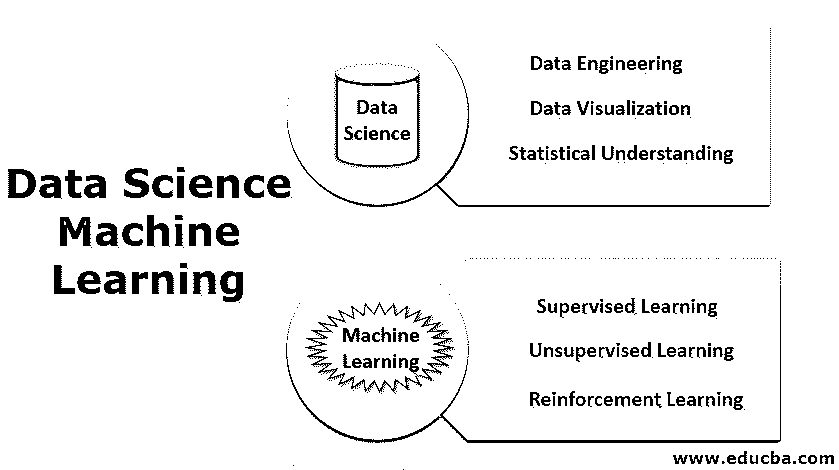

# 数据科学机器学习

> 原文：<https://www.educba.com/data-science-machine-learning/>

## 数据科学机器学习导论

数据基本上是信息，尤其是事实或数字，收集起来用于检查和考虑并用于帮助决策，或者是可以被计算机存储和使用的电子形式的信息。现在，我们将学习数据科学和机器学习的定义。

**数据科学(DS)** :这是一个广阔的领域，使用不同的技术，如统计方法、科学方法、架构流程、各种算法，从可用数据中提取有见地的信息，这些数据可以是结构化数据，也可以是非结构化数据。

<small>Hadoop、数据科学、统计学&其他</small>

**机器学习** ( **ML** ):它是数据科学的一个子集。在统计模型和不同算法的帮助下，在不给出明确指令的情况下，对机器进行机器学习基础的训练；它依赖于用数据创建的模式。"

### 数据科学的重要性

*   我们生活在一个技术时代，每个人都以这样或那样的方式使用技术来实现舒适/高效/轻松，例如，手机/笔记本电脑/平板电脑用于通信，汽车/火车/公共汽车/飞机用于交通，银行/电力等服务以及更多用于轻松生活的服务。
*   在每一个这样的场合，我们都在有意或无意地创建数据，如通话记录/文本/社交媒体——图像/视频/博客都是数据的一部分，通过 GPS 导航到不同位置的交通工具/通过 ECU 记录的车辆性能也是数据的一部分。我们的银行和移动钱包的交易产生了大量的数据；任何地区或部门的用电量也是数据的一部分。
*   如果说这个数据每天或每分钟都在呈指数增长。
*   现在出现的问题是，我们能利用这些数据做些什么吗？我们能利用这些数据提供一些有用的见解吗？我们能提高效率吗？我们能利用这些数据预测未来的结果吗？
*   为了回答所有这些问题，我们有一个叫做数据科学的领域。
*   数据科学可以被视为一个广泛的领域，包括数据挖掘、[数据工程](https://www.educba.com/what-is-data-engineering/)、数据可视化、数据集成统计方法、R/python/SQL 编程、机器学习、大数据等等。

现在让我们了解一下数据科学的重要概念。

#### 1.数据工程

数据工程是数据科学的一个方面，主要关注数据收集应用程序、数据收集和数据分析。数据科学家所做的所有工作，如回答几个与预测或分析相关的问题，都使用大量的信息。

现在他们需要的是正确和有用的信息，这就产生了收集和验证可用信息的需求。这些都是工程任务的一部分。这些任务包括检查空值(缺失数据)、对数据进行分类(分类数据)、创建数据结构(关联规则)等。

#### 2.数据可视化

数据可视化是一种表示数据的图形化方法。在这里，我们使用 python 的内置库来创建可视化元素，例如，表格、相关图、条形图、配对图等。；数据可视化在提供一种简单的方法来分析数据、查看和理解趋势、找出异常值等方面起着至关重要的作用。

#### 3.统计理解

统计学在数据科学领域发挥着至关重要的作用。统计学是执行数据科学任务的有力工具。统计学使用数学对可用信息进行技术分析。借助柱状图或图表等可视化工具，我们可以获得趋势信息，但统计数据有助于我们以数学方式/有针对性的方式对数据进行操作。没有数据知识，科学可视化只是一个猜测的游戏。

我们将讨论数据科学家日常使用的一些重要的统计方法。

*   **均值:**均值基本上是所有数据的平均值，是将所有数据元素相加，再除以几个元素计算出来的。用于识别所有元素的中心值。
*   **Median:** Median 也用于寻找可用元素的中心值，但是这里所有的数据都是按顺序排列的，精确的中间值被认为是一个中值。

如果元素的数量是奇数，那么中值是((n + 1) / 2) 第项。如果多个元素是偶数，那么中位数将是((n / 2) + 1) 第项。

*   **众数:**众数是一个统计参数，指出最频繁或出现次数最多的值作为众数。
*   **标准偏差:**标准偏差表示数据中存在多大的差异，或者它是定义平均值或平均值或期望值的差异的度量。

如果我们有一个低标准偏差，这表明大多数数据值接近平均值。如果我们有一个高的标准偏差，我们的数据值从平均值更分散。

*   **方差:**方差与标准差相同，差异较小；这是一个标准差平方。标准差来源于方差，因为标准差以数据的形式显示分布，而方差以正方形显示分布。使用方差很容易关联价差。
*   **相关性:**相关性是最重要的统计量之一；它表明数据集变量是如何相关的。当我们改变一个参数时，它如何影响另一个参数。

如果我们有一个正相关值，这意味着变量将平行增加或减少

如果我们有一个负的相关值，这意味着变量将在增量上表现相反，另一个将减少，反之亦然。

在统计学中，我们有概率分布、贝叶斯统计和假设检验，这些也是数据科学家的基本工具。

### 机器学习

机器学习基本上意味着机器可以根据输入特征进行学习并产生输出的一种方式。

**定义:**“机器学习是一个研究领域，其中计算机从可用数据/历史数据中学习，而无需显式编程。”

在机器学习中，重点是基于计算机的输入数据体验来自动化和改进计算机的学习过程。我们不会为每种类型的问题显式地编写代码，也就是说，机器会找出解决问题的方法。这里的结果可能不准确，但可以做出很好的预测。让我们这样理解吧:

传统上计算机是用来简化计算过程的，所以如果我们有任何算术计算。我们要做什么？我们将准备一个计算机程序，以简单快捷的方式解决这个问题。例如，如果我们想要添加两个实体，我们将创建一段软件代码，它将接受两个输入，并在输出中显示求和。

机器学习方法是不同的；一种特殊的算法被放入软件代码中，试图识别一种模式，并基于这些模式，试图预测最佳的可能输出，而不是提供直接的算法。这里我们没有为任何特定的操作显式地编码任何算法；相反，我们将数据输入机器来学习模式和输出。

当我们可以通过编码精确的算法直接得到精确的结果时，为什么我们需要采用这种方法呢？精确的算法是复杂的并且是有限的。让我们换个角度来看；这是一个我们拥有大量数据的时代，正如我们在上一节中讨论的那样，数据每天都在爆炸。这里我们处理[监督和非监督学习](https://www.educba.com/supervised-learning-vs-unsupervised-learning/)。

如今，机器学习引起了人们极大的兴趣，因为我们拥有大量的数据。为了理解这些数据，我们需要一些有意义的结果或有意义的模式，这些结果或模式可以被分析并投入实际使用。

但是，我们为什么对机器学习和这些数据感兴趣呢？

我们知道人类重演历史，就像我们和我们的上一代一样。我们的后代也将面临我们现在面临或曾经面临的几种相同的情况。在这个阶段，我们必须想象如何利用历史数据对未来做出反应。现在我们知道数据是一种宝贵的资产。

挑战在于我们如何最好地利用这些可用的数据？

这是最有趣的话题(如何？)，在这里我们将对可用数据进行分析。机器学习基本上有 3 种方法:

*   监督学习
*   无监督学习
*   [强化学习](https://www.educba.com/what-is-reinforcement-learning/)

这三种方法用于创建机器学习模型(线性回归、逻辑回归、随机森林、决策树等)。).

这些机器学习模型有各种各样的应用，例如:

*   **金融:**欺诈检测
*   **营销/销售:**个性化推荐
*   **保健:**识别疾病的趋势。

### 结论

*   数据科学是一个广阔的领域，机器学习是其中的一个子集。在这方面，我们分析现有的历史数据，并试图预测未来最有可能的结果。
*   要预测，我们需要清理数据，整理数据(数据工程)。有了数据在手，我们就可以将模式/趋势可视化，然后，通过统计理解，我们可以推断出有洞察力的信息。
*   这些数据将被输入到使用机器学习算法的机器中。
*   这些算法训练机器并创建一个机器学习模型。
*   然后，该模型可用于预测。

### 推荐文章

这是一本数据科学机器学习指南。在这里，我们讨论数据科学和机器学习的重要性。您也可以阅读以下文章，了解更多信息——

1.  [最佳数据科学项目](https://www.educba.com/best-data-science-programs/)
2.  [数据科学技能](https://www.educba.com/data-science-skills/)
3.  [数据科学语言](https://www.educba.com/data-science-languages/)
4.  [机器学习技术](https://www.educba.com/machine-learning-techniques/)

