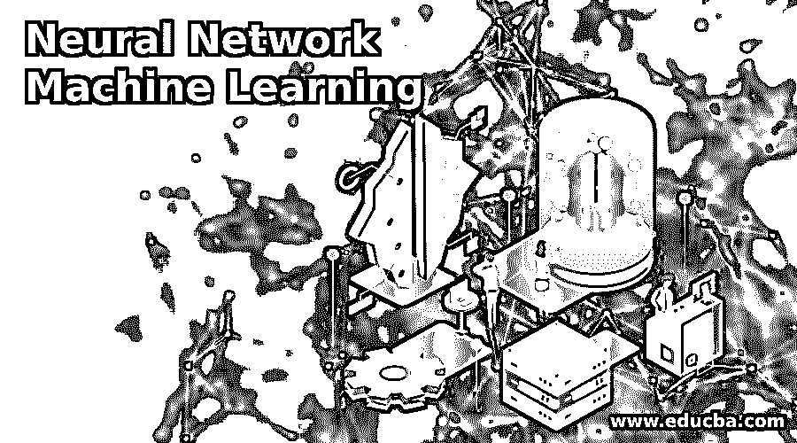

# 神经网络机器学习

> 原文：<https://www.educba.com/neural-network-machine-learning/>

## 神经网络机器学习导论

它是一个程序学习系统，使用一个功能网络来掌握一种信息输入并将其翻译成特定的输出，有时是另一种输出。人类生物学给不真实的神经网络留下了深刻的印象，因此人类大脑的方法神经元沿着从人类感官获取输入。神经网络只是机器学习算法中采用的众多工具和方法之一。神经网络本身也在许多不同的机器学习算法中用作一个比特，以将高级输入方法引入计算机将感知的领域。近年来，神经网络与诊断、金融等一起被应用于许多实际问题。

下面列出了我们想要了解的区域单元的神经网络架构:

<small>Hadoop、数据科学、统计学&其他</small>

*   感知器
*   卷积神经网络
*   递归神经网络
*   长期/短期记忆
*   门控重复单元
*   Hopfield 网络
*   玻尔兹曼机器
*   深度信念网络
*   自动编码器
*   生成对抗网络

### 神经网络机器学习算法

使用神经网络的机器学习算法通常不需要用概述从输入中期望什么的特定规则来编程。

#### 感知器

神经网络是感知器的互联系统，所以可以肯定地说，感知是任何神经网络的基础。这是一种用于学习阈值函数的二进制算法。

#### 卷积神经网络(CNN)

在深度学习中，卷积神经网络可以是深度神经网络的一个类别，最常用于分析视觉表示过程。它们被统称为移位不变或面积不变人工神经网络(SIANN)，支持它们的共享权重设计和平移不变特性。生物过程激发了卷积网络，体细胞之间的属性模式类似于动物皮层区域的组织。

单个植物组织神经元仅在被称为感受野的视野的有限区域内对刺激做出反应。各种神经元的感受野部分重叠，因此它们覆盖了完整的视野。
卷积神经网络的测量单位与大多数选择网络完全不同。它们主要用于图像技术，但是，它也用于不同风格的输入，如音频。

#### 递归神经网络(RNN)

递归神经网络依次分析输入。递归神经网络在某种程度上类似于将转换重复应用于输入，但不一定是按顺序的方式。递归神经网络是递归神经网络的更一般形式。它可以在任何层次树结构上操作。

#### 长/短时记忆(LSTM)

长 STM (LSTM)是一种用于深度学习领域的合成连续神经网络(RNN)设计。与常见的前馈神经网络不同，LSTM 有反馈连接。它不能单独处理单个信息点(如图像)，而是结合整个知识序列。
LSTM 网络区域单元非常适合于分类、处理和创建支持统计信息的预测，因为在统计期间必要事件之间存在未知长度的滞后。LSTMs 的开发是为了包含训练古代 rnn 时可能遇到的爆炸和消失梯度问题。

#### 门控连续单元(GRU)

门控连续单元(GRUs)区域单元连续神经网络中的一种门控机制。GRU 是一种具有遗忘门的长 STM (LSTM ),然而，它比 LSTM 具有更少的参数，因为它缺少关联度输出门。GRU 在复调建模和语音信号建模等确定任务上的表现与 LSTM 相似。gru 在更小的数据集上表现出更高的性能。这是 LSTMs 上的一点变化。顾的操作与非常相似，最重要的区别是，顾的计量单位运行起来更容易、更快。这些往往会相互抵消，因为您可能需要一个更大的网络来重新获得一些价值，然后依次抵消性能优势。

#### Hopfield 网络

Hopfield 网络功能具有二进制阈值节点的内容可寻址存储系统。它们肯定会收敛到一个邻域最小值，因此，可能会收敛到一个错误的模式(错误的本地最小值)而不是 keep 模式。Hopfield 网络为理解人类记忆提供了一个模型。

#### 玻尔兹曼机器

它是随机连续神经网络的一种形式。这将被视为 Hopfield 网随机生成的结果。这些机器像 Hopfield 网络一样平方测量质量，但是一些神经元平方测量标记为输入神经元，不同的保持隐藏。在全网络更新的最高级，输入神经元变成输出神经元。学习路德维希·玻尔兹曼机器学习公式的目标是最大化机器分配给工作集中的二元向量的概率的商品。在这种情况下，单元的随机更新需要是连续的。有一种特殊的样式允许交替平行更新，即平方测量方式更经济。这将被称为深度路德维希·玻尔兹曼机器，一个具有许多缺失连接的通用路德维希·玻尔兹曼机器。

#### 深度信念网络

这是一种可以逐层有效训练的方法。这种技术也被认为是贪婪的工作。建议制定国内最佳解决方案，以促使员工诚实，但最有可能不是最佳答案。使用信念网络，我们倾向于诱导出现各种各样的变量，我们能够解决一些问题，如

*   推断未观察变量状态的抽象思维缺点。
*   学习劣势调节着变量之间的相互作用，创造了大量最有可能返回工作信息的网络。

#### 自动编码器

一旦信息未被标记，自动编码器区域单元神经网络被设计用于无监督学习。作为数据压缩模型，他们将习惯于把一个给定的输入记录到一个更小维度的插图中。然后，解码器将习惯于从编码版本中重建回输入。

#### 生成对抗网络

这些网络由任意两个网络组成，一个负责提供内容，另一个负责衡量内容。辨别模型的任务是决定一个给定的图像外观是自然的还是人工创造的。
生成器的任务是像初始信息分布一样，形成自然的面积单元试图。

### 神经网络的好处

*   在整个网络上存储信息
*   在知识不足的情况下工作的能力
*   它具有容错能力
*   具有分布式存储器
*   逐渐腐败
*   训练机器的能力
*   并行处理能力

### 神经网络的缺点

*   硬件依赖性
*   确保适当的网络结构
*   网络的持续时间是未知的

### 结论

在这篇文章中，我们将讨论神经网络，神经网络的性质及其解释，神经网络的好处，神经网络的缺点。

### 推荐文章

这是一本神经网络机器学习指南。在这里，我们讨论了神经网络机器学习的算法，优点和缺点介绍。您也可以浏览我们的其他相关文章，了解更多信息——

1.  [机器学习 vs 神经网络](https://www.educba.com/machine-learning-vs-neural-network/)
2.  [深度学习工具箱](https://www.educba.com/deep-learning-toolbox/)
3.  [深度学习模型](https://www.educba.com/deep-learning-model/)
4.  [用 TensorFlow 进行深度学习](https://www.educba.com/deep-learning-with-tensorflow/)

