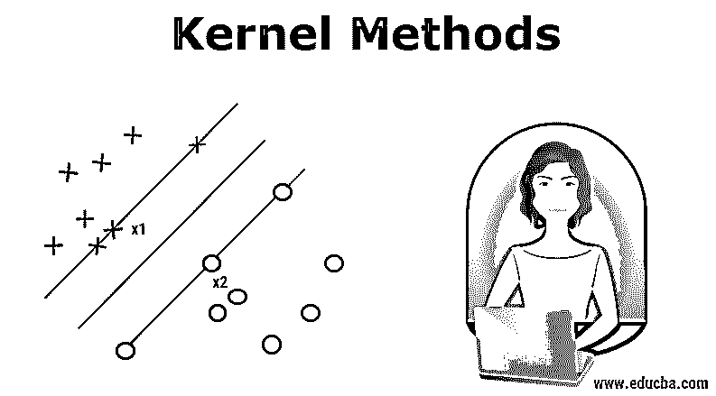
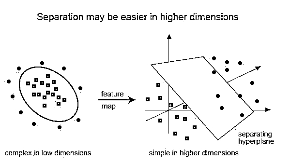
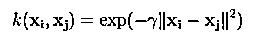
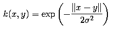
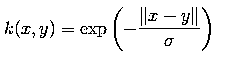
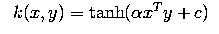
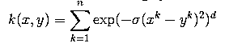

# 核心方法

> 原文：<https://www.educba.com/kernel-methods/>

## 内核方法简介

内核或内核方法(也称为内核函数)是用于模式分析的不同类型算法的集合。它们通过使用线性分类器来解决非线性问题。在分类和回归问题中使用的 SVM(支持向量机)中采用了核方法。SVM 使用所谓的“核心技巧”，即转换数据并为可能的输出找到最佳边界。

### 核方法的必要性及其工作原理

在我们进入核方法的工作之前，理解支持向量机或支持向量机更重要，因为核是在 SVM 模型中实现的。因此，支持向量机受到监督[机器学习算法](https://www.educba.com/machine-learning-algorithms/)用于分类和回归问题，例如将苹果归类为水果，而将狮子归类为动物。

<small>Hadoop、数据科学、统计学&其他</small>

为了演示，下面是支持向量机的样子:

这里我们可以看到一个超平面，它将绿点和蓝点分开。超平面比环境平面小一个维度。例如，在上面的图中，我们有表示周围空间的 2 维，但是划分或分类该空间的维比周围空间少 1 维，并且被称为超平面。

但是如果我们有这样的输入呢:

使用线性分类器来解决这种分类是非常困难的，因为由于点是随机分布的，所以没有好的线性线能够对红色和绿色点进行分类。这里使用了核函数，它将点带到更高的维度，在那里解决问题并返回输出。这样想，我们可以看到绿点被包围在某个周界区域内，而红点位于周界区域之外，同样，也可能有其他情况，绿点可能分布在梯形区域内。

因此，我们所做的是将首先由一维超平面(“或直线”)分类的二维平面转换为三维区域，这里我们的分类器，即超平面将不是直线，而是将切割该区域的二维平面。

为了获得对内核的数学理解，让我们理解内核的姜黎黎方程，它是:

K(x，y)= <f f="">其中，
K 是核函数，
X 和 Y 是维度输入，
f 是从 n 维到 m 维空间的映射，
T5】X，y >是点积。</f>

#### 借助例子的说明。

假设我们有两点，x= (2，3，4)和 y= (3，4，5)

我们已经看到，K(x，y) = < f(x), f(y) >。

让我们先计算一下< f(x), f(y) >

f(x)=(x1x1，x1x2，x1x1，x2x1，x2x2，x2x3，x3x1，x3x2，x3 x3 x3 x3)〔t 0〕f(y)=(y1，y2，y2，y2，y2y1，y2，y2y3，y2 y 3，y3 y 3)〕so，〔t1〕f (y) = f(2，3，4)。f(3，4，5)=
(36+72+120+72+144+240+120+240+400)=
1444
和，
K(x，y)=(2 * 3+3 * 4+4 * 5)++12+；

这正如我们发现的，f(x)。f(y)和 K(x，y)给出了相同的结果，但前一种方法在使用核时需要大量的计算(因为将 3 维投影到 9 维)，这要容易得多。

### SVM 的内核类型和方法

让我们看看 SVM 正在使用的一些内核函数或类型:

#### 1.线性内核

假设我们有两个名为 x1 和 Y1 的向量，那么线性核由这两个向量的点积定义:

K(x1，x2) = x1。x2

#### 2.多项式核

多项式核由以下等式定义:

K(x1，x2) = (x1。x2 + 1)d，

在哪里，

d 是多项式的次数，x1 和 x2 是向量

#### 3.高斯核

这个核是径向基函数核的一个例子。下面是这个的方程式:

给定的 sigma 在高斯核的性能中起着非常重要的作用，既不应该高估也不应该低估，应该根据问题仔细调整。

#### 4.指数内核

这与之前的内核密切相关，即高斯内核唯一的区别是–移除了范数的平方。

指数函数的作用是:

This is also a radial basis kernel function.

#### 5.拉普拉斯核

这种类型的核不太容易改变，并且完全等同于之前讨论的指数函数核，拉普拉斯核的等式给出为:

#### 6.双曲线或 Sigmoid 核

这个内核用于机器学习的[神经网络](https://www.educba.com/what-is-neural-networks/)领域。sigmoid 内核的激活函数是双极 sigmoid 函数。双曲线核函数的公式为:

这个核在支持向量机中被广泛使用和流行。

#### 7.方差分析径向基核

众所周知，这种核在多维回归问题中表现非常好，就像高斯核和拉普拉斯核一样。这也属于径向基核的范畴。

方差分析内核的等式为:

还有更多类型的核方法，我们已经讨论了最常用的核。这完全取决于问题的类型，它将决定使用的核函数。

### 结论

在这一节中，我们已经看到了内核的定义以及它是如何工作的。我们试图借助图表来解释内核的工作原理。然后，我们试图用数学给出一个关于核函数的简单例子。在最后一部分，我们已经看到了当今广泛使用的不同类型的内核函数。

### 推荐文章

这是内核方法的指南。在这里，我们讨论一个介绍，需要，它的工作和类型的核心方法与适当的方程。您也可以浏览我们推荐的其他文章，了解更多信息——

1.  [K 均值聚类算法](https://www.educba.com/k-means-clustering-algorithm/)
2.  [强力算法](https://www.educba.com/brute-force-algorithm/)
3.  [决策树算法](https://www.educba.com/decision-tree-algorithm/)
4.  [机器学习中的内核方法](https://www.educba.com/kernel-methods-in-machine-learning/)
5.  [机器学习中的决策树](https://www.educba.com/decision-tree-in-machine-learning/)

