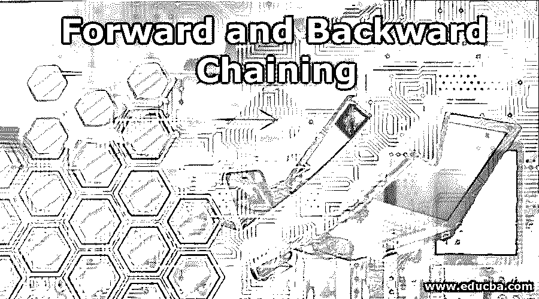

# 正向和反向链接

> 原文：<https://www.educba.com/forward-and-backward-chaining/>

## 正向和反向链接简介

正向和反向链接是推理机用来从知识库中推导新信息的模式。推理机是人工智能中智能系统的主要组件之一，它将一组逻辑规则应用于现有信息(知识库)以从已知事实中推导出新信息。正向和反向链接是推理机推理新信息的两种方式。前向和后向传播在从已知事实推断新信息的方式上是完全相反的。

### 正向传播是如何工作的？

正向链接被一些人称为正向推理或正向演绎，从知识库中的已知事实或原子句子开始，并逐渐将推理规则应用于已知事实，直到我们达到目标状态。简而言之，正向链接根据可用数据做出决策或达到目标状态。

<small>Hadoop、数据科学、统计学&其他</small>

#### 正向链接的属性

*   它遵循自下而上的方法，即推理演绎从下到上
*   它也被称为数据驱动的方法，因为它依赖于现有的数据来达到目标状态
*   它是结论驱动的，即它的目标是从初始状态得出结论
*   它广泛应用于 CLIPS 和产生式规则系统等专家系统中

#### 例子

让我们看一个例子来理解正向链接在实践中是如何工作的

规则 1: 如果 A 是人类，那么 A 是哺乳动物

规则 2: 如果 A 是哺乳动物，那么 A 就是一个生命体

规则 3: 如果 A 是一个有生命的形式，那么 A 是凡人

事实:希亚姆是人类

根据这些推理规则，我们必须达到目标

**目标:**希亚姆是凡人吗？

**步骤:**

1.  从已知的事实开始。我们知道希亚姆是人类(从事实陈述中)。
2.  利用 R1，我们可以推断希亚姆是一种哺乳动物。因为这不是目标陈述，所以请继续。
3.  然后跳到规则 2:如果希亚姆是一种哺乳动物，那么它是一种有生命的形式，所以我们可以说缪拉是一种有生命的形式。因为这不是目标陈述，所以请继续
4.  使用 R3，因为希亚姆是一个生命体，所以它一定是凡人。既然是目标陈述，那么退出吧

#### 正向链接的优势

*   [当可用信息可用于达到目标状态时，前向链接非常有用](https://www.educba.com/forward-chaining/)
*   正向链接具有从有限的初始数据提供大量数据的能力
*   正向链接最适合于需要更多控制、计划和监视的专家系统应用程序
*   当初始状态或事实的数量有限时，应该应用正向链接

#### 正向链接的缺点

*   推理机将生成新的信息，而不知道哪些信息将与达到目标状态相关
*   用户最初可能不得不输入大量信息，而不知道哪些信息将用于达到目标状态
*   推理机可能会触发许多无助于达到目标状态的规则
*   它可能给出不同的结论，这可能导致链接过程的高成本

### 反向传播是如何工作的？

反向链接或反向传播与正向链接相反。它从目标状态开始，使用推理规则反向传播，以便找出支持目标的事实。它也被称为目标驱动推理。它从给定的目标开始，搜索规则的 THEN 部分(动作部分),如果找到规则，并且它的 if 部分与推理规则匹配，则执行该规则，其他推理引擎将其设置为新的子目标。

**规则 1:** 如果 A 和 B 那么 C

规则 2: 如果 C 那么 E

**规则 3:** 如果 A 和 E 那么 H

**事实:**甲、乙

**目标:**证明 H

**证明:**

**步骤 1** :首先，系统寻找在 R.H.S .即 R3 上有目标的语句，然后寻找规则的 L.H.S .以检查它是否包含事实。它包含 A 和 E，但我们也需要 B

**步骤 2** :现在它将 E 作为子目标，由规则 2 证明。现在来看看它的左旋甲状腺激素

第三步: C 可以用规则 1 来证明，规则 1 有一个& B 作为 L.H.S

第四步:因为我们从目标中得到了事实 A & B，所以算法到此结束

**第五步:**停止

#### 反向链接的属性

*   反向链接是一种自上而下的方法，我们从目标状态开始，反向工作以找到支持目标陈述所需的事实
*   它被称为目标驱动法，因为我们从目标开始，然后分成子目标来提取事实
*   它应用深度优先搜索策略
*   它只能得出有限的结论
*   它只测试几个必需的规则

#### 反向链接的优势

*   反向链接中的搜索是定向的，因此当事实被验证时处理终止
*   反向链接只考虑知识库的相关部分，因此它从不执行不必要的推理
*   与正向链接不同，这里只需要很少的数据点，但规则会被彻底搜索
*   对于像诊断和调试这样的问题，它是非常有效的

#### 不足之处

*   由于反向链接是目标驱动的，因此必须事先知道目标[才能执行反向链接](https://www.educba.com/backward-chaining/)
*   很难实现反向链接

### 结论–向前和向后链接

基于规则的系统与人类的日常生活息息相关，因此对这些系统的理解是必不可少的。基于规则的系统中涉及的两种模式都有自己的优缺点。方法的选择取决于问题的性质。

### 推荐文章

这是向前和向后链接的指南。这里我们讨论正向和反向链接的属性、示例、优点和缺点。您也可以看看以下文章，了解更多信息–

1.  [正向链接与反向链接](https://www.educba.com/forward-chaining-vs-backward-chaining/)
2.  [联网设备](https://www.educba.com/networking-devices/)
3.  [备忘单 JQuery](https://www.educba.com/cheat-sheet-jquery/)
4.  [jQuery 元素](https://www.educba.com/jquery-elements/)

