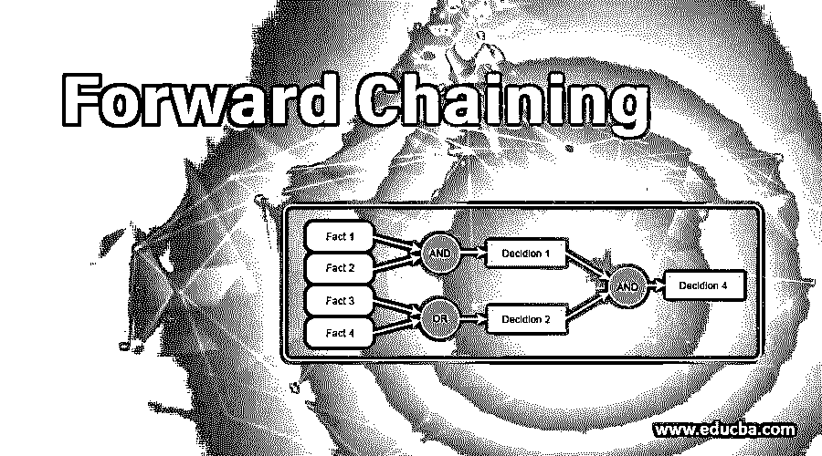
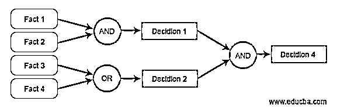
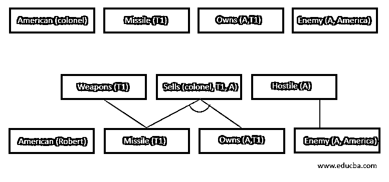
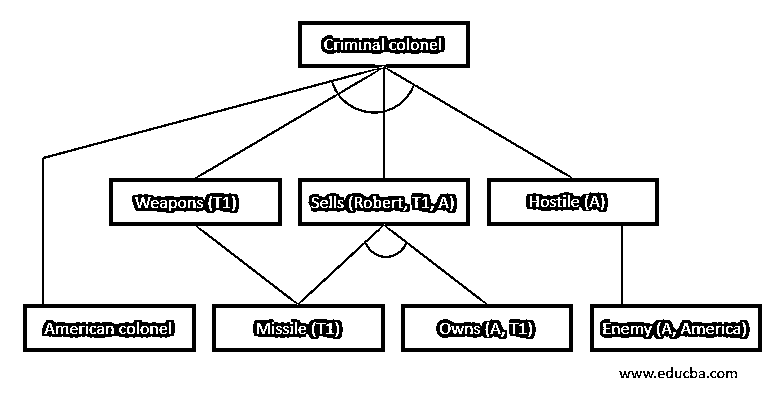

# 正向链接

> 原文：<https://www.educba.com/forward-chaining/>

## 正向链接简介

在人工智能中，我们认为前向链接和后向链接是帮助其功能的非常重要的参数。

让我们首先看看正向链接实际使用的地方是什么推理引擎。

<small>Hadoop、数据科学、统计学&其他</small>

正向链接是一种推理形式，它使用知识库中存在的原子语句，从而对给定数据应用推理规则，以便在正向提取更多数据，直到达到最终目标。当根据可用数据做出决定时，这种过程称为正向链接。它也被称为数据驱动的方法。

以下是正向链接的属性:

*   该过程自下而上进行。
*   结论是基于未知的事实，通过从初始阶段做出决定，从而达到最终目标
*   正向链接通常用于产生式规则系统和专家系统(例如 CLIPS，即 C 语言集成产生式系统)

### 正向链接过程

要进行正向链接，需要几个步骤。为了便于理解，让我们举一个例子。

法律当局规定，任何美国公民向任何敌国出售武器都是犯罪行为。A 国是美国的敌国，目前拥有一些导弹。所有这些导弹都是由一位美国上校卖给这个国家的。

这里有一些事实可以说明:

*   美国人向美国的敌人出售武器是犯罪行为
*   A 国是美国的敌人
*   一名陆军上校向一名军官出售导弹
*   导弹是武器
*   上校是美国公民

### 脂肪的转化

所有的变量都必须从句子中找出。以下变量是:

1.  美国人
2.  武器
3.  出售
4.  敌对关系
5.  犯罪
6.  上校
7.  导弹

**步骤 1:** 在正向链接的第一步中，对袋子进行分析。句子被分开，没有任何含义的句子被挑选出来。因此，在上面的句子中，以下每个都是事实:

| 美国 | A | 导弹 | 敌军 | 美国人(上校) |

第二步:我们分析那些建立任何结果的事实。

第三步:我们必须检查每个逻辑操作符是否可以被可用的事实所替代。如果是，用什么替代品来达到最终目标。

用这种方法，我们最终可以得出结论，一个美国公民上校向一个国家出售了一枚武器导弹，而这个国家是美国的敌人，这证明他在法律上是一个罪犯。

要实现该系统，必须建立一种机制，即基于使用正向链接确定的规则的推理机，该推理机必须输入到系统的工作存储器中，用户可以在其中访问、输入数据并推断出结果。规则将被写入知识库。

### 正向链接有什么用？

向前连锁部队是最有效的工具之一，可以在只有一个站的时候使用。可以产生许多可能的端点。给出的例子是一个简化的例子。但是在复杂的情况下，这在算法上非常有效地减少了实现前向链接时达到最佳可能解决方案的时间。

前向链接机制可用于简单的设备，如直接向最近的消防站指示火灾发生的烟雾报警探测器。火灾探测器传感器将根据两个因素识别火灾的发生:

1.  传感器附近的平均室温高于建筑物的平均温度
2.  如果有烟
3.  烟的密度
4.  温差(10 度或以上)

正向链接工具使我们日常使用的机器变得聪明，越多的经验是基于情况的，它的反应就越好。

### 正向链接的优点和缺点

以下是正向链接的一些优点和缺点

#### 优势

*   可以感受到多个变量，可以得出多个平行的结论，这在反向链接中是看不到的
*   当用户不太清楚要采取的假设时，链接被证明是最好的工具，因为他需要看到从所提供的情况中可以得出什么结论。

#### 不足之处

*   转发链接的主要缺点是在将数据分离成各种变量后，消除、构造和同步这些数据所花费的时间。
*   与后向链相比，前向链[的假设没有那么明确，因为后向链更加目标驱动，减少了非常有效地得出结论所需的时间](https://www.educba.com/backward-chaining/)

### 结论

专家系统中使用的前向链接工具有助于模拟人类拥有的决策能力，这种能力可以在基于计算机的系统中复制。使用这种机制，计算机能够在 and 或 else 循环的基础上做出逻辑决策，从而产生以动作形式实现的简单客观决策。

在人工智能的大视野中做一个非常简单的工具，它是最有效的方法之一，仍然由 NASA 的专家系统结合过程编程和基于逻辑的面向对象语言的范例来实现。因此，这个工具极大地减少了由计算机系统代替人类完成的多余任务。

因此，人类参与了两个过程，在这两个过程中，机器无法给出合理的解决方案来充分利用资源，并将逻辑价值较低的工作外包给机器。

### 推荐文章

这是一个正向链接的指南。在这里，我们讨论他们的过程，转换，使用，优点和缺点的前向链接。您也可以看看以下文章，了解更多信息–

1.  [Java 中的散列函数](https://www.educba.com/hashing-function-in-java/)
2.  [联网设备](https://www.educba.com/networking-devices/)
3.  [备忘单 JQuery](https://www.educba.com/cheat-sheet-jquery/)
4.  [分组密码的操作模式](https://www.educba.com/block-cipher-modes-of-operation/)

