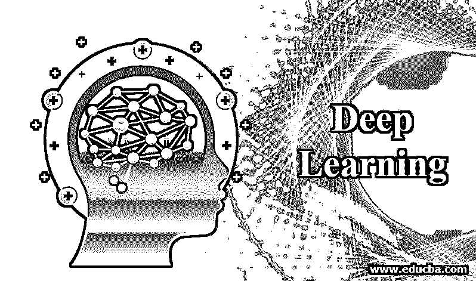
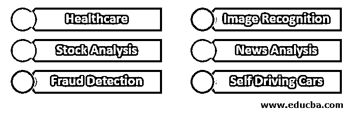

# 深度学习

> 原文：<https://www.educba.com/deep-learning/>

## 深度学习简介

深度学习是机器学习的一部分，机器学习是人工智能的子集。它使我们能够从其体系结构中的各层提取信息。它用于图像识别、欺诈检测、新闻分析、股票分析、自动驾驶汽车、医疗保健(如癌症图像分析)等。通过在网络中输入更多的数据，各层得到很好的训练。他们可以分为监督，半监督和无监督的类别。每一层都专门用于提取信息。例如在图像识别中，第一层将找到边缘、线条等，第二层像眼睛、耳朵、鼻子等。

### 深度学习的应用

下面给出深度学习的应用:

<small>Hadoop、数据科学、统计学&其他</small>

#### 1.卫生保健

从医学图像分析到治疗疾病，深度学习发挥了巨大的作用，尤其是在 GPU 处理器存在的情况下。它还可以帮助内科医生、临床医生和医生帮助病人脱离危险，并且他们可以诊断和治疗病人并给予适当的药物。

#### 2.股票分析

量化股票分析师获得了更多的好处，特别是在发现特定股票的趋势(无论是看涨还是看跌)方面，他们可以在训练深度学习层时使用更多的因素，如交易数量、买方数量、卖方数量、前一天的期末余额等。定性股票分析师在训练深度学习层时，会使用股本回报率、市盈率、资产回报率、股息、所用资本回报率、员工人均利润、现金总额等因素。

#### 3.欺诈检测

如今，黑客们，尤其是那些来自黑暗网络的黑客们，已经找到了使用不同的软件在全球范围内以数字方式窃取金钱的方法。深度学习将学习使用许多因素，如路由器信息、IP 地址等，在网络中找到这些类型的欺诈交易。自动编码器还帮助金融机构节省了数十亿美元的成本。这些类型的欺诈交易也可以通过发现异常值并对其进行调查来检测。

#### 4.图像识别

假设说，城市警察局有一个城市的人的数据库，他们想知道在公共集会中谁参与了犯罪，暴力使用街道上可用的公共网络摄像头，这种使用 CNN(卷积神经网络)的深度学习在找到参与行为的人方面有很大帮助。

#### 5.新闻分析

这些天来，政府采取了很多努力，特别是在控制假新闻的传播和来源。此外，在民意调查中，比如谁会在受欢迎程度方面赢得选举，哪个候选人在社交媒体等上被大多数人分享，以及对国家人民使用所有这些变量所做的推文的分析中，我们可以预测深度学习的结果，但也有一些限制，我们不知道数据的真实性是真是假。或者必要的信息是否被机器人传播。

#### 6.自动驾驶汽车

自动驾驶汽车通过分析在山区、沙漠、陆地等不同地形下制造的汽车中捕获的数据，使用深度学习。可以从传感器、公共摄像头等获取数据，这将有助于自动驾驶汽车的测试和实施。该系统必须能够确保在培训中处理好所有的场景。

### 我们为什么要使用深度学习？

有助于提高预测的效率，找到最佳的可能结果并进行模型优化。当数据庞大时，要降低公司在保险、销售、利润等方面的成本。当数据没有特定的结构时，深度学习会非常有用，这意味着可以分析来自音频、视频、图像、数字、文档处理等的数据。

### 深度学习的特征

下面给出深度学习的特征:

#### 1.监督、半监督或无监督

当你训练数据[时类别标签出现，那么它是监督学习](https://www.educba.com/what-is-supervised-learning/)。像线性回归这样的算法。逻辑回归，决策树使用监督学习。当你训练数据时类别标签是未知的，那么它就是无监督学习。像聚类分析、K 均值聚类、异常检测等算法使用无监督学习。数据集由标记数据和未标记数据组成，我们称之为半监督学习。基于图的模型、生成模型、聚类假设、连续性假设使用半监督学习。

#### 2.大量的资源

它需要高级图形处理单元来处理繁重的工作负载。大量数据需要像结构化或非结构化数据形式的大数据一样进行处理。有时还需要更多的时间来处理数据，这取决于输入的数据量。

#### 3.模型中有大量的层

需要大量的层，如输入、激活、输出，有时一层的输出可以通过一些小的发现输入到另一层，然后这些发现最终在 softmax 层中汇总，以找到最终输出的更广泛的分类。

#### 4.优化超参数

需要很好地调整超参数，如时期数、批量、层数、学习率，以获得成功的模型精度，因为它在层预测和最终输出预测之间建立了联系。超参数可以很好地处理过拟合和欠拟合。

#### 5.价值函数

它显示了模型在预测和准确性方面的表现。对于[深度学习模型](https://www.educba.com/deep-learning-model/)中的每次迭代，目标是与之前的迭代相比，最小化成本。根据使用的不同算法，平均绝对误差、均方误差、铰链损耗、交叉熵是不同的类型。

### 深度学习的优势

*   解决复杂的问题，如 Amazon echo 中的音频处理、图像识别等，减少对特征提取、自动化任务的需求，使用 Keras 和 Tensorflow 可以在更短的时间内完成预测。
*   可以进行并行计算，从而减少开销。
*   模型可以在大量数据的基础上进行训练，数据越多，模型越好。
*   通过不懈的训练，与人类相比，高质量的预测。
*   适用于非结构化数据，如视频剪辑、文档、传感器数据、网络摄像头数据等。

### 结论

当一家公司采用深度学习时，会带来很多好处，尤其是在未来。大多数手工工作将被淘汰，制造业中的自动化过程将像机器人完成装配过程一样完成。甚至要求政府采取更好的金融、经济政策，帮助金融机构减少欺诈交易等。帮助法院快速处理案件和法律漏洞。

### 推荐文章

这是深度学习的指南。在这里，我们讨论深度学习的介绍、应用、特征和优势。您也可以看看以下文章，了解更多信息–

1.  [深度学习技术](https://www.educba.com/deep-learning-technique/)
2.  [感知器学习算法](https://www.educba.com/perceptron-learning-algorithm/)
3.  [机器学习软件](https://www.educba.com/machine-learning-software/)
4.  [深度学习工具箱指南](https://www.educba.com/deep-learning-toolbox/)

