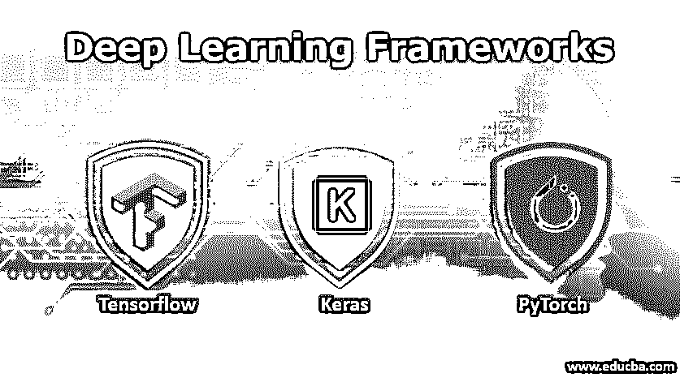
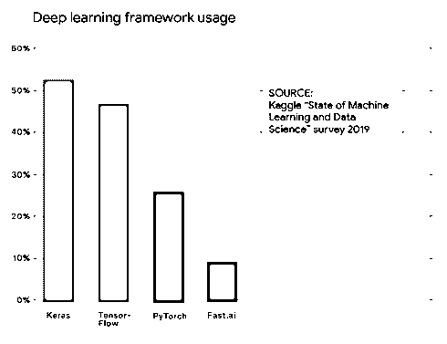
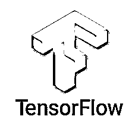

# 深度学习框架

> 原文：<https://www.educba.com/deep-learning-frameworks/>

## 深度学习框架简介

深度学习包括一个神经网络，它是深入到层网络的线性模型的子集，以理解复杂的数据模式来做到这一点，一个接口调用深度学习框架(如 TensorFlow，Keras，Pytorch，Theano 等。)被引入，它可以被称为能够构建优化的[深度学习模型](https://www.educba.com/deep-learning-model/)的黑盒，免费，平台无关，能够在 CPU、GPU 或 TPU 上运行。

### 深度学习的框架

市面上有很多免费的深度学习框架，像 TensorFlow、Keras、Pytorch、Theano、MXNet、Caffe、Deeplearning4j 等。其中，最常用的框架是 TensorFlow、Keras 和 Pytorch，如下面 2019 年调查的使用统计数据所示。

<small>Hadoop、数据科学、统计学&其他</small>

因此，我们将从上述 2019 年的使用统计数据中，按降序查看前三个深度学习框架的详细信息。

*   Keras
*   TensorFlow
*   [指针](https://www.educba.com/pytorch-versions/)

以下是按降序排列的前三个深度学习框架:

#### 1\. Keras

它是用 Python 编写的[高级开源神经网络框架，使用 TensorFlow、CNTK 和 Theano 作为后端。它有很好的文档，易于使用。因此，它被用于快节奏的环境中，最好是在需要快速实验结果的研究中。它是模块化的、可扩展的和平台无关的，因为它可以在 CPU、GPU 以及 TPU 上运行。](https://www.educba.com/what-is-python/)

它与 Python 2.7-3.6 兼容。它支持两种类型的模型体系结构，一种是顺序的，是层的线性堆栈，另一种是使用函数式编程接口，用于创建复杂的多输入/输出模型、具有共享层的有向无环图模型等。它可以使用 python 命令行安装程序来安装，也可以通过克隆 Github 库来安装，因为它是开源的。它确保了可读性，并且是模块化的。此外，它是可扩展的，因为新的层/组件可以很容易地添加到现有模型中。

#### 2\. TensorFlow

这是谷歌大脑开发的另一个流行的深度学习框架，被恰当地用于进行研究。是用 C++和 Python 写的。它使得复杂的数值计算变得更快。它使用数据流图作为后端的数据结构，图中的节点表示一组要执行的数学运算。图形的边代表多维数组或张量。

[由于它使用 C++](https://www.educba.com/uses-of-c-plus-plus/) 作为由高级 Python API 抽象的低级 API 进行数值计算，因此与其他框架相比，它的计算速度很快。它附带了一个 Tensorboard，这是一个可视化 API，可以创建交互式仪表板，用于动态分析和报告模型性能。最近 Tensorflow 在其最新的 v2.0 版本中集成了 Keras，作为 tf.keras 包。像 Keras 一样，它是独立于平台的，可以在 CPU、GPU 和 TPU 上运行。它也是开源的，可以使用 python 安装程序或通过克隆 Github 库来安装。

#### 3\. PyTorch

它是最容易使用的框架之一，被用来替代 [NumPy 数组](https://www.educba.com/numpy-arrays/)，以便在 GPU 环境中更快地执行数值计算。它使用张量确实提高了计算速度。上面讨论的框架构建了一个神经网络，并一次又一次地重用相同的结构。如果网络中存在任何修改，则必须从头开始构建。

PyTorch 使用一种称为反向模式自动微分的技术，这是一种动态技术，允许零延迟或零开销地修改神经网络。它可以即时创建数据流图。它易于调试，内存效率高，并且是用 Python 和 c++(T1)编写的。它有很好的文档，并且更容易扩展。它是独立于平台的，可以在 CPU、GPU 和 TPU 上运行。它可以使用 python 安装程序安装，也可以从 GitHub 库中克隆，因为它是开源的。

### **深度**学习的应用**框架**

**1。自然语言处理:**它使用深度学习框架来开发模型架构，如 LSTM、递归神经网络、门控递归单元、双 LSTM、双 GRU，它们在以下领域中使用:

*   **情感分析:**通过学习单词嵌入进行文本分类
*   **词性标注:**用关键字标注单词/短语
*   聊天机器人:与问答模型类似，该模型通过一些通用查询进行预处理。
*   **文档摘要:**通过单词嵌入进行学习

**2。计算机视觉:**它使用深度学习框架来开发模型架构，如卷积神经网络、基于区域的 CNN、带注意机制的 CNN 等。使用 CNN 作为后端的流行架构有 VGG-16、VGG-32、ResNet50、Alex Net、Inception Net 等。赢得了各种 ImageNet 竞赛。

它用于以下情况:

*   **人脸检测与识别:**使用基于卷积神经网络的架构。
*   **图像字幕:**使用基于区域的卷积神经网络，由递归神经网络提供注意机制。
*   **目标检测:**使用基于暗网的 YOLO 架构。
*   **生成式自动编码器网络:**使用自动编码器给图像着色，生成图像的艺术印象等。
*   **视频检测:**将视频视为图像随时间的快照

**3。特征工程:**它使用深度学习框架来创建多维自动编码器，用于生成特征和理解数据中的模式。可以创建隐藏层的集合，其在每一层学习改进的特征集。

**4。强化学习:**它定义了人工智能在基于角色扮演的游戏中的使用，并在自动驾驶汽车、使用马尔可夫决策过程的政策制定中找到了它的应用。它使用状态-行动和奖励机制作为模型创建的一部分。

### 结论

上面讨论的流行深度学习框架被广泛用于不同的技术领域。比较它们没有任何意义，因为根据使用情况，每种都有自己的优缺点。积极的研究仍在继续，目前的市场趋势正积极证明这一点。

### 推荐文章

这是深度学习框架的指南。在这里，我们讨论深度学习的介绍、不同框架及其应用。您也可以看看以下文章，了解更多信息–

1.  [深度学习算法](https://www.educba.com/deep-learning-algorithms/)
2.  [机器学习平台](https://www.educba.com/machine-learning-platform/)
3.  [机器学习框架](https://www.educba.com/machine-learning-frameworks/)
4.  [超参数机器学习](https://www.educba.com/hyperparameter-machine-learning/)

