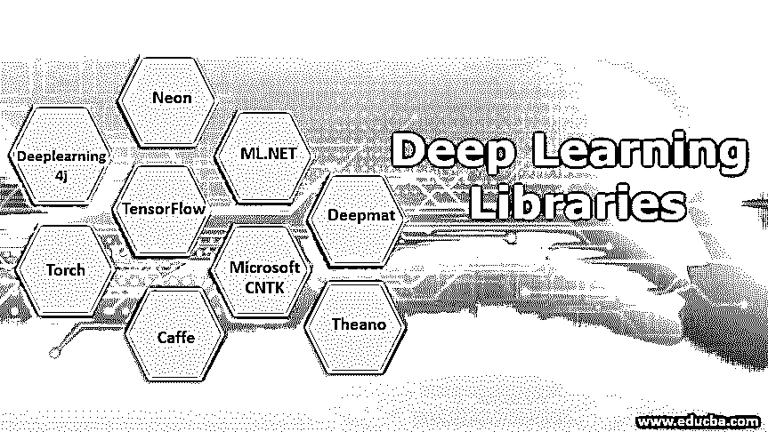

# 深度学习图书馆

> 原文：<https://www.educba.com/deep-learning-libraries/>

## 深度学习库简介

在本文中，我们将看到市场上有哪些不同的深度学习库，以及这些库如何有效地解决深度学习领域的挑战。众所周知，深度学习是机器学习领域的一个子集，[深度学习算法](https://www.educba.com/deep-learning-algorithms/)大多作用于非结构化数据，深度学习的核心是深度神经网络。深度神经网络基本上只是神经元的一种排列方式，这些神经元和网络执行的操作看起来类似于人脑。

让我们看看目前市场上有哪些深度学习库，那么库的基本含义是什么。

<small>Hadoop、数据科学、统计学&其他</small>

这个库是一组用特定编程语言编写的方法和类，可以直接用来解决问题。这些库通常由高度专业的软件开发人员编写，并在公开之前经过测试。开源库通常是免费的，任何人都可以根据自己的喜好使用和修改它。

### 深度学习的不同库

所有通常用于深度学习的库都是开源的，其中一些如下:

*   TensorFlow
*   深度学习 4j
*   火炬
*   咖啡
*   微软 CNTK
*   ML.NET
*   提亚诺
*   深垫
*   氖

在本文中，我们将讨论 TensorFlow、Theano、deeplearning4j、Torch 和 Caffe。因为这些库是深度学习领域最受欢迎和使用最广泛的库。对于商业用途，使用 TensorFlow、deeplearning4j、torch 和 Caffe，对于研究和教育用途，使用 ano。

#### 1\. TensorFlow

*   TensorFlow 是由谷歌开发的[机器学习和深度学习](https://www.educba.com/deep-learning-vs-machine-learning/)库，它于 2016 年 3 月左右进入市场。
*   TensorFlow 源自谷歌大脑的内部库 dist faith。
*   目前，TensorFlow 是市场上领先的、使用最多的库。
*   可以开发不同类型的深度网络，并且可以使用该库中可用的各种包来实现和解决深度学习领域中的大多数任务和问题。
*   这个库完全是用 python 写的，所以对于 python 程序员来说很容易使用。
*   由于 TensorFlow 灵活的计算图形结构，该库不仅仅限于深度学习操作，还可用于许多不同的操作和应用。
*   TensorFlow 提供了一个层，或者我们可以说是一个包装器，称为 Keras，用于轻松访问 TensorFlow 的不同包和方法。
*   Google 为这个库提供了非常好的文档，其中提到了每一个小的细节和用法，任何人都可以参考并使用这个库。
*   TensorFlow 是一个发展非常迅速的库，这个库可以用于教育目的，也可以构建大型商业应用。
*   Google 也为移动平台开发了这个库，名为 TensorFlow lite。
*   TensorFlow 是唯一一个为 javascript TensorFlow.js 提供 Python、Java、C++、Javascript 和 swift 编程语言支持的库
*   TensorFlow 还支持 GPU 和大数据。

#### 2.深度学习 4j

*   Deeplearning4j 是只支持 java 编程语言的开源 java 库，这个库是用 Java 编写的。
*   这是由 Adam Gibson 开发的，用于为深度神经网络提供分布式多模式能力。
*   这个库对于构建在大数据之上的应用程序来说非常有用。
*   这个库支持 Scala，并且提供了内置的 GPU 支持。

#### 3.火炬

*   这个开源的深度学习库是由脸书和 Twitter 开发的。
*   这个库是用 Lua 编程语言编写的。
*   然而 PyTorch 是一个被广泛使用的库，它是用 python 编程语言编写的

#### 4.咖啡

*   Caffe 是一个开源的深度学习库，用 C++/CUDA 编写，由 Google 的 Jia 开发。
*   这个库最初是为计算机视觉税开发的。
*   Caffe 允许用户配置深层网络的超参数。
*   层配置非常健壮，非常复杂。

#### 5.提亚诺

*   这是用 Python 和 CUDA 写的开源深度学习库。
*   这个库非常类似于 TensorFlow 库，但是实现和使用没有 TensorFlow 那么简单。
*   这个图书馆通常用于教育和研究目的。
*   Theano 并不容易使用，许多深度学习库扩展了这个库的功能，以帮助开发人员轻松编写深度学习模型的代码。
*   在提到的大多数库中，Theano 是最快的，因为它对所有函数都使用了向量和矩阵，并且由于对多个值的并行处理使事情变得更快，因此矢量化代码运行得更快。

#### 6.微软 CNTK

*   这是微软开发的一个认知工具包，用来冒险进入人工智能的[领域。](https://www.educba.com/what-is-artificial-intelligence/)
*   这个库是用 python 编写的，它支持 python 编程语言所支持的其他包和库，并且它与 Microsoft visual studio 一起提供。
*   CNTK 用于[将神经网络](https://www.educba.com/what-is-neural-networks/)描述为一系列计算有向图。

#### 7.ML.NET

*   ML.NET 是开源库，也是微软为. net 开发者开发的。
*   这个库是用 C#和 F#编写的，它使用微软的. net 平台。
*   有了这个库，创建桌面和大型 web 应用程序变得很容易，这可以为最终用户带来机器学习算法的巨大可能性。

#### 8.深垫

*   这个库是用 MATLAB 开发的。
*   有了这个库，我们就可以用 MATLAB 实现深度学习[。](https://www.educba.com/what-is-matlab/)
*   有了这个库，GSN，CNN，受限玻尔兹曼机，深度信念网络，多层感知器，以及更多的人工神经网络。

#### 9.氖

*   Neon 是由 Nervana systems 创建的深度学习框架，旨在提供行业领先的前沿技术。
*   截至 2018 年，该框架已被弃用，英特尔公司已就此开展了进一步的研究。
*   根据英特尔公司网站，要求使用替代框架，如
    针对 tensorFlow 的英特尔优化、针对 Caffe 的英特尔优化、pytorch 等。

### 结论

在这篇文章中，我们已经看到了什么是深度学习，以及实现深度学习的不同库是什么。我们也看到了市场上使用的所有深度学习库的概述，以及所有这些库的优势和应用。

### 推荐文章

这是深度学习库的指南。这里我们讨论深度学习领域中最流行、最广泛使用的库。您也可以阅读以下文章，了解更多信息——

1.  [深度学习框架](https://www.educba.com/deep-learning-frameworks/)
2.  [什么是机器学习平台？](https://www.educba.com/machine-learning-platform/)
3.  [深度学习的应用](https://www.educba.com/application-of-deep-learning/)
4.  [什么是深度学习](https://www.educba.com/what-is-deep-learning/)

