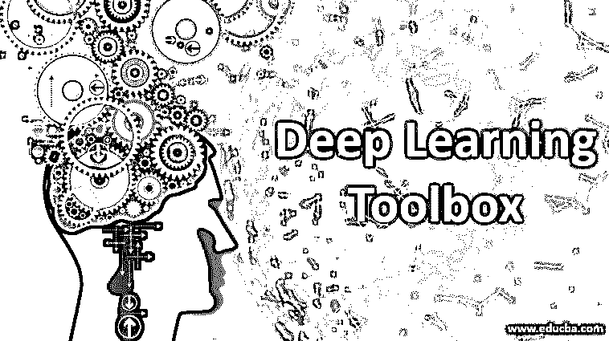
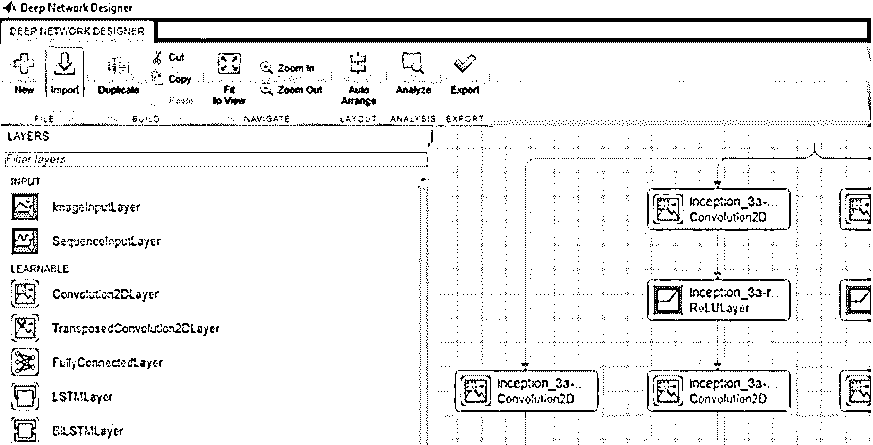

# 深度学习工具箱

> 原文：<https://www.educba.com/deep-learning-toolbox/>

## **深度学习工具箱介绍**

深度学习工具箱是 MathWorks 开发的一个框架，用于深度神经网络的开发。它支持高级架构，如卷积神经网络、生成对抗网络、暹罗网络等。其应用于图像、视频和文本处理。它还提供了一个交互式仪表板，用于绘制和可视化网络架构。它还通过使用 ONNX 格式支持 TensorFlow 和 PyTorch 之间的模型交换。它还通过使用并行计算工具箱来支持并行 GPU，该工具箱使用可扩展的架构来支持云和集群平台，包括 Amazon EC2 实例、NVIDIA 等。

### **深度学习工具箱详解**

<small>Hadoop、数据科学、统计学&其他</small>

深度学习工具箱使用 MATLAB 作为其后端编程语言。因此，用户可以参考 MATLAB 深度神经网络。它还提供了一个 MATLAB 编码器，也称为 GPU 编码器，可用于生成可在英特尔、NVIDIA 和 ARM 平台上部署的 C++和 CUDA 代码。它还提供了一个深度网络设计器，简化了用户的开发工作。深层网络设计者提出了一种简单的拖放方法，帮助用户轻松地设计、开发和可视化他/她的应用程序。它还为用户提供了一种应用预训练模型以及开发新模型架构的方法。此外，MATLAB 图像标签应用程序可以与它一起使用，以便用户可以查看他/她的图像，并为它们添加标签，以便在语义上分割它们。使用以上内容，用户可以创建一个工作流，在其中他们可以为各种特定领域的应用程序建立基础事实。它还支持预训练模型的微调。

### 卷积神经网络的类型

深度学习工具箱支持以下类型的卷积神经网络:

#### 1.MatConvNet

这是 MATLAB 用于卷积神经网络的过程之一。就使用而言，它既简单又灵活。它包括构建 CNN 架构所需的所有必要设置，内置 MATLAB 函数、卷积计算、池化等。它还支持不同的神经网络架构的快速和肮脏的实现，可以为更快的测试而开发。它还支持使用 CPU 和 GPU 为任何大型数据集训练大型复杂模型的计算。

#### 2.Cuda-Convnet

它是一个安全的实现，使用 C++/CUDA 作为后端。它向用户呈现可选层中的连通性以及网络的强度。如果被标记，它接受任何非循环层图作为其输入。使用反向传播来训练该模型。反向传播方法包括神经网络的梯度计算，该神经网络计算网络的基本权重。在输出层计算误差，该误差被传播回其它层。CUDA 使用它，因为它是 delta 方法的一种推广形式，可用于多层前馈网络。微分链规则可用于计算网络中每一层的梯度。它发现它与高斯-牛顿方法相关联，该方法是神经网络反向传播算法的高级研究的一部分。

*   深度学习工具箱支持深度和浅层神经网络。时间序列分析，回归问题等。属于浅层神经网络。它取代了以前开发的神经网络工具箱。
*   深度学习工具箱使用 ONNX 框架，该框架支持现有框架的操作能力。使用 TensorFlow、PyTorch、Keras 等框架，模型可以很容易地导出和导入。
*   它还支持深度学习容器，这是一个支持云平台(如 NVIDIA GPU)的实用程序，可以为 Azure 和 Amazon Web 服务提供广泛的性能和支持架构。

### MATLAB 中的分类任务

下面是一个在 MATLAB 中实现的 AlexNet 图像分类任务。定义上述任务只需要 8 行代码。

**代码:**

`while true
im = snapshot(camera);       % Take a picture
image(im);                   % Show the picture
im = imresize(im, [227 227]); % Resize the picture for alexnet
label = classify(net, im);    % Classify the picture
title(char(label));          % Show the class label
drawnow
end`

它还支持用于文本分类的 LSTM(长短期记忆)网络。它提供了 5G 工具箱、NVIDIA 云、支持 DGX 的传感器融合和跟踪等功能。

### **深度学习工具箱的好处**

下面我们将看到深度学习工具箱的好处:

*   **MATLAB:** 以 MATLAB 为后端，在物联网应用、仿真软件等方面得到应用。
*   **应用:**支持现有框架下的机器学习和深度学习技术。它支持回归和分类任务，包括预测、时间序列分析、图像处理、文本处理、音频处理等。
*   ONNX: 它使用 ONNX(开放神经网络交换格式),允许用户导出和导入他们现有的模型，这些模型是使用 TensorFlow、Keras、Caffe、MXNet 等现有框架开发和部署的。
*   **DNN 支持:**DNN 的部署代码可以在多种平台上使用，如 NVIDIA Tegra、Intel、ARM 等。
*   **深度网络设计师:**预先训练的模型，如 AlexNet，Google LeNet，ResNet 等。可由用户使用，并可进行微调。可以基于域创建工作流，这有助于为使用图像、视频和语音片段的应用程序建立基础事实标签。
*   **分布式计算:**提供并行计算工具箱，使用分布式计算架构为庞大的数据集训练复杂的模型。MATLAB 分布式计算服务器支持 Amazon EC2 云提供的 GPU 实例。它还支持其他流行的基于云的平台，如 Azure 和亚马逊 AWS。
*   **其他功能:** 5G 工具箱，基于 NVIDIA 的云平台，基于 DGX 的传感器融合/跟踪等。

### 结论

深度学习工具箱，以前称为神经网络工具箱，是为了满足广泛使用机器学习的物联网技术的潜在客户的需求而开发的。随着分布式计算和云的支持以及与不同框架的互操作性，它正在向现有的深度学习框架提供激烈的竞争。

### 推荐文章

这是一个深度学习工具箱的指南。在这里，我们讨论卷积神经网络的类型，MATLAB 中的分类任务，以及深度学习工具箱的顶级优势。您也可以浏览我们的其他相关文章，了解更多信息——

1.  [自然语言处理的深度学习](https://www.educba.com/deep-learning-for-nlp/)
2.  [Caffe 深度学习](https://www.educba.com/caffe-deep-learning/)
3.  [决策技巧](https://www.educba.com/decision-making-techniques/)
4.  [正则化机器学习](https://www.educba.com/regularization-machine-learning/)

