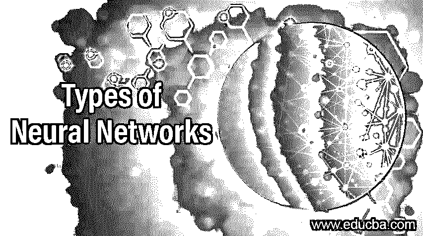
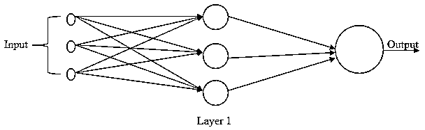
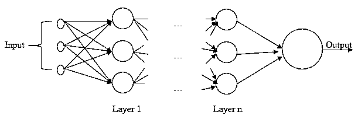

# 神经网络的类型

> 原文：<https://www.educba.com/types-of-neural-networks/>

## 神经网络导论

神经网络的类型是定义神经网络结构如何在计算中工作的概念，类似于人脑的决策功能。有几种类型的神经网络可用，例如前馈神经网络、径向基函数(RBF)神经网络、多层感知器、卷积神经网络、递归神经网络(RNN)、模块化神经网络和序列到序列模型。每种神经网络类型都特定于某些业务场景和数据模式。通过数据处理的多次迭代的学习和再学习过程，可以高度优化神经网络算法。神经网络增强了人工智能。

### 神经网络的类型

现在我们有了神经网络是什么的直觉。在看神经网络的类型之前，让我们先看看神经网络是如何工作的。由于神经网络接近于复制我们的大脑如何工作，它将增加我们对人工智能最佳尝试的直觉。

<small>Hadoop、数据科学、统计学&其他</small>

让我们将其与人体的神经系统进行比较，以便对神经网络的工作有一个清晰的直觉。第一层获得类似于耳朵中的音频神经的原始输入。接下来，它处理下一层神经元的信号。第一层的输出被馈送到下一层的不同神经元，每个神经元执行不同的处理，最后，处理后的信号到达大脑，以提供做出响应的决定。现在，在神经网络中，第一层接收原始输入，并将其发送到后续层，每个层并行处理它。该层中的每个节点都有自己的知识范围和自己学习的编程规则。现在，简单介绍一下神经网络的工作原理，让我们看看不同类型的神经网络。

#### 1.前馈神经网络

这是一个基本的神经网络，可以存在于神经网络的整个领域中。顾名思义，这个网络的运动只是向前的，一直运动到到达输出节点的点。没有反馈来改进不同层中的节点，也没有太多的自学习机制。下面是一个单层神经网络简单表示。

在上图中，数据向前移动，第 1 层中的 3 个节点具有不同的内部处理功能。这些已经在人脸识别建模和计算机视觉中找到了有用的用途。

#### 2.径向基函数神经网络

这些类型的神经网络的主要直觉是数据点相对于中心的距离。这些神经网络通常有两层(一层是隐藏层，另一层是输出层)。隐藏层具有典型的径向基函数。该函数有助于在拟合数据时进行合理的插值。这来自于直觉，即更接近的点在本质上是相似的，并且具有与 k-NN 的相似性。直觉是这样的:“一个项目的预测目标输出将表现得类似于与预测变量非常相似的其他项目。”

#### 3.多层感知器

现在，慢慢地，我们将转向具有多于两层的神经网络，即多于一个隐藏层。在多层感知器中，使用这种方法的主要直觉是当数据不是线性可分的时候。层中的每个节点由用于处理的非线性激活函数组成。这些函数通常是 Sigmoid/Logistic 函数、tanh/双曲线正切函数、ReLU(校正线性单位)、Softmax。该神经网络是完全连接的，并且还具有通过在每个数据点被处理后改变连接的权重和它产生的误差量来进行自我学习的能力。

#### 4.卷积神经网络

现在来看卷积神经网络，这种类型的神经网络是多层感知器的高级版本。在这种类型中，有一个或多个卷积层。现在的基本问题是卷积层到底是什么？卷积只不过是一种简单的过滤机制，可以实现激活。当重复这种过滤机制时，它产生检测到的特征的位置和强度。由于这种能力，这些网络被广泛用于图像处理、自然语言处理、推荐系统，以便产生重要特征检测的有效结果。

#### 5.递归神经网络

顾名思义，在这个网络中，某些东西会反复出现。现在提到这个网络，特定层的输出被保存并再次放回到输入中。这里，第一层将是一个简单的前馈神经网络，随后，每个节点将在接下来的层中保留信息。在这种情况下，如果预测是错误的，网络将尝试重新学习，并有效地学习正确的预测。这在文本到语音转换中被广泛使用。这个网络的主要组成部分是存储在记忆中，这将影响对下一步发生的事情的更好预测。

#### 6.模块化神经网络

最后但并非最不重要的神经网络类型，即模块化神经网络。顾名思义，模块化是这个神经网络的基本基石。模块化意味着独立运行的不同网络执行子任务，并且由于它们彼此不交互，因此通过处理单个组件，计算速度增加并导致大型复杂处理工作显著加快。类似于大脑的左右侧如何独立处理事情，然而是一体的，模块化神经网络是这种生物情况的类似情况。

### 结论

从上面可以明显看出，我们有很多类型，但在这一部分，我们已经讨论了行业中最常用的神经网络。这可能不是不同类型的神经网络的详尽列表，但在这里我们试图捕捉最大的和广泛使用的。从神经网络如何工作的算法中可以明显看出，它具有巨大的学习、再学习和有机增长的潜力，不像机器学习那样在几次迭代后就会停滞不前。

### 推荐文章

这是一个神经网络类型的指南。这里我们讨论神经网络的类型，如前馈神经网络、径向基函数(RBF)等。您也可以浏览我们推荐的文章，了解更多信息——

1.  [神经网络实现概述](https://www.educba.com/implementation-of-neural-networks/)
2.  [神经网络应用介绍](https://www.educba.com/application-of-neural-network/)
3.  [不同的神经网络算法](https://www.educba.com/neural-network-algorithms/)
4.  [神经网络的分类与类型](https://www.educba.com/classification-of-neural-network/)
5.  [DNN 神经网络一瞥](https://www.educba.com/dnn-neural-network/)

