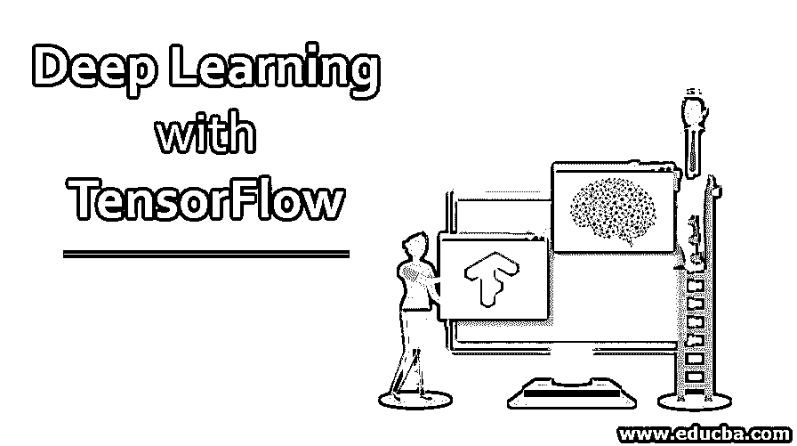
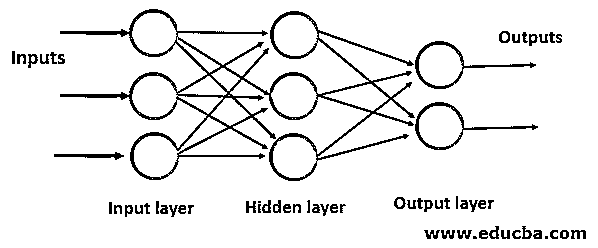

# 使用 TensorFlow 进行深度学习

> 原文：<https://www.educba.com/deep-learning-with-tensorflow/>

## TensorFlow 深度学习简介

TensorFlow 中的深度学习在过去几年中获得了很多关注。深度学习是[人工智能(AI)](https://www.educba.com/what-is-artificial-intelligence/) 的子集，它模仿人脑的神经元。深度学习模型创建了一个类似于生物神经系统的网络。它模仿人类的思维过程。深度学习是节点的集合，其中每个节点充当一个神经元。关于深度学习的炒作相当密集。

### 我们为什么需要这个？

我们需要深度学习模型的原因是为了解决语音检测、图像识别等复杂问题。从准确性来说，深度学习模型在用海量数据训练时是最好的。如果你向深度学习模型提供未标记和非结构化的数据，它仍然能够从数据中获得洞察力。早在 1943 年，沃尔特·皮茨和沃伦·麦卡洛克就基于模仿人脑的神经网络创建了第一个计算机模型。深度学习模型的决策基于节点的输入。这个神经网络有输入层、隐藏层和输出层。输入通过输入层提供给模型，隐藏层执行处理，输出在输出层生成。

<small>Hadoop、数据科学、统计学&其他</small>

### 使用 TensorFlow 进行深度学习的重要性

Markets 和 markets 预计，“到 2022 年，深度学习市场将增长到 17.729 亿美元的价值”。借助于被称为深度学习框架的接口、库和工具，很容易建立神经网络，即深度学习模型，而不必担心底层算法。

不同的深度学习框架有:

*   考菲
*   Keras
*   微软认知工具包
*   MXNET
*   深度学习 4j
*   链条机
*   TensorFlow

不同的框架是为了不同的目的而构建的。但在所有这些框架中，TensorFlow 是高度灵活的系统架构之一。许多大巨头，如脸书、谷歌、Deepmind、英伟达、Airbnb、联想等。正在采用张量流。TensorFlow 的顶级应用是语音识别系统、自动驾驶汽车、文本摘要、情感分析、图像识别、视频识别、标记、手写识别、预测。TensorFlow [支持 python、R、C++等编程语言](https://www.educba.com/what-is-a-programming-language/)，在手机和桌面上都可用。

TensorFlow 使用数据流图建立模型，它是一个开源的人工智能库。为什么叫张量流？它作用于张量(n 维数组)和流(当数据进入和处理后从网络出来)。神经网络中的每个节点是一个数学运算，边代表数据阵列(n 维)。TensorFlow 是谷歌在 2015 年发布的。TensorFlow 是一个强大的库，用于实现大型机器学习和深度学习项目。

### 张量流算法的步骤

张量流算法的基本步骤如下:

**1。数据导入/生成:** TensorFlow 模型非常依赖于海量的数据。您可以导入自己的数据集，也可以使用 TensorFlow 自带的数据集集合。

*   键入以下命令以检出 TensorFlow 中的可用数据集。

**代码:**

`import TensorFlow as tf
import TensorFlow_datasets as tendata
#This command will generate a list of datasets available in the TensorFlow
print(tfds.list_builders())`

**2。数据规范化或转换:**如果数据不在适当的论坛中。批量标准化是用于标准化 TensorFlow 中数据的命令方法。

**3。设置算法的参数:**对于 eg，迭代次数，学习率等。

**4。设置并初始化变量和占位符:**变量和占位符是 TensorFlow 的两个基本编程元素。变量保存图表的状态，占位符用于在以后的日期向图表中提供数据。

**5。创建模型结构:**定义了将对数据执行什么操作。

**6。定义损失函数:**计算预测值与实际值的差值。它告诉你的模型被训练的有多好，基本上用来评估输出。

7 .**。训练模型:**初始化计算图并创建一个图的实例。在占位符的帮助下将数据输入模型，让 TensorFlow 完成剩下的处理，以获得更好的预测。

**8。评估性能:**通过检查新数据来评估模型。

**9。预测结果:**还会根据新的和未知的数据检查您的模型。

为了更好地可视化 TensorFlow 提供的 Tensorboard 模型。它帮助我们可视化神经网络的任何统计数据，调试和优化它们。您可以检查代码中发生了什么，这会让您对内部工作有一个详细的了解。有了这个工具的帮助，你可以很容易地解决问题。

Tensorboard 提供五种类型的可视化:

*   数量
*   形象
*   声音的
*   直方图
*   图形

[tensor flow 的 summary 函数按照指定的格式给我们一个详细的](https://www.educba.com/what-is-tensorflow/)摘要。为了分配资源，保存中间结果和变量，并执行图形或使用部分图形会话功能。

### 优势

下面是提到的优点:

*   它是开源的，可以免费使用。
*   它背后是大巨头谷歌，所以软件发布频繁，更新快，性能好。
*   它提供了 Tensorboard，允许我们可视化图形，并看到内部工作。
*   没有任何硬件支持，您可以在笔记本电脑上执行高级计算。TensorFlow 运行在 CPU、GPU、桌面、服务器和移动平台上。它们也是可扩展的。
*   使用 TensorFlow 很容易调试图形的子部分。

### TensorFlow 中深度学习的范围

*   深度学习正在对我们的生活产生巨大影响。
*   在深度学习领域开始职业生涯所需的技能是建模深度学习神经网络，如 CNN、RNN、LSTM、亚当、辍学等。，并对概率方法有很好的理解。
*   [机器学习](https://www.educba.com/what-is-machine-learning/)工程师根据 Glassdoor 的平均工资是 8LPA。深度学习工程师的平均工资与机器学习工程师相比将会很高。
*   与深度学习库相比，TensorFlow 提供了出色的功能。
*   随着大型科技巨头采用这项技术，市场上已经出现了对 TensorFlow 专家的需求。

### 结论

在本文中，我们看到了 TensorFlow 的基础知识、优势和应用。记住以上关于 TensorFlow 的事实，可以说，如果你有强烈的学习 AI 的愿望，现在就开始你的职业生涯。

### 推荐文章

这是用 TensorFlow 进行深度学习的指南。在这里，我们讨论了张量流深度学习的简介、重要性、范围、优势和算法步骤。您也可以浏览我们的其他相关文章，了解更多信息——

1.  [感知器学习算法](https://www.educba.com/perceptron-learning-algorithm/)
2.  [张量低图像分类](https://www.educba.com/tensorflow-image-classification/)
3.  [深度学习职业](https://www.educba.com/careers-in-deep-learnings/)
4.  [深度学习框架](https://www.educba.com/deep-learning-frameworks/)

