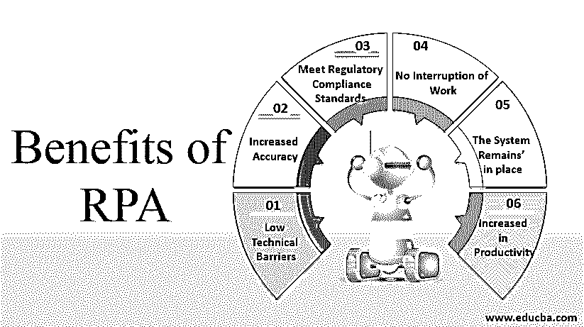

# RPA 的优势

> 原文：<https://www.educba.com/benefits-of-rpa/>

## RPA 优势介绍

机器人流程自动化(RPA)的优势用于专门的计算机程序，称为机器人，用于自动化用于商业目的的结构化数据或信息。他们在不同的领域有许多流程。每个过程都需要单独的验证。

**数据结构化或信息使用:**

<small>Hadoop、数据科学、统计学&其他</small>

*   假设一个机器人坐在电脑前，像一个人使用电脑一样查看系统应用程序。而机器人软件自动化不能涉及任何形式的物理机器人；因此，软件机器人可以通过与应用软件交互来代替人类的意图，应用软件以与人类相同的方式产生结果。
*   作为虚拟助理，机器人必须在为员工争取时间后执行大量任务，这些员工可以集中精力处理各种流程，为任何组织的工作流程创造收入。机器人自动化过程最好的部分是，即使非技术和技术背景也可以用于开发软件机器人应用程序。
*   根据业务需求，我们需要继续分析所提供的信息，检查流程的可行性，并计算自动化流程的持续时间。
*   需要查看、分析和检查用于处理每个流程的方法，以确定每个流程的可行性。
*   开发机器人过程自动化(RPA)的步骤。

### 机器人过程自动化的各种好处

机器人过程自动化是一个用户友好的工具，可以很容易地访问，有几个方法，我们没有所需的许可证。

RPA 的业务流程优势所涉及的步骤如下:

#### 1.低技术壁垒

对于非技术程序员来说，熟练掌握这种软件技术非常有用，一定不要配置机器人。由于它是一种免费的[编程语言](https://www.educba.com/what-is-a-programming-language/)，可以有任何非技术人员习惯于以拖放为目的来设计编码，可以在软件环境中设置为 bot 来实现；这些可以在它们自己的步骤中被记录，这些步骤可以在一个过程中被自动化，通过它可以被记录。有许多特征可以被记录并且可以被适当地访问。

#### 2.精确度提高

机器人非常灵活，可以在任何形式的过程中执行，这在其可行性方面非常一致，可以支持错误而不是人为干预。

#### 3.符合法规遵从性标准

机器人需要被结构化，并且可以用适当的文档来决定，它们已经被配置为遵循这些文档，并且为每个步骤提供该过程的演示实现。此外，如果有任何流程需要审查，可以根据需要处理机器人。最后，bot 工作的受控性质使其适合满足最严格的合规标准。

#### 4.不中断工作

操作可以全天候执行，因为这些机器人可以不知疲倦地使用自动化技术工作，员工需要这些技术来手动生成启动所需业务技术的位。如果有一个人需要干预，它需要采取和作出适当的决定，以解决一个进程的工作。机器人在可以根据客户要求的每个流程进行处理的流程中非常有用。如果进程开始执行，就不会有任何干扰。

#### 5.这一制度仍然保持不变

不太可能的是，特定的自动化可能是需要大量资源的计划，这些资源用于集成跨多个软件应用程序的过程。RPA 包括机器人技术中所有系统的分布数量。机器人跨表示层工作，执行应用程序，就像人类做他们的工作一样。这对于 API 中提供的系统非常有用，这些系统可能不会立即可用，或者如果存在组织无法在与现有软件机器人应用程序集成的深度学习中开发资源的任何情况。

#### 6.改进员工在 RPA 中暴露的建模

机器人降低了人类日常工作的效率，以便我们可以专注于按时完成工作的不同方面。它们在卸载每个员工完成的手工工作时更有用，在这种情况下，特定的任务可以被提供给员工的许多战略信息所覆盖。

#### 7.生产率提高

流程周期时间更可行，可以在人工工作时间内完成。RPA 的重要性在于，在技术处理过程中，任何人都可以轻松处理它。随着 RPA 的进一步发展，未来一代的技术可以为后代带来许多附加价值。机器学习、深度学习和人工智能等高级认知分析在数据处理方面更加智能，而机器人将允许结构化和需要结构化的数据或信息，即使是非结构化格式。

### 结论–RPA 的优势

推进 RPA 的未来。由于这些技术的后代更有可能得到改进，而这些价值的重要性在任何发展过程中又会更上一层楼。智能机器人的高级认知分析也正在得到应用，如机器学习、深度学习和人工智能数据，而机器人将允许结构化格式的数据或信息，并且需要结构化，即使是非结构化格式。机器学习允许机器人随着时间的推移识别数据的模式和信息；这意味着机器人在执行过程之间不需要人工干预。一个 bot 可以自动学习和行动，然后每一步的过程继续，直到过程完成。

### 推荐文章

这是 RPA 优势指南。这里我们分别讨论机器人过程自动化的介绍和好处。您也可以浏览我们的其他相关文章，了解更多信息-

1.  [什么是 RPA？](https://www.educba.com/what-is-rpa/)
2.  [RPA 工具](https://www.educba.com/rpa-tools/)
3.  [机器学习的类型](https://www.educba.com/types-of-machine-learning/)
4.  [什么是人工智能](https://www.educba.com/what-is-artificial-intelligence/)

