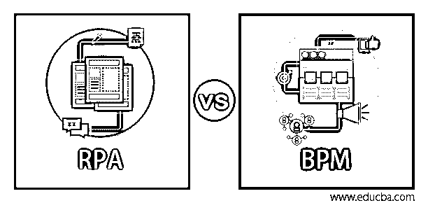
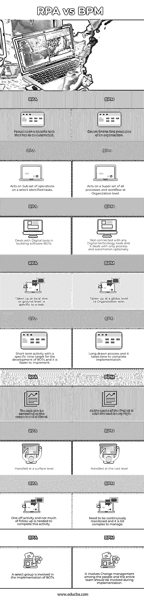

# 南非 vs BPM

> 原文：<https://www.educba.com/rpa-vs-bpm/>

## RPA 与 BPM 的区别

业务流程管理(BPM)经常在业务流程自动化环境中互换使用。BPM 不是一个特定的流程自动化工具，它采用一种整体的方法来简化业务流程，使其精简高效。任何组织都会有过时的遗留流程，这些流程是用当时可用的技术经过多年构建的，人们的心态也会被调整到这个重量级的流程。BPM 有助于发现这样的过程，重新设计过程，建议一个精益的替代过程，使组织变得敏捷和灵活。

机器人流程自动化(RPA)就是这样一种 BPM 实践，用于自动化已确定的流程并消除人工依赖。

<small>Hadoop、数据科学、统计学&其他</small>

### 什么是 BPM？

BPM 是一种识别和列出组织边界内外(包括供应商、经销商、客户、服务机构和政府机构)所有活动的方法。这些活动是在主要流程和子流程级别捕获的，包括自动化活动和手动活动。分析流程和子流程的清单，并作为 BPM 的一部分执行以下活动。

*   每一项活动都受到严格审查，其在当今环境中的相关性是
*   根据业务战略和组织目标验证流程。它应该与业务保持一致
*   过时的、违反现代管理理念和原则的遗留活动需要被识别和消除。例如，休假审批流程、差旅报销审批流程和许多其他审批流程在当今的现代管理环境中并不适用。他们可以被淘汰。
*   替代轻过程和更简单的工作流程将不得不被设计来代替当前的笨重和麻烦
*   新设计的流程应该是敏捷的、灵活的和创新的，并且应该增加
*   尽可能使用最新的信息技术工具实现流程自动化，并且应考虑到所有利益相关方对协作工具的使用，以消除浪费并减少流程
*   准备一套新的流程并实施。它应该涵盖所有部门和利益相关者
*   在持续的基础上对其进行监控，根据计划的意图衡量新流程的成功，并在需要时进行过程修正。

### RPA 是什么？

工厂里的机器人完成了以前手工完成的工作，它以一种高效、精确的方式工作，不会感到疲劳。机器人是电子控制的硬件设备，用于焊接、材料移动、加工操作等。类似地，被称为机器人的软件机器人做平凡重复的任务，如

*   使用预先提供的输入执行应用程序的前端活动，并完成一个流程，例如接收电子邮件、从附件中提取数据、处理数据、向用户发送回复并将结果存储在
*   监控应用程序的性能并在出现异常时发出警报
*   通过 API 与外部系统接口并挑选数据
*   在生产部署之前，使用软件脚本对应用程序进行回归测试
*   嵌入了人工智能技术(如语音识别、模式检测功能)的软件机器人模仿人类行为，用于构建自动交互式语音响应(IVR)

RPA 使用软件机器人实现了特定或离散业务流程的自动化，如上所述，这些软件机器人可以执行多项任务。

行业采用的一些典型 RPA 应用程序包括

1.  准备销售发票并尽早提供给用户，跟踪应收账款和销售运作
2.  应付供应商款项跟进
3.  回答员工门户和外部门户中的查询
4.  账目核对和价格比较
5.  Auto 中的数据提取、数据管理和报告生成
6.  自动化客户服务应用

### RPA 与 BPM 之间的直接比较(信息图表)

以下是 RPA 与 BPM 之间的 9 大区别:

### RPA 与 BPM 的主要区别

RPA 与 BPM 之间的一些主要区别如下:

*   BPM 与任何流程自动化或任何软件工具无关，无法取代手动的日常活动。但是它从整体上处理组织内部的端到端流程以及与外部利益相关者相关的流程。它主要集中在 EAO(消除，自动化和外包)的概念。首先，它消除了系统中多余的脂肪，自动化了剩余的过程，然后为了成本优势而外包出去。
*   而 RPA 处理一个特定的业务流程，它被认为是 BPM 实践的一个分支，是一个可以用软件机器人自动化的潜在流程。软件机器人(bot)开发将仅采用这些确定的流程，最新的数字艺术技术将用于开发 BOT
*   BPM 提供了长期解决方案，可将任何组织的运营效率和敏捷性提升到下一个级别，而 RPA 专注于一项活动，可实现 it 自动化并消除人工劳动。

### RPA 与 BPM 对比表

让我们讨论一下 RPA 与 BPM 之间的主要对比:

| **南非** | **BPM** |
| 专注于必须自动化的特定任务。 | 涵盖组织的端到端流程。 |
| 对选定的已识别任务的操作子集进行操作。 | 作用于组织级别的所有流程和工作流的超集。 |
| 处理构建软件机器人的数字工具 | 不涉及任何数字技术工具，它只处理过程和自动化的选择。 |
| 在地方一级或基层进行，即针对某项任务。 | 在全球层面(即组织层面)采用。 |
| 针对机器人开发的有特定时间目标的短期活动，实施起来更快。 | 漫长的过程，需要时间来完成实施。 |
| 由于范围明确，成本可以得到控制。 | 由于项目范围广，成本很高 |
| 在表面水平处理。 | 在根级别处理。 |
| 完成这项活动只需要一次性的活动，不需要太多的后续工作。 | 需要持续监控，管理起来有点复杂。 |
| 一个精选小组参与了机器人的实施。 | 它涉及到人员之间的变更管理，整个团队都应该参与到实施过程中。 |

### 推荐文章

这是 RPA 与 BPM 的对比指南。在这里，我们通过信息图和比较表来讨论 RPA 与 BPM 的主要区别。您也可以浏览我们推荐的其他文章，了解更多信息——

1.  [谷歌云 vs AWS |主要差异](https://www.educba.com/google-cloud-vs-aws/)
2.  [通过例子](https://www.educba.com/comparable-in-java-example/)了解 Java 中什么是可比较的
3.  [GitHub 与 SVN 的对决](https://www.educba.com/github-vs-svn/)
4.  [Z 得分与 T 得分的主要差异](https://www.educba.com/z-score-vs-t-score/)

